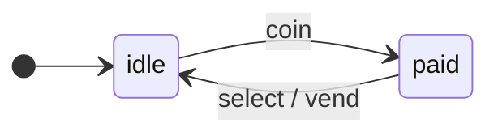

**English** · [Русский](README.ru.md)

<p align="center">
  <a href="https://www.npmjs.com/package/@evgkch/machjs"></a>
  <a href="LICENSE"></a>
  
  
  
</p>

<p align="center">
  <a href="#installation">Installation</a> ·
  <a href="#quick-start">Quick Start</a> ·
  <a href="https://evgkch.github.io/machjs/">Examples</a> ·
  <a href="#formal-definition-and-terminology">Formal definition</a> ·
  <a href="https://github.com/evgkch/machjs/issues">Issues</a>
</p>

A TypeScript library implementing a Mealy state machine with state‑dependent context. The machine is defined by a schema — a typed transition structure that can be analyzed, formatted, and visualized.

Complete, runnable examples live in a repository of their own, [`evgkch/machjs-examples`](https://github.com/evgkch/machjs-examples), and are hosted at [evgkch.github.io/machjs](https://evgkch.github.io/machjs/).

---

## Table of contents

| Section                                                                                  | What it covers                                                         |
| ---------------------------------------------------------------------------------------- | ---------------------------------------------------------------------- |
| [Installation](#installation)                                                            | Entry points, bundler requirements                                     |
| [Quick Start](#quick-start)                                                              | The rule language, two examples                                        |
| [`@evgkch/machjs`](#evgkchmachjs)                                                          | `StateMachine` class, carriers, schema, bus, serialization, asynchrony, graph, JSON   |
| [`@evgkch/machjs/analysis`](#evgkchmachjsanalysis)                                         | Reachability, issues, paths                                            |
| [`@evgkch/machjs/formatters`](#evgkchmachjsformatters)                                     | Tree, rules, Mermaid, DOT                                              |
| [`@evgkch/machjs/debug`](#evgkchmachjsdebug)                                               | Logging, invariants, history                                           |
| [The inspector](#the-inspector)                                                          | The development tool: its pages and widgets                            |
| [Limitations](#limitations)                                                              | Important notes for usage                                              |
| [TypeScript compiler messages](#typescript-compiler-messages)                            | How to read type errors                                                |
| [Formal definition and terminology](#formal-definition-and-terminology)                  | Mathematical model, notation                                           |
| [Visualizing and checking a schema from a file](#visualizing-and-checking-a-schema-from-a-file) | `render.ts` script, JSON                                    |

---

## Installation

```sh
npm i @evgkch/machjs
```

The package is ESM-only and requires `"module": "nodenext"` or a compatible resolver. Main entry point:

```ts
import { StateMachine, TRANSITION } from "@evgkch/machjs";
```

Additional modules are imported separately – only what you import ends up in your bundle:

```ts
import { analyze, validate, paths } from "@evgkch/machjs/analysis";
import { toTree, toMermaid } from "@evgkch/machjs/formatters";
import { log, history } from "@evgkch/machjs/debug";
```

---

## Quick Start

### What is a Mealy state machine

A state machine is a model of a system that always occupies exactly one **state** from a predefined set and switches between states in response to **input events**. On a transition the machine may produce an **output event**.

It's natural to draw the machine as a graph: vertices are states, arrows are transitions labeled `input_event / output_event`.

**Example** — a vending machine. States: `idle` (waiting) and `paid` (coin inserted). Input events: `coin` (insert coin) and `select` (choose item); output event: `vend` (dispense item).



### The rule language: FROM, ON, TO, EMIT

Machine behavior is described by **rules** — sentences of four words, where the output event is optional:

```text
FROM <state>  ON <event>  TO <state>  [EMIT <event>]
```

For our example there are two rules:

```text
FROM idle  ON coin   TO paid
FROM paid  ON select TO idle  EMIT vend
```

The second one reads: “from state `paid` on event `select` go to `idle`, emitting `vend`.”

### First example: code

Let's encode these rules with the library.

```ts
import { StateMachine } from "@evgkch/machjs";
import type { IState, IEvent, Merge } from "@evgkch/machjs";

type Q = IState<"idle" | "paid">;                  // states without context
type Σ = Merge<IEvent<"coin"> | IEvent<"select">>; // input events without data
type Λ = IEvent<"vend">;                           // output event without data

const vm = new StateMachine<Q, Σ, Λ>(
  {
    idle: { coin:   [{ to: "paid" }] },
    paid: { select: [{ to: "idle", emit: "vend" }] },
  },
  { type: "idle", context: undefined },
);
```

Dispatch events and listen for outputs:

```ts
vm.rx.on("vend", () => console.log("Item dispensed"));

vm.can("select");      // UNHANDLED – no rule for this pair
vm.dispatch("select"); // UNHANDLED – in idle, select is not handled
vm.dispatch("coin");   // OK – idle → paid
vm.dispatch("select"); // OK – paid → idle + dispense
vm.state.type;         // "idle"
```

### Extended machine: context and three more words

When you need to store data and check conditions, the machine gains a **context** tied to the state, plus three new words: `WHEN`, `WITH`, `BY`. The full seven-word rule (everything except `FROM`, `ON`, `TO` is optional):

```text
FROM <state>  ON <event>  [WHEN <condition>]  TO <state>  [WITH <update>]  [EMIT <event>  [BY <data>]]
```

Execution order: `WHEN` → `TO` → `WITH` → `EMIT` → `BY`. `BY` receives the already updated context.

### Second example: vending machine with different state contexts

The item costs 50. The machine accepts coins of different denominations, accumulates the total, allows selection only when enough money has been inserted, and returns change.

Each state stores its own context:

- `idle` stores the accumulated amount and the change returned last time,
- `paid` stores only the amount.

```ts
import { StateMachine } from "@evgkch/machjs";
import type { IState, IEvent, Merge } from "@evgkch/machjs";

type Idle = { paid: number; change: number };
type Paid = { paid: number };

type Q = Merge<IState<"idle", Idle> | IState<"paid", Paid>>;
type Σ = Merge<IEvent<"coin", { value: number }> | IEvent<"select">>;
type Λ = IEvent<"vend", { change: number }>;

const PRICE = 50;

const vm = new StateMachine<Q, Σ, Λ>(
  {
    idle: {
      coin: [
        {
          when: (ctx, { value }) => ctx.paid + value < PRICE,
          to: [
            "idle",
            (ctx, { value }) => ({ paid: ctx.paid + value, change: 0 }),
          ],
        },
        {
          to: ["paid", (ctx, { value }) => ({ paid: ctx.paid + value })],
        },
      ],
    },
    paid: {
      select: [
        {
          to: ["idle", (ctx) => ({ paid: 0, change: ctx.paid - PRICE })],
          emit: ["vend", (ctx: Idle) => ({ change: ctx.change })],
        },
      ],
    },
  },
  { type: "idle", context: { paid: 0, change: 0 } },
);

vm.rx.on("vend", ({ change }) => console.log(`Change: ${change}`));
vm.dispatch("coin", { value: 20 }); // idle → idle, paid=20
vm.dispatch("coin", { value: 50 }); // idle → paid, paid=70
vm.dispatch("select");              // idle again — dispensed, change 20
```

Each context function returns exactly the context of the state named beside it — `Idle` with `change`, `Paid` without — and the type system enforces the correspondence. On `select` the change is computed by `with` into the new `idle` context, and `by` reads it from there: `by` receives the context after the move. Its parameter is annotated because `to` written as a pair does not narrow the target for TypeScript's inference.

---

## `@evgkch/machjs`

### Creating a machine and the state

```ts
new StateMachine<Q, Σ, Λ>(schema, start);
```

- `schema` — transition schema;
- `start` — initial state: `{ type, context }`.

All three parameters are carriers. `Q` and `Σ` are required; `Λ` defaults to `Σ` and is given only when the output differs from the input.

The current state is read via the `state` getter:

```ts
vm.state;         // { type: 'idle', context: { paid: 0 } }
vm.state.type;    // 'idle'
vm.state.context; // { paid: 0 }
```

Context is tied to the state, so there is no separate getter for it – it is returned together with the type. Narrowing by `type` also narrows the context:

```ts
if (vm.state.type === "paid") {
  vm.state.context.change; // field only available in paid
}
```

The `restore(state)` method sets the state directly – without transitions and without publishing `TRANSITION`:

```ts
vm.restore({ type: "paid", context: { paid: 70, change: 20 } });
```

### Carriers and helpers `IState` / `IEvent`

The three type parameters are carriers (object mappings):

| Parameter | Mapping | Set |
| --- | --- | --- |
| `Q` | state → its context | `keyof Q` |
| `Σ` | input event → its payload | `keyof Σ` |
| `Λ` | output event → its payload | `keyof Λ` |

You can write a carrier by hand:

```ts
type Q = { empty: void; ready: { rect: Rect }; dragging: { rect: Rect; from: Point } };
```

Helpers describe it one entry at a time. `Merge` combines a union of entries into a single carrier:

```ts
type Q = Merge<
  | IState<"empty">
  | IState<"ready", { rect: Rect }>
  | IState<"dragging", { rect: Rect; from: Point }>
>;
```

Multiple states with the same form are written together, and then `Merge` is not needed:

```ts
type Q = IState<"open" | "closed", { at: number }>;
type Σ = Merge<IEvent<"down" | "move", Point> | IEvent<"up">>;
```

`IEvent` is the same helper for events. The second argument defaults to `void` – an event without data.

### Transition schema

The schema is a two-level object: `schema[state][event]` → list of rules. Cell lookup is O(1).

```ts
{
    idle: {
        coin: [
            { when: short, to: ['idle', collect] },
            { to: ['paid', toPaid] }
        ]
    },
    paid: {
        select: [
            { to: ['idle', toIdle], emit: ['vend', refund] }
        ]
    }
}
```

The order of rules in the list matters: the first rule whose `when` is true (unconditional rules always match) is applied. If none match, no transition occurs.

**Rule fields:**

| Field | Required | Purpose |
|-------|----------|---------|
| `to` | required | Target state — a name, or a pair `[name, function]` |
| `when?` | optional | Guard condition (pure function) |
| `emit?` | optional | Output event — a name, or a pair `[name, function]` |

`to` is a bare name or a pair `[name, function]`; which one is written depends on the target state:

- if the target stores nothing – the bare name, and a pair does not compile;
- if the source context fits – either;
- if the shapes differ – the pair, and the bare name does not compile.

`emit` follows the same rule: an event without data is written bare, an event with data as a pair. With no `emit` at all, neither is written.

A dump keeps the pair: `JSON.stringify` writes `["idle", "toIdle"]`, the function's name where the function stood. See [`toJSON`](#graph-and-json-representation) below.

### Executing a transition: `dispatch` and `can`

```ts
dispatch(event, payload?) => Verdict
can(event, payload?)      => Verdict

type Verdict = Result<true, MachineError>;
```

`Result<T, E>` is the two-branch container — `Result.Ok<T>` carries `result`, `Result.Err<E>` carries `error`, and exactly one of the two fields is set. `isOk()` and `isError()` narrow the branch, `unwrap()` returns the value or throws the error, `toJSON()` writes the branch out as data. A verdict carries `true` on the `Ok` branch: `can` runs the guards and nothing else, so the only thing both asks report is that the answer is yes.

The answer is one of five constant objects, one instance each. No call allocates; read the branch through `isOk`, or compare against the constants by identity.

| Constant | `error` | Meaning |
| -------- | ------- | ------- |
| `OK` | — | the transition fired; for `can` — it would |
| `UNHANDLED` | `UnhandledError` | the current state has no cell for this event |
| `REJECTED` | `RejectedError` | the cell exists, every `when` refused the event with this payload |
| `TERMINAL` | `TerminalError` | the state is terminal: no outgoing transitions at all |
| `BUSY` | `BusyError` | a nested call: the outer `dispatch` is still executing |

The order of `dispatch`:

1. Looks up `schema[state][event]`. A state with no cells at all – `TERMINAL`; no cell for this event – `UNHANDLED`.
2. Iterates over the rules, evaluating `when`. Picks the first match. If none match – `REJECTED`.
3. Computes the new context with the function paired to `to`, if there is one.
4. If `emit` is present, constructs the output event with the packer paired to it, if there is one.
5. Atomically commits the new state.
6. Publishes the output event to `rx`, then `TRANSITION`.
7. Returns `OK`.

Steps 3–4 run before the commit, so an exception in a guard, a context function or a packer leaves the machine unchanged. The errors are shared by all calls and carry no call data: the caller already knows the event, the state and the refusing guard's name.

`can` performs only steps 1–2, without side effects.

```ts
button.disabled = !vm.can("select").isOk();

const r = vm.dispatch("select");
if (r.isError()) say(r.error);
```

> [!WARNING]
> The answers of `can` and `dispatch` are guaranteed to match if `when` functions are pure.

### The `rx` bus and `TRANSITION`

Output events are published to `rx` — the receiving end of a [`@evgkch/chanjs`](https://github.com/evgkch/chanjs) channel.

```ts
const off = vm.rx.on("vend", ({ change }) => console.log(change));
off(); // unsubscribe
```

Every successful transition publishes a `Transition` object on the `TRANSITION` key:

```ts
import { TRANSITION } from "@evgkch/machjs";
vm.rx.on(TRANSITION, (t) => console.log(t));
```

`t` contains fields `input`, `source`, `target`, `output?` and `at`. `at` is `Date.now()` taken when the transition happened; it is not part of the transition relation, only a timestamp for whatever records the run.

### Atomicity and nested calls

The state is committed before events are sent – handlers run with the new state already in place. An exception in a guard, a context function or a packer leaves the machine unchanged.

A nested `dispatch` on the same instance — from a subscription, or from the current transition's `when`/`with`/`by` — does nothing: the answer is `BUSY`, and the outer transition completes normally. To feed an event back through `dispatch`, use `queueMicrotask` inside the `rx.on / rx.once` subscription.

### Serialization

`JSON.stringify(machine)` writes the graph — the schema with every operation reduced to a name. The machine's position is `machine.state`: a `{ type, context }` pair; JSON writes it whenever the context itself does, and a context with unserializable content gets its own `toJSON`. Restoring is the constructor:

```ts
const saved = JSON.stringify(vm.state);
// …in another process, with the same schema:
const vm2 = new StateMachine<Q, Σ, Λ>(schema, JSON.parse(saved));
```

A run serializes as the same pairs: a `history` record (`@evgkch/machjs/debug`) is ready JSON values.

### Asynchrony

`when`, `with` and `by` are synchronous. Asynchronous work runs outside the machine; its result is dispatched into it as an ordinary event. Two ways:

**The result is computed before dispatching:**

```ts
button.addEventListener("click", async () => {
  vm.dispatch("sign", { who, sig: await sign(who, text) });
});
```

**Waiting is a state.** The request is sent as an output event, the answer comes back as an input event; in between, the machine is in a waiting state:

```text
FROM draft    ON submit  TO checking EMIT gate
FROM checking ON checked TO review
```

```ts
vm.rx.on("gate", async ({ text }) => {
  // After the `await`, execution resumes outside the current transition: this dispatch is not nested.
  vm.dispatch("checked", await check(text));
});
```

### Reading the schema without a machine

`edges`, `nodes`, `graph` extract information from the schema:

```ts
import { edges, nodes, graph } from "@evgkch/machjs";

const allEdges = edges(schema);   // Edge[] – one edge per rule
const allNodes = nodes(schema);   // string[] – all states
const graphObj = graph(schema);   // Graph<...> – same as toJSON
```

`nodes` returns the union of the schema's keys and every rule's target state. The list therefore includes a state written with an empty cell (`ghost: {}`), which has no edges at all, as well as a state that only ever appears as a target.

The same entry point exports `nameOf(operation, slot)`. It is used by `toJSON` and by the formatters, so operation names agree across every representation of a schema. A custom renderer should call it rather than reconstruct the name itself.

### Graph and JSON representation

`toJSON()` returns a graph – the schema without function bodies but with their names. Every operation becomes a string (or `"?"` for an anonymous function), in the place the function stood: inside the pair for a context function or a packer, under `when` for a guard. This representation is suitable for visualization and validation.

```json
{
  "idle": {
    "coin": [
      { "when": "short", "to": ["idle", "collect"] },
      { "to": ["paid", "toPaid"] }
    ]
  },
  "paid": {
    "select": [{ "to": ["idle", "toIdle"], "emit": ["vend", "refund"] }]
  }
}
```

The JSON has the same shape as the schema in code, and the shape is unambiguous for `emit` too: `["vend", "refund"]` is one event with its packer, never a list of two events.

Such a schema can be drawn and checked, but it can also be passed to the constructor. A name in place of a function is read as that function's neutral value: a guard as a condition that holds, a context function as the identity, a packer as no data at all. A machine restored from JSON walks its graph but computes nothing: the context is carried into the target state unchanged, and output events are sent without data.

### Signatures

```ts
class StateMachine<Q extends Carrier, Σ extends Carrier, Λ extends Carrier = Σ> {
    constructor(schema: Schema<Q, Σ, Λ>, start: FsmState<Q>);
    readonly schema: Schema<Q, Σ, Λ>;
    get state(): FsmState<Q>;
    get rx(): Rx<...>;
    // one signature: the event's name alone, or the name and its payload
    can(...args: Args<Σ>): Verdict;
    dispatch(...args: Args<Σ>): Verdict;
    restore(state: FsmState<Q>): void;
    toJSON(): Graph<Q, Σ, Λ>;
}

type IState<Q extends PropertyKey, D = void> = { [q in Q]: D };
type IEvent<T extends PropertyKey, D = void> = { [t in T]: D };
type Merge<U> = { ... };

function edges<T>(schema: T): Edge<Nodes<T>>[];
function nodes<T>(schema: T): Nodes<T>[];
function graph<T, Σ extends Carrier = Carrier, Λ extends Carrier = Carrier>(
    schema: T,
): Graph<IState<Nodes<T>, unknown>, Σ, Λ>;
function nameOf(operation: Function | string | undefined, slot: string): string | undefined;
// the two halves of a `to` or an `emit` pair
function nameIn(slot: Slot | undefined): PropertyKey | undefined;
function opIn(slot: Slot | undefined): Op | undefined;

// the shape every machine satisfies, for code that handles machines generically
type AnyMachine = {
    readonly state: { readonly type: PropertyKey };
    readonly rx: { on(msg: typeof TRANSITION, hear: (t: AnyTransition) => void): Off };
    can(type: PropertyKey, payload?: unknown): Verdict;
    dispatch(type: PropertyKey, payload?: unknown): Verdict;
    toJSON(): unknown;
};

// core/result: the two-branch answer — one of Ok and Err, never both
type Result<T, E extends Error = Error> = Result.Ok<T, E> | Result.Err<T, E>;
namespace Result {
    class Ok<T, E extends Error = Error> {
        readonly result: T;
        readonly error: undefined;
    }
    class Err<T, E extends Error = Error> {
        readonly result: undefined;
        readonly error: E;
    }
    const ok: <T, E extends Error = Error>(result: T) => Result.Ok<T, E>;
    const error: <E extends Error, T = never>(error: E) => Result.Err<T, E>;
}
// on both branches
isOk(): this is Result.Ok<T, E>;
isError(): this is Result.Err<T, E>;
unwrap(): T;                        // the value, or the error thrown
toJSON(): { result: T } | { error: { name: string; message: string } };

// the verdict of dispatch and can: five constants, one instance each
type Verdict = Result<true, MachineError>;
type MachineError = UnhandledError | RejectedError | TerminalError | BusyError;
const OK: Result.Ok<true, MachineError>;
const UNHANDLED: Result.Err<true, MachineError>; // error: UnhandledError
const REJECTED: Result.Err<true, MachineError>;  // error: RejectedError
const TERMINAL: Result.Err<true, MachineError>;  // error: TerminalError
const BUSY: Result.Err<true, MachineError>;      // error: BusyError

// core/errors: four verdict errors; none are thrown
class UnhandledError extends Error {}
class RejectedError extends Error {}
class TerminalError extends Error {}
class BusyError extends Error {}
const TRANSITION: unique symbol;
```

`Args<Σ>` in the signatures above is an internal type and is not exported. It is the one type behind both calls — the event's name alone where it carries nothing, the name and its payload where it does — a single tuple union instead of two overloads.

Exported types: `Carrier`, `IState`, `IEvent`, `Merge`, `FsmState`, `FsmEvent`, `When`, `With`, `By`, `Rule`, `Schema`, `Graph`, `Edge`, `Nodes`, `Transition`, `AnyTransition`, `AnyMachine`, `Off`, `Verdict`.

---

## `@evgkch/machjs/analysis`

Static checking of the schema: the machine is not run, guard functions are not called. The analysis relies on the structure of the graph — the `to` and `emit` fields and the presence of a `when` — but never on what a guard returns. A schema with code and the same schema restored from JSON therefore give the same result.

```ts
function analyze<T, Q extends PropertyKey = PropertyKey>(schema: T, start?: Q): Analysis<Q>;
function validate<T, Q extends PropertyKey = PropertyKey>(schema: T, start?: Q): Issue<Q>[];
function paths<T, Q extends PropertyKey = PropertyKey>(schema: T, from: Q): Path<Q>[];
```

### `analyze`

Returns four lists of states:

| Field         | What it holds                            |
| ------------- | ---------------------------------------- |
| `nodes`       | every state in the schema                |
| `reachable`   | reachable from `start`                   |
| `unreachable` | present but not reachable from `start`   |
| `terminal`    | no outgoing transitions                  |

> [!WARNING]
> `start` is optional, but without it reachability is not computed at all: `reachable` and `unreachable` come back empty. This means `validate(schema)` with no second argument reports no `unreachable` findings at all.

### `validate`

The same facts plus two cell-level checks:

| `kind`           | Level     | When                                                       |
| ---------------- | --------- | ---------------------------------------------------------- |
| `unreachable`    | `error`   | the state is not reachable from `start`                     |
| `dead-rule`      | `error`   | a rule sits after an unconditional one and can never fire   |
| `terminal`       | `warning` | the state has no way out                                    |
| `duplicate-edge` | `warning` | two rules in a cell a run cannot tell apart                 |

A terminal state is a warning rather than an error because it is usually a final state the author intended.

Each `Issue` carries `severity`, `kind`, `node` and a ready-made `message`; cell-level findings also fill in `event`. `formatIssues` from `formatters` renders the report.

```ts
console.log(formatIssues(validate(vm.schema, "idle")));
```

`duplicate-edge` is the one check that needs the code: rules are compared by the identity of the guard function, and a name left behind by a dump gives no identity, since two different anonymous guards both print as `?`. On a schema loaded from JSON this check does not fire; the other three work in full.

A missing `when` is not a finding: an absent guard is read as true, and refusing a transition is as ordinary an outcome as taking one.

### `paths`

`paths` enumerates every simple path from the given state. `nodes` holds the sequence of states, `legs` the edges traversed, and `kind` how the path ended: `terminal` if it reached a state with no outgoing transitions, `cycle` if it returned to a state already visited. In the second case the last element of `nodes` repeats an earlier one.

> [!WARNING]
> On dense graphs the number of paths grows exponentially.

Exported types: `Analysis`, `Issue`, `Path`.

---

## `@evgkch/machjs/formatters`

Rendering a schema as text. The module only builds a representation and computes nothing about the graph: walking it, reachability and path enumeration belong to `analysis`.

The prefix in a name says what the function takes: `to*` takes a schema, `format*` takes a value produced by another module.

```ts
type Formatter<T, Opts = never> = (value: T, options?: Opts) => string;

const toMermaid: Formatter<unknown, RenderOptions<PropertyKey>>;
const toDot: Formatter<unknown, RenderOptions<PropertyKey>>;
const toTree: Formatter<unknown, TextOptions<PropertyKey>>;
const toRules: Formatter<unknown>;
const formatIssues: Formatter<Issue<PropertyKey>[], FormatOptions>;
const edgeLabel: (edge: Edge) => string;
```

Every exported function has the shape of a `Formatter`, so any of them can be replaced by one of your own with the same signature.

### Output formats

- `toMermaid` – Mermaid `stateDiagram-v2`, pasted straight into Markdown.
- `toDot` – Graphviz DOT.
- `toTree` – indented tree for the terminal: a line per state, its outgoing edges below it.
- `toRules` – line-by-line rule list, all seven words: `FROM ON WHEN TO WITH EMIT BY`.
- `formatIssues` – a `validate` report, one line per finding (`✗ error` / `⚠ warning`).

### Options

A formatter takes a schema rather than a machine, so the current state is passed to it in the options.

`RenderOptions` (`toMermaid`, `toDot`):

| Field       | What it does                                    |
| ----------- | ----------------------------------------------- |
| `current`   | highlight this state as the current one         |
| `start`     | draw an initial-state marker                    |
| `direction` | `'TB'` (default) or `'LR'`                      |
| `label`     | your own edge label instead of `edgeLabel`      |

`TextOptions` (`toTree`) – the same `current` and `label` plus two of its own; `start` and `direction` are not needed here.

| Field   | What it does                                              |
| ------- | --------------------------------------------------------- |
| `color` | mark the current state with ANSI inverse video, off by default |
| `at`    | print one state's slice instead of the whole schema        |

`FormatOptions` (`formatIssues`) – `color` only.

Tree markers: `●` is the state passed as `current`, `∎` a dead end.

```ts
toMermaid(vm.schema, { start: "idle", direction: "LR", current: vm.state.type });
toTree(vm.schema, { at: "paid" });
```

### Labels and names

`edgeLabel` builds an edge label in the order the rule runs: `ON coin WHEN short WITH collect EMIT vend`. `toRules` and the transition log in `debug` use the same keywords.

`BY` is left out of an edge label deliberately. A guard decides which edge fires and `WITH` changes the context — both facts about the transition itself — whereas `BY` only shapes the data of an event the label already names. The full set of seven words is printed by `toRules`.

`edgeLabel` is exported so that a renderer of your own labels edges the way the shipped ones do: a label rebuilt by hand will drift from the standard one over time.

Operation names are taken from the functions themselves; an anonymous one prints as `?`. A schema restored from JSON gives the same output as a schema with code: `toRules(vm.schema)` and `toRules(vm.toJSON())` agree.

Column widths are computed over the whole schema at once, so lines are aligned with one another. A column no rule fills is dropped from the output entirely; in the remaining lines a filled column is padded with spaces.

---

## `@evgkch/machjs/debug`

Observing a running machine. All four functions subscribe to `TRANSITION`, so they receive only transitions that actually happened. A `dispatch` that answered on the `Err` branch, and `restore`, publish no events and do not show up here.

```ts
function log(fsm, sink?: (t: Transition) => void): Off;
function rules(sink?: (line: string, t: Transition) => void): (t: Transition) => void;
function invariant(fsm, check: (context, t: Transition) => boolean, onViolation?): Off;
function history(fsm, opts?: { maxSize?: number }): History;
```

### `log`

`log` subscribes to transitions and returns an unsubscribe handle. The `sink` receives the whole `Transition`, so a handler can print it, filter it, count it or ship it somewhere.

```ts
const off = log(vm, (t) => {
  if (t.output) send(t.output);
});
```

This is also how output events are handled without naming their types: `rx.on` wants one specific type, while `TRANSITION` delivers them all.

### `rules`

`rules` is not a printer of its own but a wrapper: it turns a function that takes a line into a `sink` for `log`. The line is written in the same language as `toRules` output, but only four of the seven words are filled in. A transition carries `FROM`, `ON`, `TO` and `EMIT`; the names of the operations in the rule that fired are not part of it.

```ts
log(vm); // the default sink is rules(), printing to the console
log(vm, rules((line) => file.write(line + "\n")));
```

The wrapped function receives the transition itself as a second argument, so there is no need to parse the assembled line back apart to get at the event data.

> [!NOTE]
> `rules` from `debug` and `toRules` from `formatters` should not be confused. The first formats one transition that happened, the second prints the whole schema; the language is the same.

### `invariant`

`invariant` checks a property of the context after every transition that fired. If `check` returns `false` and no `onViolation` is given, an exception is thrown. An `onViolation` that is given is called instead and receives the transition together with the same line the exception message would have carried.

```ts
invariant(vm, (ctx) => ctx.paid >= 0);
```

### `history`

`history` records the machine's state after every transition.

| Member               | What it is                                          |
| -------------------- | ---------------------------------------------------- |
| `states`, `index`    | the recorded states and the current position in them |
| `canUndo`, `canRedo` | whether a step back or forward is available          |
| `undo`, `redo`       | step back and forward; return `false` if impossible  |
| `jump(i)`            | move to a record by its number                       |
| `rx`                 | publishes `moved` with the new index when history moves the machine  |
| `stop()`             | stop recording and unsubscribe from transitions      |

Navigation goes through `fsm.restore`: nothing is replayed and no `Transition` is published, which is why the history does not record its own steps. It publishes `moved` on its own `rx` instead — the signal to redraw anything that renders the machine. The next `dispatch` after an undo discards everything recorded ahead of it.

`maxSize` (at least 1) caps the buffer. Once it is full the oldest record is dropped, and undo then goes back no further than `maxSize` transitions.

Exported type: `History`.

---

## The inspector

[`@evgkch/machjs-inspector`](https://github.com/evgkch/machjs-inspector) is the development tool for this library's machines: the rule text, the transition figure, the classic diagram and the run, joined by shared highlighting. It reads a dumped schema — [open the inspector](https://evgkch.github.io/machjs-inspector/) — or attaches to a running machine with one line:

```ts
import { inspect } from "@evgkch/machjs-inspector";

const cart = inspect(new StateMachine(schema, start), { name: "cart" });
```

The inspector's widgets also attach one at a time, without raising the whole inspector: this repository's examples draw their machines with them ([open the examples](https://evgkch.github.io/machjs/)).

---

## Limitations

- The schema is read once, in the constructor. Mutating the schema object afterwards does not change the machine's behaviour — build a new machine instead.
- **`when` must be pure.** Otherwise `can` and `dispatch` stop agreeing on the same question.
- **An unconditional rule, if present, must be last.** Rules after it are unreachable; `validate` reports this as a `dead-rule` error.
- **The context function must return a new object.** The context is frozen after the transition, and changing it in place raises an error. Freezing is on when `process` is unavailable or `NODE_ENV !== 'production'`; it is also shallow and does not extend to nested objects. In production nothing prevents a mutation of the context, so the rule is kept by the developer and the check merely helps catch a violation while debugging.
- **`restore` is not a transition.** It publishes no events, does not freeze the context and does not check it against the state.
- **A nested `dispatch` on the same instance is refused with `BUSY`.** Use `queueMicrotask` inside the subscription.

---

## TypeScript compiler messages

| Message                                 | Cause                                 |
| --------------------------------------- | ------------------------------------- |
| `Type '"x"' is not assignable to type 'readonly ["x", ...]'`          | A bare name where a pair is required: the target state's context, or the event's data, is not built. |
| `Type 'readonly ["x", ...]' is not assignable to type '"x"'`        | A pair where a bare name belongs: the target carries nothing, or the event carries no data.    |
| `Type '"vending"' is not assignable ...` | Invalid target state.                 |
| `... 'insert' does not exist in type ...` | The event is not part of the input alphabet. |
| `Expected 2 arguments, but got 1`       | The event carries data and none was given. |

---

## Formal definition and terminology

### Basic Mealy machine

A tuple $(Q, \Sigma, \Lambda, \delta, \omega, q_0)$:

- $Q$ – states;
- $\Sigma$ – input;
- $\Lambda$ – output;
- $\delta$ – partial transition function;
- $\omega$ – partial output function;
- $q_0$ – initial state.

> [!NOTE]
> All three — $Q$, $\Sigma$, $\Lambda$ — are carriers in the library rather than sets: mappings from a tag to what it carries. The sets are spelled with `keyof`: $\mathrm{keyof}\,Q$ is the state types, $\mathrm{keyof}\,\Sigma$ the input alphabet. An event is `{ type, payload }`, a state `{ type, context }`.

### State-dependent context

The context belongs to the state, not to the machine: $Q[q]$ is what state $q$ carries, and it differs from one $q$ to the next. So a state in full is a type together with its context — the type `FsmState<Q>`; the ordinary "one context for every state" case is the one where $Q[q]$ does not depend on $q$.

### Step mapping

$$\mathrm{step}: \mathrm{FsmState}\langle Q \rangle \times \mathrm{Msg}(\Sigma) \rightharpoonup \mathrm{FsmState}\langle Q \rangle \times \mathrm{Msg}(\Lambda)$$

A step takes and returns a state in full — the context cannot be recovered from a type name alone. Partiality matters: rejection (`UNHANDLED`, `REJECTED`, `TERMINAL` or `BUSY`) is as legitimate an outcome as a transition.

### Notation

| Symbol | Meaning |
|--------|---------|
| $Q$ | State carrier: state type → its context |
| $\mathrm{keyof}\,Q$ | The set of state types |
| $q$ | One state type |
| $Q[q]$ | The context of state $q$ |
| $\mathrm{FsmState}\langle Q\rangle$ | A state in full: `{ type, context }` |
| $\mathrm{Msg}(\Sigma)$ | An event in full: `{ type, payload }`, the type `FsmEvent<Σ>` |
| $\Sigma$, $\Lambda$ | Input and output carriers |
| $\sigma$, $\lambda$ | An input and an output event type |
| $\delta$ | Transitions (`to`: name and context function) |
| $\omega$ | Output (`emit`: name and packer) |
| $q_0$ | Initial state |

---

## Visualizing and checking a schema from a file

The `scripts/render.ts` script (not included in the package):

```sh
node scripts/render.ts machine.json tree           # tree
node scripts/render.ts machine.json rules          # rules
node scripts/render.ts machine.json mermaid        # Mermaid
node scripts/render.ts machine.json dot            # DOT
node scripts/render.ts machine.json report idle    # report
```

The input is the output of `JSON.stringify(machine)`: labels and operation names with no code. The script imports the package by name (`@evgkch/machjs/formatters`), so in a fresh clone it needs a built `dist` — run `npm run build` first. The default mode is `tree`, and an unknown mode prints a tree as well.

---

<p align="center">
  <a href="https://evgkch.github.io/machjs/">Examples</a> ·
  <a href="https://github.com/evgkch/chanjs">chanjs</a> ·
  <a href="LICENSE">MIT</a>
</p>
