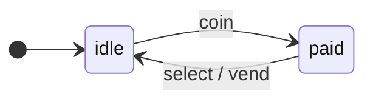

[English](README.md) · **Русский**

<p align="center">
  <a href="https://www.npmjs.com/package/@evgkch/machjs"></a>
  <a href="LICENSE"></a>
  
  
  
</p>

<p align="center">
  <a href="#установка">Установка</a> ·
  <a href="#быстрый-старт">Быстрый старт</a> ·
  <a href="https://evgkch.github.io/machjs/">Примеры</a> ·
  <a href="#формальное-определение-и-термины">Формальное определение</a> ·
  <a href="https://github.com/evgkch/machjs/issues">Issues</a>
</p>

Библиотека реализует автомат Мили с контекстом, привязанным к состоянию. Автомат задаётся схемой — типизированной структурой переходов, которую можно анализировать, форматировать и визуализировать.

Готовые примеры лежат в отдельном репозитории [`evgkch/machjs-examples`](https://github.com/evgkch/machjs-examples) и выложены на [evgkch.github.io/machjs](https://evgkch.github.io/machjs/).

---

## Содержание

| Раздел                                                                            | О чём                                                                        |
| --------------------------------------------------------------------------------- | ---------------------------------------------------------------------------- |
| [Установка](#установка)                                                           | Точки входа, требования к сборке                                             |
| [Быстрый старт](#быстрый-старт)                                                   | Язык правил, два примера                                                     |
| [`@evgkch/machjs`](#evgkchmachjs)                                                   | Класс `StateMachine`, носители, схема, шина, сериализация, асинхронность, граф, JSON       |
| [`@evgkch/machjs/analysis`](#evgkchmachjsanalysis)                                  | Достижимость, ошибки, пути                                                   |
| [`@evgkch/machjs/formatters`](#evgkchmachjsformatters)                              | Дерево, правила, Mermaid, DOT                                                |
| [`@evgkch/machjs/debug`](#evgkchmachjsdebug)                                        | Журнал, инварианты, история                                                  |
| [Инспектор](#инспектор)                                                                  | Инструмент разработки: страницы и виджеты                              |
| [Ограничения](#ограничения)                                                       | Что важно помнить при использовании                                          |
| [Сообщения компилятора TypeScript](#сообщения-компилятора-typescript)             | Как читать ошибки типов                                                      |
| [Формальное определение и термины](#формальное-определение-и-термины)             | Математическая модель, обозначения                                           |
| [Визуализация и проверка схемы из файла](#визуализация-и-проверка-схемы-из-файла) | Скрипт `render.ts`, JSON                                                     |

---

## Установка

```sh
npm i @evgkch/machjs
```

Пакет поставляется только в формате ESM и требует `"module": "nodenext"` или совместимого резолвера. Основная точка входа:

```ts
import { StateMachine, TRANSITION } from "@evgkch/machjs";
```

Дополнительные модули подключаются отдельно — в сборку попадает только то, что импортировано:

```ts
import { analyze, validate, paths } from "@evgkch/machjs/analysis";
import { toTree, toMermaid } from "@evgkch/machjs/formatters";
import { log, history } from "@evgkch/machjs/debug";
```

---

## Быстрый старт

### Что такое конечный автомат Мили

Конечный автомат — это модель системы, которая всегда находится ровно в одном **состоянии** из заранее заданного набора и переключается между ними под действием **входных событий**. При переходе автомат может порождать **выходное событие**.

Автомат удобно представлять в виде графа: вершины — состояния, стрелки — переходы, подписанные парой `входное_событие / выходное_событие`.

**Пример: торговый автомат.** Состояния: `idle` (ожидание) и `paid` (монета получена). Входные события: `coin` (опустить монету) и `select` (выбрать товар). Выходное событие: `vend` (выдача товара).



### Язык правил: FROM, ON, TO, EMIT

Поведение автомата описывается **правилами** — предложениями из четырёх слов (выходное событие опционально):

```text
FROM <состояние>  ON <событие>  TO <состояние>  [EMIT <событие>]
```

Для нашего примера нужны два правила:

```text
FROM idle  ON coin   TO paid
FROM paid  ON select TO idle  EMIT vend
```

Второе читается так: «из состояния `paid` по событию `select` перейти в `idle`, на выходе — `vend`».

### Первый пример: код

Запишем правила с помощью библиотеки.

```ts
import { StateMachine } from "@evgkch/machjs";
import type { IState, IEvent, Merge } from "@evgkch/machjs";

type Q = IState<"idle" | "paid">;                  // состояния без контекста
type Σ = Merge<IEvent<"coin"> | IEvent<"select">>; // входные события без данных
type Λ = IEvent<"vend">;                           // выходное событие без данных

const vm = new StateMachine<Q, Σ, Λ>(
  {
    idle: { coin:   [{ to: "paid" }] },
    paid: { select: [{ to: "idle", emit: "vend" }] },
  },
  { type: "idle", context: undefined },
);
```

Отправляем события и слушаем выход:

```ts
vm.rx.on("vend", () => console.log("Товар выдан"));

vm.can("select");      // { ok: false, error } — правила для этой пары нет
vm.dispatch("select"); // { ok: false, error } — в idle событие select не обрабатывается
vm.dispatch("coin");   // { ok: true } — переход idle → paid
vm.dispatch("select"); // { ok: true } — переход paid → idle + выдача
vm.state.type;         // "idle"
```

### Расширенный автомат: контекст и ещё три слова

Когда нужно хранить данные и проверять условия, автомат дополняется **контекстом**, привязанным к состоянию, и тремя словами: `WHEN`, `WITH`, `BY`. Полное правило (из семи слов; всё, кроме `FROM`, `ON` и `TO`, опционально):

```text
FROM <состояние>  ON <событие>  [WHEN <условие>]  TO <состояние>  [WITH <обновление>]  [EMIT <событие>  [BY <данные>]]
```

Порядок выполнения: `WHEN` → `TO` → `WITH` → `EMIT` → `BY`. `BY` использует уже обновлённый контекст.

### Второй пример: торговый автомат с разными контекстами состояний

Товар стоит 50 единиц. Автомат принимает монеты разного достоинства, накапливает сумму, разрешает выбор только когда накоплено достаточно, и возвращает сдачу.

Каждое состояние хранит свой контекст:

- `idle` хранит накопленную сумму и сдачу, выданную в прошлый раз,
- `paid` хранит только сумму.

```ts
import { StateMachine } from "@evgkch/machjs";
import type { IState, IEvent, Merge } from "@evgkch/machjs";

type Idle = { paid: number; change: number };
type Paid = { paid: number };

type Q = Merge<IState<"idle", Idle> | IState<"paid", Paid>>;
type Σ = Merge<IEvent<"coin", { value: number }> | IEvent<"select">>;
type Λ = IEvent<"vend", { change: number }>;

const PRICE = 50;

const vm = new StateMachine<Q, Σ, Λ>(
  {
    idle: {
      coin: [
        {
          when: (ctx, { value }) => ctx.paid + value < PRICE,
          to: [
            "idle",
            (ctx, { value }) => ({ paid: ctx.paid + value, change: 0 }),
          ],
        },
        {
          to: ["paid", (ctx, { value }) => ({ paid: ctx.paid + value })],
        },
      ],
    },
    paid: {
      select: [
        {
          to: ["idle", (ctx) => ({ paid: 0, change: ctx.paid - PRICE })],
          emit: ["vend", (ctx: Idle) => ({ change: ctx.change })],
        },
      ],
    },
  },
  { type: "idle", context: { paid: 0, change: 0 } },
);

vm.rx.on("vend", ({ change }) => console.log(`Сдача: ${change}`));
vm.dispatch("coin", { value: 20 }); // idle → idle, paid=20
vm.dispatch("coin", { value: 50 }); // idle → paid, paid=70
vm.dispatch("select");              // снова idle — товар выдан, сдача 20
```

Каждая функция контекста возвращает ровно контекст состояния, названного рядом с ней, — `Idle` со сдачей, `Paid` без — и типизация требует точного соответствия. На `select` сдачу вычисляет `with` в новый контекст `idle`, а `by` читает её оттуда: `by` получает контекст уже после перехода. Его параметр аннотирован: `to`, записанный парой, не сужает цель для вывода типов TypeScript.

---

## `@evgkch/machjs`

### Создание автомата и состояние

```ts
new StateMachine<Q, Σ, Λ>(schema, start);
```

- `schema` — схема переходов;
- `start` — начальное состояние: `{ type, context }`.

Все три параметра — носители. `Q` и `Σ` обязательны; `Λ` по умолчанию равен `Σ` и указывается, только когда выход отличается от входа.

Текущее состояние читается через геттер `state`:

```ts
vm.state;         // { type: 'idle', context: { paid: 0 } }
vm.state.type;    // 'idle'
vm.state.context; // { paid: 0 }
```

Контекст привязан к состоянию, поэтому отдельного геттера для контекста нет — он возвращается вместе с типом. Сужение по `type` сужает и контекст:

```ts
if (vm.state.type === "paid") {
  vm.state.context.change; // поле, доступное только в paid
}
```

Метод `restore(state)` устанавливает состояние напрямую — без переходов и без публикации `TRANSITION`:

```ts
vm.restore({ type: "paid", context: { paid: 70, change: 20 } });
```

### Носители и хелперы `IState` / `IEvent`

Три параметра типа — это носители (объекты-отображения):

| Параметр | Отображение | Множество |
| --- | --- | --- |
| `Q` | состояние → его контекст | `keyof Q` |
| `Σ` | входное событие → его данные | `keyof Σ` |
| `Λ` | выходное событие → его данные | `keyof Λ` |

Носитель можно написать вручную:

```ts
type Q = { empty: void; ready: { rect: Rect }; dragging: { rect: Rect; from: Point } };
```

Хелперы описывают его по одной записи. `Merge` сливает объединение записей в один носитель:

```ts
type Q = Merge<
  | IState<"empty">
  | IState<"ready", { rect: Rect }>
  | IState<"dragging", { rect: Rect; from: Point }>
>;
```

Несколько состояний с одной формой записываются вместе, и тогда `Merge` не нужен:

```ts
type Q = IState<"open" | "closed", { at: number }>;
type Σ = Merge<IEvent<"down" | "move", Point> | IEvent<"up">>;
```

`IEvent` — тот же хелпер для событий. Второй аргумент по умолчанию `void` — событие без данных.

### Схема переходов

Схема — это двухуровневый объект: `schema[состояние][событие]` → список правил. Доступ к ячейке — O(1).

```ts
{
    idle: {
        coin: [
            { when: short, to: ['idle', collect] },
            { to: ['paid', toPaid] }
        ]
    },
    paid: {
        select: [
            { to: ['idle', toIdle], emit: ['vend', refund] }
        ]
    }
}
```

Порядок правил в списке важен: выполняется первое, чьё `when` истинно (безусловное — всегда). Если ни одно не подошло, перехода нет.

**Поля правила:**

| Поле    | Обязательность | Назначение                                                          |
| ------- | -------------- | ------------------------------------------------------------------- |
| `to`    | обязательно    | Целевое состояние: имя или пара `[имя, функция]`                    |
| `when?` | опционально    | Условие применимости (чистая функция)                               |
| `emit?` | опционально    | Выходное событие: имя или пара `[имя, функция]`                     |

`to` — это имя или пара `[имя, функция]`; что писать, зависит от целевого состояния:

- если оно ничего не хранит — только имя, пара не скомпилируется;
- если контекст источника подходит — любая из двух;
- если формы различаются — только пара, одного имени не хватит.

Для `emit` правило то же: событие без данных пишется именем, событие с данными — парой. Если `emit` нет вовсе, не пишется ни то, ни другое.

Дамп сохраняет пару: `JSON.stringify` пишет `["idle", "toIdle"]` — имя функции там, где стояла функция.

### Выполнение перехода: `dispatch` и `can`

```ts
dispatch(event, payload?) => Verdict
can(event, payload?)      => Verdict

type Verdict = { ok: true } | { ok: false; error: Error };
```

Ответ — один из пяти замороженных объектов-констант; вызов не создаёт объектов. Ответ читают по полю `ok` или сравнивают с константами по идентичности.

| Константа | `error` | Значение |
| --------- | ------- | -------- |
| `OK` | — | переход выполнен; у `can` — выполнился бы |
| `UNHANDLED` | `UnhandledError` | в текущем состоянии нет ячейки для события |
| `REJECTED` | `RejectedError` | ячейка есть, все `when` отклонили событие с этими данными |
| `TERMINAL` | `TerminalError` | состояние терминальное: исходящих переходов нет вообще |
| `BUSY` | `BusyError` | вложенный вызов: внешний `dispatch` ещё выполняется |

Порядок `dispatch`:

1. Ищет `schema[состояние][событие]`. У состояния нет ни одной ячейки — `TERMINAL`; нет ячейки для события — `UNHANDLED`.
2. Перебирает правила, проверяя `when`. Выбирает первое подходящее. Ни одно не подошло — `REJECTED`.
3. Вычисляет новый контекст функцией из пары с `to`, если она там есть.
4. Если есть `emit`, формирует выходное событие функцией из пары с ним, если она там есть.
5. Атомарно фиксирует новое состояние.
6. Публикует выходное событие в `rx`, затем `TRANSITION`.
7. Возвращает `OK`.

Шаги 3–4 выполняются до фиксации, поэтому исключение в условии или в любой из двух функций оставляет автомат неизменным. Ошибки общие для всех вызовов и данных не содержат: событие, состояние и имя отклонившего условия известны вызывающему коду.

`can` выполняет только шаги 1–2, без побочных эффектов.

```ts
button.disabled = !vm.can("select").ok;

const r = vm.dispatch("select");
if (!r.ok) say(r.error);
```

> [!WARNING]
> Совпадение ответов `can` и `dispatch` гарантировано, если `when` чисты.

### Шина `rx` и `TRANSITION`

Выходные события публикуются в `rx` — приёмнике канала [`@evgkch/chanjs`](https://github.com/evgkch/chanjs).

```ts
const off = vm.rx.on("vend", ({ change }) => console.log(change));
off(); // отписка
```

Каждый успешный переход публикует объект `Transition` по ключу `TRANSITION`:

```ts
import { TRANSITION } from "@evgkch/machjs";
vm.rx.on(TRANSITION, (t) => console.log(t));
```

`t` содержит поля `input`, `source`, `target`, `output?` и `at`. `at` — это `Date.now()`, снятый в момент перехода; время не входит в отношение переходов, это лишь метка для того, кто записывает прогон.

### Атомарность и вложенные вызовы

Состояние фиксируется до отправки событий — обработчики выполняются уже при новом состоянии. Исключение в условии или в любой из двух функций оставляет автомат без изменений.

Вложенный `dispatch` от того же экземпляра — из подписки или из `when`/`with`/`by` текущего перехода — не выполняется: ответ `BUSY`, внешний переход завершается штатно. Чтобы отправить следующее событие в ответ на переход, вызовите `dispatch` через `queueMicrotask` внутри подписки `rx.on / rx.once`.

### Сериализация

`JSON.stringify(machine)` пишет граф — схему, где каждая операция сведена к имени. Позиция машины — `machine.state`: пара `{ type, context }`; JSON записывает её, если записывается сам контекст, а контексту с несериализуемым содержимым задаётся свой `toJSON`. Восстановление — конструктором:

```ts
const saved = JSON.stringify(vm.state);
// …в другом процессе, с той же схемой:
const vm2 = new StateMachine<Q, Σ, Λ>(schema, JSON.parse(saved));
```

Прогон сериализуется теми же парами: запись из `history` (`@evgkch/machjs/debug`) — готовые JSON-значения.

### Асинхронность

`when`, `with` и `by` синхронны. Асинхронная работа выполняется вне автомата; в автомат отправляется её результат — обычным событием. Два способа:

**Результат вычисляется до отправки:**

```ts
button.addEventListener("click", async () => {
  vm.dispatch("sign", { who, sig: await sign(who, text) });
});
```

**Ожидание — это состояние.** Запрос отправляется выходным событием, ответ — входным; между ними автомат находится в состоянии ожидания:

```text
FROM draft    ON submit  TO checking EMIT gate
FROM checking ON checked TO review
```

```ts
vm.rx.on("gate", async ({ text }) => {
  // После `await` выполнение продолжается вне текущего перехода: это не вложенный dispatch.
  vm.dispatch("checked", await check(text));
});
```

### Чтение схемы без автомата

`edges`, `nodes`, `graph` извлекают информацию из схемы:

```ts
import { edges, nodes, graph } from "@evgkch/machjs";

const allEdges = edges(schema);   // Edge[] — по одному ребру на правило
const allNodes = nodes(schema);   // string[] — все состояния
const graphObj = graph(schema);   // Graph<...> — то же, что toJSON
```

`nodes` возвращает объединение ключей схемы и всех целевых состояний правил. Поэтому в список попадает и состояние с пустой ячейкой (`ghost: {}`), у которого нет ни одного ребра, и состояние, встречающееся только как цель.

Там же экспортируется `nameOf(operation, slot)`. Её используют `toJSON` и форматтеры, поэтому имена операций во всех представлениях схемы совпадают. Собственному рендереру лучше вызывать эту функцию, а не восстанавливать имя самостоятельно.

### Граф и JSON‑представление

`toJSON()` возвращает граф — схему без тел функций, но с их именами. Каждая функция заменяется строкой (или `"?"` для анонимной) на том месте, где стояла: внутри пары в `to` или `emit`, под `when` у условия. Такое представление пригодно для визуализации и валидации.

```json
{
  "idle": {
    "coin": [
      { "when": "short", "to": ["idle", "collect"] },
      { "to": ["paid", "toPaid"] }
    ]
  },
  "paid": {
    "select": [{ "to": ["idle", "toIdle"], "emit": ["vend", "refund"] }]
  }
}
```

У JSON та же форма, что и у схемы в коде. Эта форма однозначна и для `emit`: `["vend", "refund"]` — одно событие с функцией данных, а не список из двух событий.

Такую схему можно не только нарисовать и проверить, но и передать в конструктор. Имя на месте функции трактуется как её нейтральное значение: условие — как истинное, функция контекста — как тождественная, функция данных — как отсутствие данных. Автомат, восстановленный из JSON, выполняет переходы по графу, но ничего не вычисляет: контекст переносится в целевое состояние без изменений, а выходные события отправляются без данных.

### Сигнатуры

```ts
class StateMachine<Q extends Carrier, Σ extends Carrier, Λ extends Carrier = Σ> {
    constructor(schema: Schema<Q, Σ, Λ>, start: FsmState<Q>);
    readonly schema: Schema<Q, Σ, Λ>;
    get state(): FsmState<Q>;
    get rx(): Rx<...>;
    // одна сигнатура: имя события, или имя и его данные
    can(...args: Args<Σ>): Verdict;
    dispatch(...args: Args<Σ>): Verdict;
    restore(state: FsmState<Q>): void;
    toJSON(): Graph<Q, Σ, Λ>;
}

type IState<Q extends PropertyKey, D = void> = { [q in Q]: D };
type IEvent<T extends PropertyKey, D = void> = { [t in T]: D };
type Merge<U> = { ... };

function edges<T>(schema: T): Edge<Nodes<T>>[];
function nodes<T>(schema: T): Nodes<T>[];
function graph<T, Σ extends Carrier = Carrier, Λ extends Carrier = Carrier>(
    schema: T,
): Graph<IState<Nodes<T>, unknown>, Σ, Λ>;
function nameOf(operation: Function | string | undefined, slot: string): string | undefined;
// две половины пары `to` или `emit`
function nameIn(slot: Slot | undefined): PropertyKey | undefined;
function opIn(slot: Slot | undefined): Op | undefined;

// общая форма любого автомата, для кода, который работает с автоматами вообще
type AnyMachine = {
    readonly state: { readonly type: PropertyKey };
    readonly rx: { on(msg: typeof TRANSITION, hear: (t: AnyTransition) => void): Off };
    can(type: PropertyKey, payload?: unknown): Verdict;
    dispatch(type: PropertyKey, payload?: unknown): Verdict;
    toJSON(): unknown;
};

// ответ dispatch и can: пять констант, по одному экземпляру
type Verdict = { ok: true } | { ok: false; error: Error };
const OK: Verdict;
const UNHANDLED: Verdict; // error: UnhandledError
const REJECTED: Verdict;  // error: RejectedError
const TERMINAL: Verdict;  // error: TerminalError
const BUSY: Verdict;      // error: BusyError

// файл core/errors: четыре ошибки-вердикта; не бросаются
class UnhandledError extends Error {}
class RejectedError extends Error {}
class TerminalError extends Error {}
class BusyError extends Error {}
const TRANSITION: unique symbol;
```

`Args<Σ>` в сигнатурах выше — внутренний тип, он не экспортируется. Один тип на оба вызова: где событие ничего не несёт — только имя, где несёт — имя вместе с данными; одно объединение кортежей вместо двух перегрузок.

Экспортируемые типы: `Carrier`, `IState`, `IEvent`, `Merge`, `FsmState`, `FsmEvent`, `When`, `With`, `By`, `Rule`, `Schema`, `Graph`, `Edge`, `Nodes`, `Transition`, `AnyTransition`, `AnyMachine`, `Off`, `Verdict`.

---

## `@evgkch/machjs/analysis`

Статическая проверка схемы: автомат не запускается, условия не вызываются. Анализ опирается на структуру графа — поля `to`, `emit` и наличие `when`, — но не на то, какое значение возвращает условие. Поэтому схема с кодом и та же схема, восстановленная из JSON, дают одинаковый результат.

```ts
function analyze<T, Q extends PropertyKey = PropertyKey>(schema: T, start?: Q): Analysis<Q>;
function validate<T, Q extends PropertyKey = PropertyKey>(schema: T, start?: Q): Issue<Q>[];
function paths<T, Q extends PropertyKey = PropertyKey>(schema: T, from: Q): Path<Q>[];
```

### `analyze`

Возвращает четыре списка состояний:

| Поле          | Что в нём                                  |
| ------------- | ------------------------------------------ |
| `nodes`       | все состояния схемы                        |
| `reachable`   | достижимые из `start`                      |
| `unreachable` | присутствующие, но недостижимые из `start` |
| `terminal`    | без исходящих переходов                    |

> [!WARNING]
> `start` необязателен, но без него достижимость не считается вовсе: `reachable` и `unreachable` возвращаются пустыми. То есть `validate(schema)` без второго аргумента не выдаст ни одной находки `unreachable`.

### `validate`

Те же факты плюс две проверки на уровне ячейки:

| `kind`           | Уровень   | Когда                                                   |
| ---------------- | --------- | ------------------------------------------------------- |
| `unreachable`    | `error`   | состояние недостижимо из `start`                        |
| `dead-rule`      | `error`   | правило стоит после безусловного и не сработает никогда |
| `terminal`       | `warning` | из состояния нет выхода                                 |
| `duplicate-edge` | `warning` | два правила ячейки во время работы неразличимы          |

Тупиковое состояние отнесено к предупреждениям, а не к ошибкам: обычно это конечное состояние, предусмотренное автором схемы.

Каждый элемент `Issue` содержит `severity`, `kind`, `node` и готовое сообщение `message`; у находок уровня ячейки заполнено также поле `event`. Для вывода отчёта служит `formatIssues` из `formatters`.

```ts
console.log(formatIssues(validate(vm.schema, "idle")));
```

Проверка `duplicate-edge` — единственная, которой нужен исходный код: правила сравниваются по тождеству функции-условия, а имя, оставшееся от дампа, тождества не даёт, поскольку два разных анонимных условия печатаются одинаково — как `?`. На схеме из JSON эта проверка не срабатывает, остальные три работают в полном объёме.

Отсутствие `when` нарушением не считается: пустое условие трактуется как истинное, а отказ от перехода — такой же штатный исход, как и сам переход.

### `paths`

`paths` перечисляет все простые пути из заданного состояния. В `nodes` лежит последовательность состояний, в `legs` — пройденные рёбра, в `kind` — способ завершения пути: `terminal`, если путь закончился в состоянии без исходящих переходов, и `cycle`, если он вернулся в уже пройденное состояние. Во втором случае последний элемент `nodes` повторяет один из предыдущих.

> [!WARNING]
> На плотных графах число путей растёт экспоненциально.

Экспортируемые типы: `Analysis`, `Issue`, `Path`.

---

## `@evgkch/machjs/formatters`

Вывод схемы в текст. Модуль только формирует представление и ничего не вычисляет о графе: обход, достижимость и перечисление путей относятся к `analysis`.

Префикс в имени указывает на тип аргумента: `to*` принимает схему, `format*` — значение, построенное другим модулем.

```ts
type Formatter<T, Opts = never> = (value: T, options?: Opts) => string;

const toMermaid: Formatter<unknown, RenderOptions<PropertyKey>>;
const toDot: Formatter<unknown, RenderOptions<PropertyKey>>;
const toTree: Formatter<unknown, TextOptions<PropertyKey>>;
const toRules: Formatter<unknown>;
const formatIssues: Formatter<Issue<PropertyKey>[], FormatOptions>;
const edgeLabel: (edge: Edge) => string;
```

Все экспортируемые функции имеют форму `Formatter`, поэтому любую из них можно заменить собственной функцией с той же сигнатурой.

### Форматы вывода

- `toMermaid` — Mermaid `stateDiagram-v2`, вставляется прямо в Markdown.
- `toDot` — Graphviz DOT.
- `toTree` — дерево с отступами для терминала: строка на состояние, под ней исходящие рёбра.
- `toRules` — построчный список правил, все семь слов: `FROM ON WHEN TO WITH EMIT BY`.
- `formatIssues` — отчёт `validate`, по строке на находку (`✗ error` / `⚠ warning`).

### Опции

Форматтер принимает схему, а не автомат, поэтому текущее состояние передаётся ему в опциях.

`RenderOptions` (`toMermaid`, `toDot`):

| Поле        | Что делает                                              |
| ----------- | ------------------------------------------------------- |
| `current`   | подсветить это состояние как текущее                    |
| `start`     | нарисовать метку начального состояния                   |
| `direction` | `'TB'` (по умолчанию) или `'LR'`                        |
| `label`     | своя подпись ребра вместо `edgeLabel`                   |

`TextOptions` (`toTree`) — те же `current` и `label` плюс два своих; `start` и `direction` здесь не нужны.

| Поле    | Что делает                                                   |
| ------- | ------------------------------------------------------------ |
| `color` | выделить текущее состояние инверсией (ANSI), по умолчанию нет |
| `at`    | напечатать срез одного состояния, а не всю схему             |

`FormatOptions` (`formatIssues`) — только `color`.

Маркеры дерева: `●` — состояние, переданное в `current`, `∎` — тупик.

```ts
toMermaid(vm.schema, { start: "idle", direction: "LR", current: vm.state.type });
toTree(vm.schema, { at: "paid" });
```

### Подписи и имена

`edgeLabel` строит подпись ребра в том порядке, в каком выполняется правило: `ON coin WHEN short WITH collect EMIT vend`. Те же ключевые слова используют `toRules` и журнал переходов из `debug`.

Слово `BY` в подписи ребра опущено намеренно. Условие определяет, какое ребро сработает, `WITH` изменяет контекст — оба факта относятся к самому переходу, тогда как `BY` формирует только данные уже названного события. Полный набор из семи слов печатает `toRules`.

`edgeLabel` экспортируется для того, чтобы собственный рендерер подписывал рёбра так же, как штатные: подпись, собранная заново, со временем разойдётся со стандартной.

Имена операций берутся у самих функций; у анонимных вместо имени печатается `?`. Схема, восстановленная из JSON, даёт тот же вывод, что и схема с кодом: результаты `toRules(vm.schema)` и `toRules(vm.toJSON())` совпадают.

Ширина колонок вычисляется по всей схеме сразу, поэтому строки выровнены между собой. Колонка, которую не заполняет ни одно правило, из вывода убирается целиком; в остальных строках заполненная колонка дополняется пробелами.

---

## `@evgkch/machjs/debug`

Наблюдение за работающим автоматом. Все четыре функции подписываются на `TRANSITION`, поэтому получают только состоявшиеся переходы. `dispatch` с ответом `ok: false` и `restore` событий не публикуют и в наблюдение не попадают.

```ts
function log(fsm, sink?: (t: Transition) => void): Off;
function rules(sink?: (line: string, t: Transition) => void): (t: Transition) => void;
function invariant(fsm, check: (context, t: Transition) => boolean, onViolation?): Off;
function history(fsm, opts?: { maxSize?: number }): History;
```

### `log`

`log` подписывается на переходы и возвращает функцию отписки. В `sink` передаётся объект `Transition` целиком, так что обработчик может его напечатать, отфильтровать, посчитать или отправить дальше.

```ts
const off = log(vm, (t) => {
  if (t.output) send(t.output);
});
```

Так же обрабатывают выходные события, не перечисляя их типы: `rx.on` требует указать один конкретный тип, а через `TRANSITION` приходят все.

### `rules`

`rules` — не самостоятельный принтер, а обёртка: она превращает функцию, принимающую строку, в `sink` для `log`. Строка составлена на том же языке, что и вывод `toRules`, но из семи слов заполняются четыре. Переход содержит `FROM`, `ON`, `TO` и `EMIT`; имена операций сработавшего правила в нём не сохраняются.

```ts
log(vm); // sink по умолчанию — rules(), печать в консоль
log(vm, rules((line) => file.write(line + "\n")));
```

Вторым аргументом обёрнутая функция получает сам переход, поэтому, чтобы получить данные события, не нужно разбирать собранную строку обратно.

> [!NOTE]
> Не следует путать `rules` из `debug` и `toRules` из `formatters`. Первая форматирует по одному состоявшемуся переходу, вторая печатает схему целиком; язык у них общий.

### `invariant`

`invariant` проверяет свойство контекста после каждого состоявшегося перехода. Если `check` вернул `false`, а `onViolation` не задан, выбрасывается исключение. Заданный `onViolation` вызывается вместо этого и получает переход и ту же строку, которая попала бы в текст исключения.

```ts
invariant(vm, (ctx) => ctx.paid >= 0);
```

### `history`

`history` записывает состояние автомата после каждого перехода.

| Член                 | Что это                                                     |
| -------------------- | ------------------------------------------------------------ |
| `states`, `index`    | записанные состояния и текущая позиция в них                |
| `canUndo`, `canRedo` | доступны ли шаг назад и шаг вперёд                          |
| `undo`, `redo`       | шаг назад и вперёд; возвращают `false`, если шаг невозможен |
| `jump(i)`            | переход к записи по номеру                                  |
| `rx`                 | публикует `moved` с новым индексом, когда история сдвигает автомат |
| `stop()`             | прекратить запись и отписаться от переходов                 |

Навигация выполняется через `fsm.restore`: переходы не переигрываются и `Transition` не публикуется, поэтому собственные шаги история не записывает. Вместо этого она публикует `moved` в собственном `rx` — сигнал перерисовать все представления автомата. Очередной `dispatch` после отмены отбрасывает всё, что было записано впереди.

Параметр `maxSize` (не меньше 1) ограничивает размер буфера. При переполнении удаляется самая старая запись, и отмена доступна не дальше чем на `maxSize` переходов назад.

Экспортируемый тип: `History`.

---

## Инспектор

[`@evgkch/machjs-inspector`](https://github.com/evgkch/machjs-inspector) — инструмент разработки для машин этой библиотеки: текст правил, фигура переходов, классическая диаграмма и прогон, связанные общей подсветкой. Он читает дамп схемы — [открыть инспектор](https://evgkch.github.io/machjs-inspector/) — или подключается к работающей машине одной строкой:

```ts
import { inspect } from "@evgkch/machjs-inspector";

const cart = inspect(new StateMachine(schema, start), { name: "cart" });
```

Виджеты инспектора подключаются и по отдельности, не поднимая целый инспектор: примеры этого репозитория рисуют ими свои машины ([открыть примеры](https://evgkch.github.io/machjs/)).

---

## Ограничения

- Схема читается один раз, в конструкторе. Позднейшие изменения объекта схемы машина не читает — постройте новую машину.
- **`when` должны быть чистыми.** Иначе ответы `can` и `dispatch` на один и тот же вопрос перестают совпадать.
- **Безусловное правило, если оно есть, должно стоять последним.** Правила после него недостижимы; `validate` сообщает об этом ошибкой `dead-rule`.
- **Функция контекста должна возвращать новый объект.** После перехода контекст замораживается, и попытка изменить его на месте приводит к ошибке. Заморозка включена, когда `process` недоступен или `NODE_ENV !== 'production'`; кроме того, она поверхностная и на вложенные объекты не распространяется. В продакшене мутация контекста ничем не пресекается, поэтому правило соблюдается разработчиком, а проверка лишь помогает найти нарушение при отладке.
- **`restore` не является переходом.** Он не публикует событий, не замораживает контекст и не проверяет его на соответствие состоянию.
- **Вложенный `dispatch` от того же экземпляра не выполняется — ответ `BUSY`.** Используйте `queueMicrotask` внутри подписки.

---

## Сообщения компилятора TypeScript

| Сообщение                                 | Причина                                 |
| ----------------------------------------- | --------------------------------------- |
| `Type '"x"' is not assignable to type 'readonly ["x", ...]'`            | Имя там, где нужна пара: контекст целевого состояния или данные события не построены. |
| `Type 'readonly ["x", ...]' is not assignable to type '"x"'`          | Пара там, где нужно имя: цель ничего не несёт, или событие без данных.               |
| `Type '"vending"' is not assignable ...`  | Недопустимое целевое состояние.         |
| `... 'insert' does not exist in type ...` | Событие отсутствует во входном алфавите. |
| `Expected 2 arguments, but got 1`         | Событие несёт данные, а их не передали. |

---

## Формальное определение и термины

### Базовый автомат Мили

Кортеж $(Q, \Sigma, \Lambda, \delta, \omega, q_0)$:

- $Q$ — состояния;
- $\Sigma$ — вход;
- $\Lambda$ — выход;
- $\delta$ — частичная функция переходов;
- $\omega$ — частичная функция выхода;
- $q_0$ — начальное состояние.

> [!NOTE]
> Все три — $Q$, $\Sigma$, $\Lambda$ — в библиотеке носители, а не множества: отображения «тег → что он несёт». Сами множества выражаются через `keyof`: $\mathrm{keyof}\,Q$ — типы состояний, $\mathrm{keyof}\,\Sigma$ — входной алфавит. Событие — `{ type, payload }`, состояние — `{ type, context }`.

### Зависимый контекст

Контекст принадлежит состоянию, а не автомату: $Q[q]$ — то, что несёт состояние $q$, и у разных $q$ оно разное. Поэтому состояние целиком — это тип вместе со своим контекстом, тип `FsmState<Q>`; обычный случай «один контекст на все состояния» получается, когда $Q[q]$ от $q$ не зависит.

### Отображение шага

$$\mathrm{step}: \mathrm{FsmState}\langle Q \rangle \times \mathrm{Msg}(\Sigma) \rightharpoonup \mathrm{FsmState}\langle Q \rangle \times \mathrm{Msg}(\Lambda)$$

Шаг принимает и возвращает состояние целиком — по одному имени контекст не восстановить. Частичность существенна: отказ (возврат `false`) такой же законный исход, как переход.

### Обозначения

| Символ                            | Значение                                          |
| --------------------------------- | ------------------------------------------------- |
| $Q$                               | Носитель состояний: тип состояния → его контекст  |
| $\mathrm{keyof}\,Q$               | Множество типов состояний                         |
| $q$                               | Один тип состояния                                |
| $Q[q]$                            | Контекст состояния $q$                            |
| $\mathrm{FsmState}\langle Q\rangle$ | Состояние целиком: `{ type, context }`            |
| $\mathrm{Msg}(\Sigma)$            | Событие целиком: `{ type, payload }`, тип `FsmEvent<Σ>` |
| $\Sigma$, $\Lambda$               | Носители входа и выхода                           |
| $\sigma$, $\lambda$               | Тип входного и выходного события                  |
| $\delta$                          | Переходы (`to`: имя и функция контекста)                          |
| $\omega$                          | Выход (`emit`: имя и функция данных)                             |
| $q_0$                             | Начальное состояние                               |

---

## Визуализация и проверка схемы из файла

Скрипт `scripts/render.ts` (не входит в пакет):

```sh
node scripts/render.ts machine.json tree           # дерево
node scripts/render.ts machine.json rules          # правила
node scripts/render.ts machine.json mermaid        # Mermaid
node scripts/render.ts machine.json dot            # DOT
node scripts/render.ts machine.json report idle    # отчёт
```

На входе — результат `JSON.stringify(machine)`: метки и имена операций без исходного кода. Скрипт импортирует пакет по имени (`@evgkch/machjs/formatters`), поэтому в свежем клоне ему нужен собранный `dist`: сначала выполняется `npm run build`. Режим по умолчанию — `tree`; неизвестный режим также выводит дерево.

---

<p align="center">
  <a href="https://evgkch.github.io/machjs/">Примеры</a> ·
  <a href="https://github.com/evgkch/chanjs">chanjs</a> ·
  <a href="LICENSE">MIT</a>
</p>
