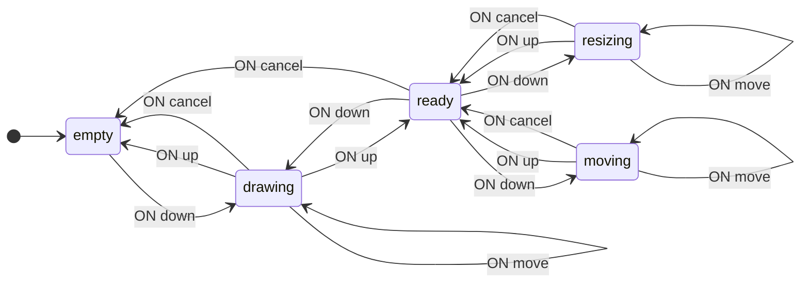
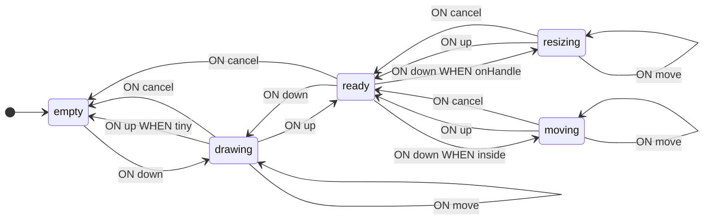
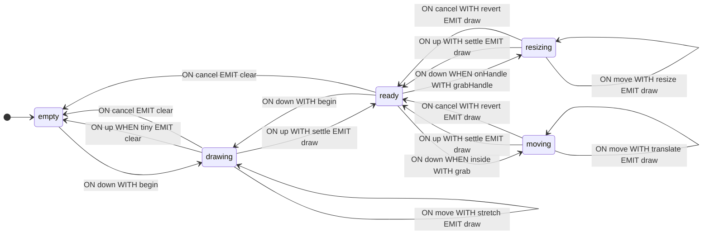

**English** · [Русский](README.ru.md)

# Selection Rectangle

A complete walkthrough from problem statement to a working state machine: managing a selection rectangle in the browser. The sections follow the order of work — first the transition graph, then context, guards and operations, then integration with the program and analysis. In the code, type definitions are usually placed before the schema, but here they are introduced as needed.

Notation and definitions are given in the [guide](https://github.com/evgkch/machjs/blob/master/packages/core/README.md). References of the form “section 4.2” point to sections of this document; the guide is referenced by section title — “README, “Transition schema””.

**Working project.** The example runs as a page — [live demo](https://evgkch.github.io/machjs/selection-rect/). Vite, plain HTML and TypeScript, no frameworks; the commands are run from the root of this repository:

```sh
npm install
npm run dev       # http://localhost:5173/selection-rect/
npm run build     # tsc --noEmit + build to dist/
```

Correspondence between files and sections of the document:

| File                                 | Sections                                       |
| ------------------------------------ | ---------------------------------------------- |
| [`src/types.ts`](src/types.ts)       | 2.1, 3 — states, events, context               |
| [`src/geometry.ts`](src/geometry.ts) | 4.2 — `norm`, `handleAt`                       |
| [`src/machine.ts`](src/machine.ts)   | 4.1, 4.2, 5 — guards, operations, schema       |
| [`src/main.ts`](src/main.ts)         | 6, 9 — markup, cursor, undo                    |

**Contents**

1. [Problem statement](#1-problem-statement)
2. [Transition graph](#2-transition-graph)
3. [Context](#3-context)
4. [Guards](#4-guards)
5. [Operations](#5-operations)
6. [Interaction from the browser](#6-interaction-from-the-browser)
7. [Machine run](#7-machine-run)
8. [Schema analysis](#8-schema-analysis)
9. [Undo drag](#9-undo-drag)

## 1. Problem statement

The task: draw a selection rectangle on the screen and control it — move and resize via corners and edges. The Escape key cancels the current action, a click on empty space clears the selection.

The same pointer movement can mean different actions: stretching a new rectangle, moving an existing one, or resizing. The specific action depends on what happened before the press and which part of the rectangle the pointer hit.

## 2. Transition graph

### 2.1 States and events

Table 1 — Machine states

| State      | Meaning                                  |
| ---------- | ---------------------------------------- |
| `empty`    | No selection                             |
| `ready`    | Rectangle is set, no action in progress  |
| `drawing`  | Stretching a new rectangle               |
| `moving`   | Moving in progress                       |
| `resizing` | Resizing in progress                     |

There are four input events: `down`, `move`, `up`, and `cancel`. The first two contain the pointer coordinates and the size of the area it is in. There are two output events: `draw` with the rectangle and `clear` without payload.

```ts
import type { IState, IEvent, Merge } from "@evgkch/machjs";

// Pure states without context.
type Q = IState<"empty" | "ready" | "drawing" | "moving" | "resizing">;

type Σ = Merge<
  IEvent<"down" | "move", Spot> | IEvent<"up"> | IEvent<"cancel">
>;
type Λ = Merge<IEvent<"draw", { rect: Rect }> | IEvent<"clear">>;
```

The types `Point`, `Rect`, `Size`, and `Spot` will be introduced in section 3, when context and geometry appear.

### 2.2. First schema

There is no executable code (functions) in it yet — only the structure of states and transitions.

```ts
import type { Schema } from "@evgkch/machjs";

const draft = {
  empty: { down: [{ to: "drawing" }] },
  ready: {
    down: [{ to: "resizing" }, { to: "moving" }, { to: "drawing" }],
    cancel: [{ to: "empty" }],
  },
  drawing: {
    move: [{ to: "drawing" }],
    up: [{ to: "empty" }, { to: "ready" }],
    cancel: [{ to: "empty" }],
  },
  moving: {
    move: [{ to: "moving" }],
    up: [{ to: "ready" }],
    cancel: [{ to: "ready" }],
  },
  resizing: {
    move: [{ to: "resizing" }],
    up: [{ to: "ready" }],
    cancel: [{ to: "ready" }],
  },
} satisfies Schema<Q, Σ, Λ>;
```

Three rules in the pair `ready` + `down` correspond to three different press locations, and two rules in `drawing` + `up` correspond to a rectangle smaller than the minimum size and all other cases. What exactly distinguishes them is not yet written.

The schema is already executable: the machine transitions between states without performing any calculations.

```ts
import { StateMachine } from "@evgkch/machjs";

const walk = new StateMachine<Q, Σ, Λ>(draft, {
  type: "empty",
  context: undefined,
});
walk.dispatch("down", { x: 0, y: 0, area: { w: 400, h: 300 } }); // { ok: true }
walk.state.type; // 'drawing'
```

### 2.3. Validation

```ts
import { validate } from "@evgkch/machjs/analysis";
import { formatIssues } from "@evgkch/machjs/formatters";

console.log(formatIssues(validate(draft, "empty")));
```

```
✗ error   cell "down" at "ready": rule 1 has no guard, so the 2 after it can never fire
✗ error   cell "up" at "drawing": rule 1 has no guard, so the 1 after it can never fire
```

Both diagnostics point to the same problem: there are multiple rules in the list but no guards, so the first rule always fires (README, “Transition schema” and “Limitations”).

```ts
import { toMermaid } from "@evgkch/machjs/formatters";

toMermaid(draft, { start: "empty", direction: "LR" });
```



## 3. Context

The guards from section 2.3 must distinguish between pressing a handle and pressing inside, so they need access to the rectangle itself.

```ts
type Point = { x: number; y: number };
type Rect = { x0: number; y0: number; x1: number; y1: number };
type Size = { w: number; h: number };
type Spot = Point & { area: Size };
```

The move offset is computed from the start point, and cancel reverts the rectangle to what it was at the start of the drag. But the context composition is **different in different states**.

Table 2 — What each state holds

| State                   | Content                                                       |
| ----------------------- | ------------------------------------------------------------- |
| `empty`                 | nothing                                                       |
| `ready`                 | `rect` — the rectangle                                        |
| `drawing`, `moving`     | `rect`, `from` (pointer at drag start), `start` (rectangle at drag start) |
| `resizing`              | same plus `handle` — the captured handle                      |

```ts
type Handle = "n" | "s" | "e" | "w" | "nw" | "ne" | "sw" | "se";

/** What any drag remembers. */
type Dragging = { rect: Rect; from: Point; start: Rect };

type Sel = Merge<
  | IState<"empty">
  | IState<"ready", { rect: Rect }>
  | IState<"drawing" | "moving", Dragging>
  | IState<"resizing", Dragging & { handle: Handle }>
>;
```

A single context with all fields at once would look shorter, but it would require an initial value for `empty` — which doesn't exist: in the empty state there is no rectangle, no grab point, no handle. It would take a placeholder — a `blank` with a zero rectangle — and such a 0×0 rectangle ends up on screen after an undo as if it were real. A state-dependent context rules the placeholder out: `empty` has no field to put it in.

This choice has a consequence: a state and its context only make sense together, so the machine returns them as a single value — `sel.state` of type `FsmState` — where `type` narrows the `context` (README, “Creating a machine and the state”).

## 4. Guards

### 4.1. Names in the schema

Guards are written in the rules by function names; their implementations are given in section 4.2.

> [!NOTE]
> Below is a sketch; the compiler would not accept it, and there is no `satisfies` intentionally: guards read the context (section 3), and entering a state with context requires a context function, so the full schema is given in section 5.3, together with the operations.

```ts
const guarded = {
  empty: { down: [{ to: "drawing" }] },
  ready: {
    down: [
      { to: "resizing", when: onHandle },
      { to: "moving", when: inside },
      { to: "drawing" },
    ],
    cancel: [{ to: "empty" }],
  },
  drawing: {
    move: [{ to: "drawing" }],
    up: [{ to: "empty", when: tiny }, { to: "ready" }],
    cancel: [{ to: "empty" }],
  },
  moving: {
    move: [{ to: "moving" }],
    up: [{ to: "ready" }],
    cancel: [{ to: "ready" }],
  },
  resizing: {
    move: [{ to: "resizing" }],
    up: [{ to: "ready" }],
    cancel: [{ to: "ready" }],
  },
};
```

Validation no longer emits diagnostics: in both lists, the unconditional rule is last, so there are no dead rules.

```ts
validate(guarded, "empty"); // []
```

Guard names appear in the diagram because they are taken from the functions themselves (README, “Labels and names”):



### 4.2. Implementation

`norm` normalises a rectangle to the form where `x0 ≤ x1` and `y0 ≤ y1`. `handleAt` returns the captured handle or `undefined`: the name is composed of vertical and horizontal halves, so a corner is obtained without enumerating eight cases.

```ts
const TOL = 6;

function norm(r: Rect): Rect {
  return {
    x0: Math.min(r.x0, r.x1),
    y0: Math.min(r.y0, r.y1),
    x1: Math.max(r.x0, r.x1),
    y1: Math.max(r.y0, r.y1),
  };
}

function handleAt(r: Rect, p: Point): Handle | undefined {
  const { x0, y0, x1, y1 } = norm(r);
  function near(a: number, b: number) {
    return Math.abs(a - b) <= TOL;
  }
  function span(v: number, a: number, b: number) {
    return v >= a - TOL && v <= b + TOL;
  }
  const v = near(p.y, y0) ? "n" : near(p.y, y1) ? "s" : "";
  const h = near(p.x, x0) ? "w" : near(p.x, x1) ? "e" : "";
  if (!v && !h) return;
  if (!span(p.x, x0, x1) || !span(p.y, y0, y1)) return;
  return (v + h) as Handle;
}

function onHandle(s: { rect: Rect }, p: Point) {
  return handleAt(s.rect, p) !== undefined;
}

function inside(s: { rect: Rect }, p: Point) {
  const { x0, y0, x1, y1 } = norm(s.rect);
  return p.x > x0 && p.x < x1 && p.y > y0 && p.y < y1;
}

function tiny(s: Dragging) {
  const r = norm(s.rect);
  return r.x1 - r.x0 < TOL || r.y1 - r.y0 < TOL;
}
```

Guards only read the context and event payload, never mutating them (README, “Limitations”).

## 5. Operations

### 5.1. Context after transition

Table 3 — Context update functions

| Function     | What it does                                              |
| ------------ | ----------------------------------------------------------- |
| `begin`      | Starts a new rectangle at the pointer point                 |
| `grab`       | Saves the point and rectangle at the start of the drag      |
| `grabHandle` | The same plus the captured handle                           |
| `stretch`    | Moves the free corner                                       |
| `translate`  | Translates by the pointer offset                            |
| `resize`     | Moves the sides named by the handle                         |
| `settle`     | Leaving a drag for `ready`: keep the rectangle, drop the rest |
| `revert`     | Restores the rectangle saved at capture                     |

The listing below also contains `shot`. It does not update the context but builds the output event's data, and so is covered in section 5.2.

```ts
function begin(_s: unknown, p: Spot): Dragging {
  const q = within(p, p.area);
  const r = { x0: q.x, y0: q.y, x1: q.x, y1: q.y };
  return { rect: r, from: q, start: r };
}

function grab(s: { rect: Rect }, p: Spot): Dragging {
  return { rect: s.rect, from: { x: p.x, y: p.y }, start: s.rect };
}

function grabHandle(s: { rect: Rect }, p: Spot): Dragging & { handle: Handle } {
  return { ...grab(s, p), handle: handleAt(s.rect, p) ?? "se" };
}

function stretch(s: Dragging, p: Spot): Dragging {
  const q = within(p, p.area);
  return { ...s, rect: { ...s.start, x1: q.x, y1: q.y } };
}

function translate(s: Dragging, p: Spot): Dragging {
  const dx = p.x - s.from.x,
    dy = p.y - s.from.y;
  return {
    ...s,
    rect: slideInto(
      {
        x0: s.start.x0 + dx,
        y0: s.start.y0 + dy,
        x1: s.start.x1 + dx,
        y1: s.start.y1 + dy,
      },
      p.area,
    ),
  };
}

function resize(s: Dragging & { handle: Handle }, p: Spot) {
  const g = s.handle,
    b = norm(s.start),
    q = within(p, p.area);
  return {
    ...s,
    rect: {
      x0: g.includes("w") ? q.x : b.x0,
      y0: g.includes("n") ? q.y : b.y0,
      x1: g.includes("e") ? q.x : b.x1,
      y1: g.includes("s") ? q.y : b.y1,
    },
  };
}

/** Leaving a drag for `ready`: keep the rectangle, drop what only a drag needed. */
function settle(s: Dragging): { rect: Rect } {
  return { rect: s.rect };
}

/** `cancel` mid-drag: back to the rectangle as it stood when the drag began. */
function revert(s: Dragging): { rect: Rect } {
  return { rect: s.start };
}

/** The `draw` payload — built from the context *after* the move. */
function shot(s: { rect: Rect }) {
  return { rect: norm(s.rect) };
}
```

The selection never goes outside the area, and it is the context-update operations that enforce this, not the drawing code. The context is what the rest of the program reads, so the constraint “rectangle inside the area” belongs to the machine itself rather than to the way it is displayed.

```ts
/** A point pulled back into the area — the edge stops at the boundary. */
function within(p: Point, a: Size): Point {
  return {
    x: Math.min(Math.max(p.x, 0), a.w),
    y: Math.min(Math.max(p.y, 0), a.h),
  };
}

/** A rectangle shifted inward preserving its size — it is pushed against the boundary. */
function slideInto(r: Rect, a: Size): Rect {
  const n = norm(r);
  const dx = n.x0 < 0 ? -n.x0 : n.x1 > a.w ? a.w - n.x1 : 0;
  const dy = n.y0 < 0 ? -n.y0 : n.y1 > a.h ? a.h - n.y1 : 0;
  return dx === 0 && dy === 0
    ? r
    : { x0: r.x0 + dx, y0: r.y0 + dy, x1: r.x1 + dx, y1: r.y1 + dy };
}
```

Constraining only the pointer point would be insufficient; this is most evident in `translate`: if the rectangle is taken by the middle and dragged, the pointer always stays inside the area while the far corner moves out. A moved rectangle keeps its size and stops at the boundary: the constraint applies to the whole rectangle and not to a single one of its points.

Each function returns a new object, never mutating the passed one (README, “Limitations”).

### 5.2. Output events

The `draw` event carries the rectangle, so its `emit` is a pair — the name and a packer (README, “Transition schema”). The `clear` event carries no payload, so its `emit` is a bare name.

The data for `draw` is built by `shot` from the listing in section 5.1. It is the one function in the example that reads the context *after* the transition.

### 5.3. Full schema

```ts
import { StateMachine } from "@evgkch/machjs";

const sel = new StateMachine<Sel, Σ, Λ>(
  {
    empty: { down: [{ to: ["drawing", begin] }] },
    ready: {
      down: [
        { to: ["resizing", grabHandle], when: onHandle },
        { to: ["moving", grab], when: inside },
        { to: ["drawing", begin] },
      ],
      cancel: [{ to: "empty", emit: "clear" }],
    },
    drawing: {
      move: [{ to: ["drawing", stretch], emit: ["draw", shot] }],
      up: [
        { to: "empty", when: tiny, emit: "clear" },
        { to: ["ready", settle], emit: ["draw", shot] },
      ],
      cancel: [{ to: "empty", emit: "clear" }],
    },
    moving: {
      move: [{ to: ["moving", translate], emit: ["draw", shot] }],
      up: [{ to: ["ready", settle], emit: ["draw", shot] }],
      cancel: [{ to: ["ready", revert], emit: ["draw", shot] }],
    },
    resizing: {
      move: [{ to: ["resizing", resize], emit: ["draw", shot] }],
      up: [{ to: ["ready", settle], emit: ["draw", shot] }],
      cancel: [{ to: ["ready", revert], emit: ["draw", shot] }],
    },
  },
  { type: "empty", context: undefined },
);
```

## 6. Interaction from the browser

### 6.1. Markup and subscriptions

```html
<div
  id="area"
  style="position:relative; width:400px; height:300px; border:1px solid #ccc"
>
  <div
    id="box"
    style="position:absolute; display:none;
                       border:1px solid #4f46e5; background:#4f46e522"
  ></div>
</div>
```

Coordinates are rounded once, at the input: `clientX` and the bounding rectangle are fractional when the page is zoomed or on HiDPI screens, and everything downstream — context, guard tolerance, CSS borders — is computed from that point.

```ts
const area = document.getElementById("area")!;
const box = document.getElementById("box")!;

function at(e: PointerEvent): Spot {
  const b = area.getBoundingClientRect();
  return {
    x: Math.round(e.clientX - b.left),
    y: Math.round(e.clientY - b.top),
    area: { w: Math.round(b.width), h: Math.round(b.height) },
  };
}

area.addEventListener("pointerdown", (e) => {
  area.setPointerCapture(e.pointerId);
  sel.dispatch("down", at(e));
});
area.addEventListener("pointermove", (e) => sel.dispatch("move", at(e)));
area.addEventListener("pointerup", () => sel.dispatch("up"));
// A pointer stolen by the browser won't send an `up` event. `cancel` is already in
// the alphabet and is accepted by every dragging state, so this case is covered by a single line.
area.addEventListener("pointercancel", () => sel.dispatch("cancel"));
addEventListener("keydown", (e) => {
  if (e.key === "Escape") sel.dispatch("cancel");
});

sel.rx.on("draw", ({ rect }) =>
  Object.assign(box.style, {
    display: "block",
    left: `${rect.x0}px`,
    top: `${rect.y0}px`,
    width: `${rect.x1 - rect.x0}px`,
    height: `${rect.y1 - rect.y0}px`,
  }),
);
sel.rx.on("clear", () => {
  box.style.display = "none";
});
```

There are no checks for the current state in the handlers. The `pointermove` handler always sends `move`, but the `ready` state has no such rule, so `dispatch` answers `UNHANDLED` without changing state (README, “Executing a transition: `dispatch` and `can`”).

### 6.2. Cursor

The cursor shows what action will be performed on press. The same choice is written in the schema guards, so the same `handleAt` and `inside` are used. The state is checked first: in `empty` there is no rectangle, and after checking the `type` discriminator the context fields are accessible.

```ts
function cursor(at: { context: { rect: Rect } }, p: Point) {
  const g = handleAt(at.context.rect, p);
  return g ? `${g}-resize` : inside(at.context, p) ? "move" : "crosshair";
}

area.addEventListener("pointermove", (e) => {
  const p = at(e);
  sel.dispatch("move", p);
  const now = sel.state;
  if (now.type === "ready") area.style.cursor = cursor(now, p);
});
```

For a rectangle 20,20 – 120,80 in state `ready`:

```
  (20,20)      nw-resize
  (70,80)      s-resize
  (120,50)     e-resize
  (70,50)      move
  (300,300)    crosshair
```

The handle names match the CSS cursor names: the `Handle` type uses compass directions, and the corresponding CSS property is formed by simple substitution.

## 7. Machine run

The run is performed by sending coordinates directly, without using the browser; the markup and subscriptions from section 6.1 are not involved. After each event, the state and rectangle are shown.

```
down 20,20  (empty)          drawing   20,20 0×0
move 120,80                  drawing   20,20 100×60
up                           ready     20,20 100×60
down 70,50  (inside)         moving    20,20 100×60
move 90,70                   moving    40,40 100×60
up                           ready     40,40 100×60
down 140,100 (corner se)     resizing  40,40 100×60
move 200,160                 resizing  40,40 160×120
cancel                       ready     40,40 100×60
down 40,70  (edge w)         resizing  40,40 100×60
move 10,70                   resizing  10,40 130×60
up                           ready     10,40 130×60
down 300,300 (outside)       drawing   300,300 0×0
up  (without movement)       empty     —
```

The `cancel` event in the middle of resizing reverted the rectangle to what it was at the time of capture: that is stored in the `start` field. Grabbing the `w` edge moved only the left side because `resize` changes the coordinates named by the handle. The `up` event without movement produced a zero-size rectangle: the `tiny` guard fired, and the selection was cleared.

## 8. Schema analysis

### 8.1. Diagram

The same schema as in sections 2.3 and 4.1, but now with operations and output events.

```ts
toMermaid(sel.schema, { start: "empty", direction: "LR" });
```



All operations here are named functions, so `?` does not appear in the labels: the formatter takes the name from the function itself (README, “Labels and names”). Edges from `empty` have no `WITH` label — that state stores nothing, so there is nothing to build.

### 8.2. Validation

```ts
validate(sel.schema, "empty"); // []
```

There are no unreachable states in the schema, every state has an outgoing path, and unconditional rules are last — no dead rules appear.

### 8.3. Schema without code

```ts
import { toRules } from "@evgkch/machjs/formatters";

toRules(JSON.parse(JSON.stringify(sel)));
```

```
FROM empty    ON down                 TO drawing  WITH begin
FROM ready    ON down   WHEN onHandle TO resizing WITH grabHandle
FROM ready    ON down   WHEN inside   TO moving   WITH grab
FROM ready    ON down                 TO drawing  WITH begin
FROM ready    ON cancel               TO empty                    EMIT clear
FROM drawing  ON move                 TO drawing  WITH stretch    EMIT draw  BY shot
FROM drawing  ON up     WHEN tiny     TO empty                    EMIT clear
FROM drawing  ON up                   TO ready    WITH settle     EMIT draw  BY shot
FROM drawing  ON cancel               TO empty                    EMIT clear
FROM moving   ON move                 TO moving   WITH translate  EMIT draw  BY shot
FROM moving   ON up                   TO ready    WITH settle     EMIT draw  BY shot
FROM moving   ON cancel               TO ready    WITH revert     EMIT draw  BY shot
FROM resizing ON move                 TO resizing WITH resize     EMIT draw  BY shot
FROM resizing ON up                   TO ready    WITH settle     EMIT draw  BY shot
FROM resizing ON cancel               TO ready    WITH revert     EMIT draw  BY shot
```

The output matches `toRules(sel.schema)` line for line: there is no code in JSON, but the *name* of each operation survives, and only the name is printed in a rule line. The `WHEN` column also survives, so during validation of the serialized schema, the second `up` rule is still not considered dead (README, “Graph and JSON representation”).

## 9. Undo drag

Undo here means rolling back the entire drag, not a single `move` event. The built-in `history` records every transition, so one undo step would revert one pointer sample. `log` hands the full transition object to a sink of your own, so a record is pushed onto a stack under a condition.

```ts
import type { FsmState } from "@evgkch/machjs";
import { log } from "@evgkch/machjs/debug";

const DRAG = ["drawing", "moving", "resizing"];
const undo: { at: FsmState<Sel> }[] = [];

log(sel, (t) => {
  if (DRAG.includes(t.target.type) && !DRAG.includes(t.source.type))
    undo.push({ at: t.source });
});
```

The condition reads the `source` and `target` of a single transition, so a record is pushed only on the step *into* a drag — one per operation, no matter how many `move` events it contains.

What is stored is `t.source` itself — a value of type `FsmState`, i.e. both the state and its context together. The rectangle alone is not enough; this is evident on the very first undo: that drag started in `empty`, so it must return to `empty`. If we restore only the rectangle while staying in `ready`, a 0×0 selection is left on the page, and no state in the schema corresponds to it.

```ts
const back = undo.pop()!;
sel.restore(back.at);
```

`restore` is not a transition: nothing is sent, no output event occurs, `TRANSITION` is not published (README, “Limitations”). This is why undo does not go into its own stack — but the subscriptions that render the page do not fire either, so the view after `restore` is updated manually: the box (or its absence in `empty`) and the readouts.

```
down 20,20 → drag → up       ready     20,20 100×60 | stack: 1
grab middle → drag            ready     60,60 100×60 | stack: 2
undo                          ready     20,20 100×60 | stack: 1
undo                          empty     —            | stack: 0
```

## 10. The machine on the page

At the bottom of the page the automaton is drawn by the widgets of [`@evgkch/machjs-inspector`](https://github.com/evgkch/machjs/tree/master/packages/inspector): the legend of states, the transition diagram and the run. `<machjs-desk>` binds them — it wires the widgets to one subject and gives each a switch:

```ts
import { MachjsDesk, fromMachine } from "@evgkch/machjs-inspector/ui";

const desk = new MachjsDesk();
desk.wiring = { subject: fromMachine(sel) };
board.append(desk);
desk.enroll(diagram); // wiring, drawing and a switch
```

The widgets subscribe to the machine themselves: every transition is drawn with no code on the page.
