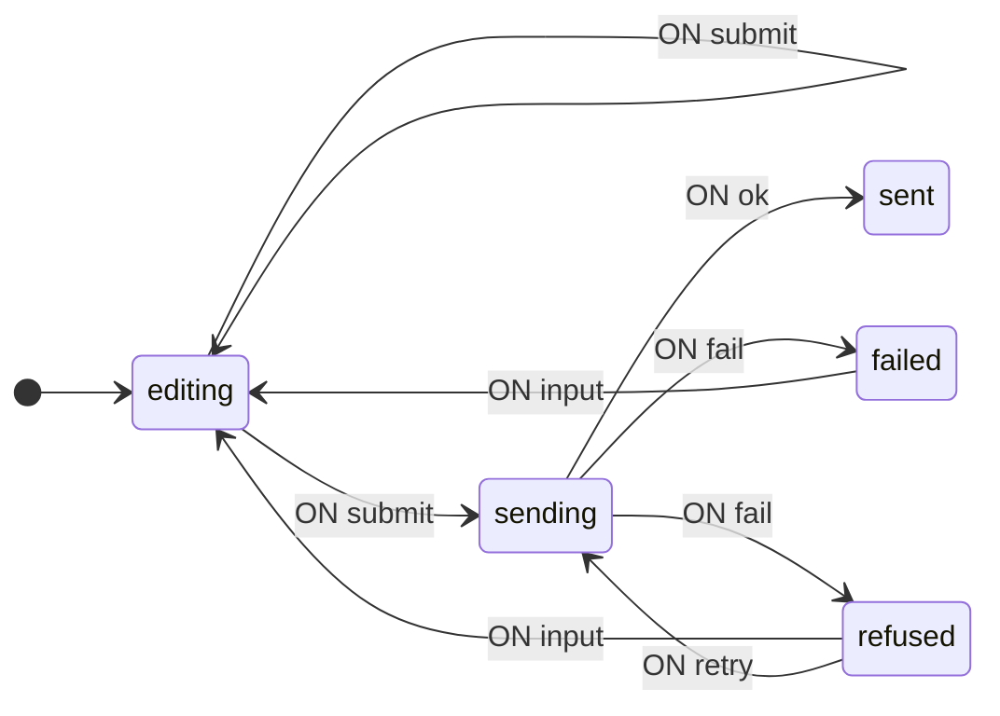
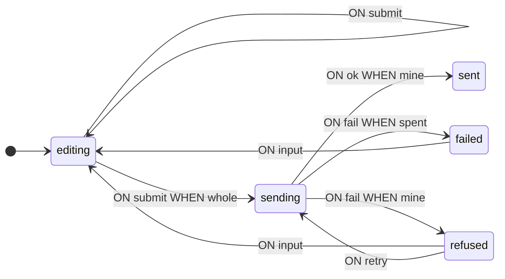
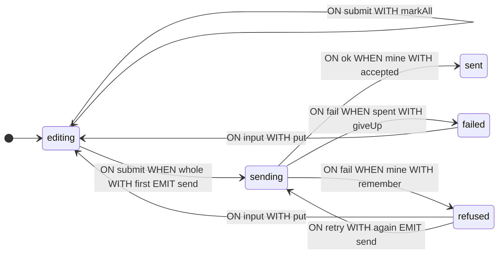

**English** · [Русский](README.ru.md)

# A form over a flaky wire

A complete walkthrough from the problem statement to the finished machine: a three-field form, a server that answers late — and delivers refusals twice — a budget of three attempts, and answers told apart by their attempt number. The sections follow the working order: the transition graph first, then the context, the guards and the operations, then the browser wiring and the analysis. In code the type definitions usually stand before the schema; here they appear as they become necessary.

Notation and definitions are given in the [manual](https://github.com/evgkch/machjs/blob/master/README.md). References like “section 5.2” point at sections of this document; the manual is referenced by section name — “README, ‘The transition schema’”.

**Working project.** The example opens as a page — [live version](https://evgkch.github.io/machjs/form/). Vite, plain HTML and TypeScript, no framework; the commands run from the root of this repository:

```sh
npm install
npm run dev       # http://localhost:5173/form/
npm run build     # tsc --noEmit + build to dist/
```

Files against the sections of this document:

| File                               | Sections                                  |
| ---------------------------------- | ----------------------------------------- |
| [`src/types.ts`](src/types.ts)     | 2.1, 3 — states, events, context          |
| [`src/machine.ts`](src/machine.ts) | 4, 5 — guards, operations, the schema     |
| [`src/main.ts`](src/main.ts)       | 6, 9 — subscriptions, the server, drawing |

**Contents**

1. [Problem statement](#1-problem-statement)
2. [Transition graph](#2-transition-graph)
3. [Context](#3-context)
4. [Guards](#4-guards)
5. [Operations](#5-operations)
6. [Interaction from the browser](#6-interaction-from-the-browser)
7. [Machine run](#7-machine-run)
8. [Schema analysis](#8-schema-analysis)
9. [The machine on the page](#9-the-machine-on-the-page)

## 1. Problem statement

The task: an order form of three fields — a name, an email address, an amount. The name is non-empty, the address matches an email-address pattern, the amount is an integer from 1 to 1000. The button sends the order to a server; the server answers late and may refuse. The wire is flaky: every refusal is delivered twice, and the copy arrives when the order may already be on its way again. Three attempts are budgeted; after the third refusal the attempts stop.

The same keystroke means different things: while the form is being edited it changes a field; while the order is with the server the fields are locked; after a refusal it takes the form back to editing. The server's answer means different things too: an answer to the current attempt is a transition, an answer to a bygone one is dropped. What happens depends on the phase and on the attempt number, not on the field's content.

## 2. Transition graph

### 2.1 States and events

Table 1 — The machine's states

| State     | Meaning                                      |
| --------- | -------------------------------------------- |
| `editing` | The form is being edited                     |
| `sending` | An attempt is with the server, no answer yet |
| `refused` | The server refused; attempts remain         |
| `failed`  | The server refused; the budget is spent      |
| `sent`    | The order is accepted                        |

Six input events: four from the user — `input` with a field name and its new value, `leave` with the name of the field left, `submit` and `retry` with no payload — and two from the server. An answer's payload holds the number of the attempt it answers: `ok` — the number and a receipt, `fail` — the number and the reason. One output event: `send`, with the attempt number and the order's fields. The attempt number is a ticket: it is written into `send` and comes back in the answer.

```ts
import type { IState, IEvent, Merge } from "@evgkch/machjs";

export type Fields = { name: string; email: string; amount: string };
export type Field = keyof Fields;

// Bare states with no context — the context arrives in section 3.
type Phase = IState<"editing" | "sending" | "refused" | "failed" | "sent">;

export type Σ = Merge<
  | IEvent<"input", { field: Field; value: string }>
  | IEvent<"leave", { field: Field }>
  | IEvent<"submit">
  | IEvent<"ok", { attempt: number; receipt: string }>
  | IEvent<"fail", { attempt: number; why: string }>
  | IEvent<"retry">
>;

export type Λ = IEvent<"send", { attempt: number; fields: Fields }>;
```

### 2.2. The first schema

No executable code (no functions) in it yet — only the structure of states and transitions.

```ts
import type { Schema } from "@evgkch/machjs";

const draft = {
  editing: {
    input: [{ to: "editing" }],
    leave: [{ to: "editing" }],
    submit: [{ to: "sending" }, { to: "editing" }],
  },
  sending: {
    ok: [{ to: "sent" }],
    fail: [{ to: "failed" }, { to: "refused" }],
  },
  refused: { input: [{ to: "editing" }], retry: [{ to: "sending" }] },
  failed: { input: [{ to: "editing" }] },
  sent: {},
} satisfies Schema<Phase, Σ, Λ>;
```

The rule pairs match the forks of the task. `editing` + `submit`: a whole form goes to the server, an incomplete one stays in editing. `sending` + `fail`: the last allowed refusal leads to `failed`, an intermediate one to `refused`. What tells the rules of each pair apart is not written yet. There is no `input` rule in `sending` — while the order is with the server, the form is not edited; `sent` has no transitions out.

The schema already runs: the machine moves between states, computing nothing.

```ts
import { StateMachine } from "@evgkch/machjs";

const walk = new StateMachine<Phase, Σ, Λ>(draft, {
  type: "editing",
  context: undefined,
});
walk.dispatch("submit"); // { ok: true }
walk.state.type; // 'sending'
walk.dispatch("fail", { attempt: 1, why: "refused" }); // { ok: true }
walk.state.type; // 'failed'
```

The run shows both flaws of the draft: `submit` moved the machine to `sending` on an empty form, and the very first refusal moved it to `failed`, past `refused` — both pairs are unguarded, so the first rule always fires.

### 2.3. Validation

```ts
import { validate } from "@evgkch/machjs/analysis";
import { formatIssues } from "@evgkch/machjs/formatters";

console.log(formatIssues(validate(draft, "editing")));
```

```
⚠ warning node "sent" has no outgoing transitions
✗ error   cell "submit" at "editing": rule 1 has no guard, so the 1 after it can never fire
✗ error   cell "fail" at "sending": rule 1 has no guard, so the 1 after it can never fire
```

Both errors are what the run showed: the `submit` and `fail` pairs have no guards, the first rule always fires, the second is dead (README, “The transition schema” and “Limitations”). The guards arrive in section 4.

The warning about `sent` is intended: it is a final state, and the finished schema will have no way out of it either (section 8.2).

```ts
import { toMermaid } from "@evgkch/machjs/formatters";

toMermaid(draft, { start: "editing", direction: "LR" });
```



## 3. Context

The guards of section 2.3 have to tell a whole form from an incomplete one, and an answer to the current attempt from a foreign one. So they need the form's fields with the fault list, and the number of the attempt now with the server. The context differs **from state to state**.

Table 2 — What each state holds

| State     | Content                                                         |
| --------- | --------------------------------------------------------------- |
| `editing` | `fields`, `faults` — the errors, `touched` — the leave marks    |
| `sending` | the same plus `attempt` — the attempt's number, its ticket      |
| `refused` | as in `sending`, plus `why` — the refusal's reason              |
| `failed`  | as in `editing`, plus `why`; no counter — nothing left to count |
| `sent`    | `fields` and `receipt` — the server's receipt                   |

```ts
/** One thing wrong with one field, said for the reader. */
export type Fault = { field: Field; say: string };

/** Which fields the reader has left at least once — a fault is shown only for those. */
export type Touched = Readonly<Record<Field, boolean>>;

/** The form as it is being filled: the fields, what is wrong right now, and what to say it for. */
export type Filling = {
  fields: Fields;
  faults: readonly Fault[];
  touched: Touched;
};

/** An attempt on the wire or refused: the same form and the attempt's number — its ticket. */
export type InFlight = Filling & { attempt: number };

/** The server refused this attempt: the reason beside the count. */
export type Refused = InFlight & { why: string };

/** The budget is spent: the form and the last reason; nothing left to count. */
export type Failed = Filling & { why: string };

export type Q = Merge<
  | IState<"editing", Filling>
  | IState<"sending", InFlight>
  | IState<"refused", Refused>
  | IState<"failed", Failed>
  | IState<"sent", { fields: Fields; receipt: string }>
>;
```

A single context with every field at once would look shorter, but each of the extra fields makes sense only somewhere: `attempt` only while a send is on, `why` only after a refusal, `receipt` only after acceptance. Elsewhere they would hold `null`, and “no refusal happened” would differ from “a refusal with an empty reason” by convention only. A context bound to the state rules the stray fields out: `editing` has none of them, and a context function entering `refused` without a reason does not compile.

`sending` extends `Filling` with the attempt number: the guards `mine` and `spent` compare it (section 4.2), and the same number is written into `send` (section 5.2). `failed` keeps no number: the budget is spent, there is nothing left to compare — the form and the last reason remain. `sent` keeps only the sent fields and the receipt: the fault list and the leave marks belong to editing, and the editing is over.

A state and its context make sense only together, so the machine returns them as one value — `form.state` of type `FsmState` — where `type` narrows `context` (README, “Creating a machine, and the state”).

## 4. Guards

### 4.1. Names in the schema

Guards go into the rules by function name; the implementation is in section 4.2.

> [!NOTE]
> Below is a sketch: the compiler will not take it, and it has no `satisfies` on purpose — the guards read the context (section 3), and entering a state with context requires a context function, so the full schema appears in section 5.3, operations and all. This shows only where the guard names stand in the rules; the other cells do not differ from the draft.

```ts
const guarded = {
  editing: {
    input: [{ to: "editing" }],
    leave: [{ to: "editing" }],
    submit: [{ when: whole, to: "sending" }, { to: "editing" }],
  },
  sending: {
    ok: [{ when: mine, to: "sent" }],
    fail: [
      { when: spent, to: "failed" },
      { when: mine, to: "refused" },
    ],
  },
  // refused, failed, sent — as in section 2.2
};
```

The dead-rule errors are gone: in the `submit` pair the unguarded rule stands last, and in the `fail` pair both rules carry guards. The intended warning about `sent` remains.

```ts
formatIssues(validate(guarded, "editing"));
```

```
⚠ warning node "sent" has no outgoing transitions
```

The guard names reach the diagram because they are taken from the functions themselves (README, “Labels and names”): the rules within each pair are now told apart.



### 4.2. Implementation

```ts
/** Attempts the budget allows before the machine gives the form up. */
export const TRIES = 3;

/** Nothing is wrong: the one condition `submit` fires under. */
export function whole(c: Filling): boolean {
  return c.faults.length === 0;
}

/** The answer is to the attempt in flight — any other is dropped. */
function mine(c: InFlight, p: { attempt: number }): boolean {
  return p.attempt === c.attempt;
}

/** The answer is to the attempt in flight, and the budget allows no further one. */
function spent(c: InFlight, p: { attempt: number }): boolean {
  return p.attempt === c.attempt && c.attempt >= TRIES;
}
```

`whole` reads the ready-made list from the context and computes nothing: the operations maintain the list (section 5). There is no separate “validate now” call on submit — the page and the panel's counter read the same `faults` field.

`mine` and `spent` read both arguments — the context and the event's payload: a guard receives the two of them (README, “The transition schema”). Order matters in the `fail` pair: `spent` is the narrower case of `mine` and stands first. An answer that passes neither guard matches no rule: `dispatch` answers `REJECTED`, the state does not change. Declining a transition is as regular an outcome as taking one (README, “Formal definition”), and it is exactly how duplicates and stragglers are dropped.

Guards only read the context and the event payload, never mutating them (README, “Limitations”).

## 5. Operations

### 5.1. The context after a move

Table 3 — Context update functions

| Function   | What it does                                         |
| ---------- | ---------------------------------------------------- |
| `put`      | Replaces a field and re-reads the fault list         |
| `mark`     | Marks the left field in `touched`                    |
| `markAll`  | Marks every field: `submit` on an incomplete form    |
| `first`    | Starts the count: the same form, attempt 1           |
| `again`    | The same form, the attempt number one higher         |
| `remember` | Adds the refusal's reason to the attempt             |
| `giveUp`   | Drops the counter; the form and the last reason stay |
| `accepted` | Keeps the fields and the server's receipt            |

The listing below also carries `faultsOf` — a pure function from the fields to the fault list, called by `put`. The function `ticketed` does not update the context but builds the output event's payload, so it is described in section 5.2.

```ts
/** What is wrong with the fields, read fresh on every keystroke. */
export function faultsOf(f: Fields): Fault[] {
  return [
    ...(f.name.trim() === ""
      ? [{ field: "name", say: "a name is required" } as const]
      : []),
    ...(/^\S+@\S+\.\S+$/.test(f.email)
      ? []
      : [{ field: "email", say: "not an address" } as const]),
    ...(/^\d+$/.test(f.amount) && +f.amount >= 1 && +f.amount <= 1000
      ? []
      : [{ field: "amount", say: "a number, 1 to 1000" } as const]),
  ];
}

/** One keystroke folded in: the field replaced, the faults re-read, the touches kept. */
function put(c: Filling, p: { field: Field; value: string }): Filling {
  const fields = { ...c.fields, [p.field]: p.value };
  return { fields, faults: faultsOf(fields), touched: c.touched };
}

/** The reader left the field: from now on its fault is said out loud. */
function mark(c: Filling, p: { field: Field }): Filling {
  return { ...c, touched: { ...c.touched, [p.field]: true } };
}

/** A submit on a faulty form says every fault out loud. */
function markAll(c: Filling): Filling {
  return { ...c, touched: { name: true, email: true, amount: true } };
}

/** The first attempt: the ticket starts at 1. */
function first(c: Filling): InFlight {
  return { ...c, attempt: 1 };
}

/** The next attempt: the same form, the ticket advanced. */
function again(c: Refused): InFlight {
  return {
    fields: c.fields,
    faults: c.faults,
    touched: c.touched,
    attempt: c.attempt + 1,
  };
}

/** The refusal, remembered beside the attempt. */
function remember(c: InFlight, p: { attempt: number; why: string }): Refused {
  return { ...c, why: p.why };
}

/** The budget is spent: the count is dropped, the last reason stays. */
function giveUp(c: InFlight, p: { attempt: number; why: string }): Failed {
  return { fields: c.fields, faults: c.faults, touched: c.touched, why: p.why };
}

/** An accepted order: the fields and the server's receipt; nothing of the editing. */
function accepted(
  c: InFlight,
  p: { attempt: number; receipt: string },
): { fields: Fields; receipt: string } {
  return { fields: c.fields, receipt: p.receipt };
}
```

The fault list is context data, not the result of a separate “check now” call: `put` calls `faultsOf` on every keystroke and lays the result beside the fields. A fault is recorded from the first keystroke; it is shown only for fields marked in `touched` (section 6.3).

Every function returns a new object rather than mutating the given one (README, “Limitations”). `again` and `giveUp` build the object explicitly, field by field: a `...c` spread would carry the previous refusal's `why` into the new attempt.

### 5.2. The output event

The `send` event holds the attempt number and the fields, so its `emit` is a pair: a name and a payload function (README, “The transition schema”).

```ts
/** What `send` carries: the ticket and the fields. Reads the context after the move. */
function ticketed(c: InFlight): { attempt: number; fields: Fields } {
  return { attempt: c.attempt, fields: c.fields };
}
```

`ticketed` receives the context after the move: by then `first` or `again` has written the attempt number, and that is the number `send` goes out with. One function covers both transitions into `sending`.

### 5.3. The schema in full

```ts
import { StateMachine } from "@evgkch/machjs";

const EMPTY: Fields = { name: "", email: "", amount: "" };
const UNTOUCHED: Touched = { name: false, email: false, amount: false };

export const form = new StateMachine<Q, Σ, Λ>(
  {
    editing: {
      input: [{ to: ["editing", put] }],
      leave: [{ to: ["editing", mark] }],
      submit: [
        { when: whole, to: ["sending", first], emit: ["send", ticketed] },
        { to: ["editing", markAll] },
      ],
    },
    sending: {
      ok: [{ when: mine, to: ["sent", accepted] }],
      // The order matters: `spent` is the narrower case and stands first. An answer that
      // passes neither guard matches no rule — that is the drop.
      fail: [
        { when: spent, to: ["failed", giveUp] },
        { when: mine, to: ["refused", remember] },
      ],
    },
    refused: {
      // Touching any field is editing again; the refusal's reason stays behind.
      input: [{ to: ["editing", put] }],
      retry: [{ to: ["sending", again], emit: ["send", ticketed] }],
    },
    failed: {
      // Editing resets the budget: the next submit is a first attempt again.
      input: [{ to: ["editing", put] }],
    },
    sent: {},
  },
  {
    type: "editing",
    context: { fields: EMPTY, faults: faultsOf(EMPTY), touched: UNTOUCHED },
  },
);
```

The initial context is built by the same `faultsOf`: the empty form's fault list is recorded before the first event. The `input` rule in `refused` and `failed` is the one from `editing` — touching any field takes the form back to work, `put` does not carry the refusal's reason over, and the next `submit` starts the count anew: `first`, attempt 1.

## 6. Interaction from the browser

### 6.1. Markup and subscriptions

Each field has a label, an input and a paragraph for its fault; the counter, the phase, the attempt number, the server's verdict and the wire journal are permanent parts of the panel.

```html
<div class="row">
  <label for="name">Name</label>
  <input id="name" type="text" autocomplete="off" />
  <p class="fault" data-for="name"></p>
</div>
```

Input goes to the machine unprocessed; leaving a field is an event too.

```ts
for (const [field, box] of boxes) {
  box.addEventListener("input", () =>
    form.dispatch("input", { field, value: box.value }),
  );
  box.addEventListener("blur", () => form.dispatch("leave", { field }));
}
submit.addEventListener("click", () => form.dispatch("submit"));
retry.addEventListener("click", () => form.dispatch("retry"));
```

No handler checks the current state. In `sending` there is no `input` rule, and `dispatch` answers `UNHANDLED` without changing the state (README, “Running a transition: `dispatch` and `can`”).

### 6.2. The server

There is no server in the example — the page itself is subscribed to `send`, and the page answers. Each line of the wire journal is one message on the line; the “taken” or “dropped” mark on an answer is the `ok` field of `dispatch`'s verdict: `ok: false` when no rule matched the message.

```ts
/** One line per message on the wire; for an answer, the machine's own boolean says the rest. */
function line(text: string): void {
  const li = document.createElement("li");
  li.textContent = text;
  wire.append(li);
  wire.scrollTop = wire.scrollHeight;
}

// `send` comes out of the machine with its ticket; the answer carries the ticket back.
// `setTimeout`, because a nested `dispatch` is forbidden; the delays stand in for the network.
form.rx.on("send", ({ attempt, fields }) => {
  line(`▸ send #${attempt}`);
  const deliver = (ms: number, label: string, answer: () => boolean) =>
    setTimeout(() => line(`◂ ${label} — ${answer() ? "taken" : "dropped"}`), ms);
  if (+fields.amount > 900) {
    const why = `amounts over 900 are refused — got ${fields.amount}`;
    // The wire is flaky: every refusal is delivered twice. The copy arrives when the machine
    // may already be on the next attempt — no rule matches a foreign ticket.
    deliver(700, `fail #${attempt}`, () =>
      form.dispatch("fail", { attempt, why }),
    );
    deliver(2100, `fail #${attempt} (copy)`, () =>
      form.dispatch("fail", { attempt, why }),
    );
  } else {
    deliver(700, `ok #${attempt}`, () =>
      form.dispatch("ok", { attempt, receipt: `ord-${fields.amount}-${attempt}` }),
    );
  }
});
```

The refusal is delivered twice: the copy arrives 2.1 seconds in, when after a quick `retry` the server already holds the next attempt. No rule takes the copy — `mine` and `spent` compare the ticket (section 4.2) — and the journal prints “dropped”. The page checks nothing along the way: both taking and dropping are recorded off the boolean of `dispatch`.

### 6.3. Drawing

One function, run after every transition, reads the machine and nothing else:

```ts
import { TRANSITION } from "@evgkch/machjs";

function paint(): void {
  const s = form.state;
  const fields = s.context.fields;
  const wrong = s.type === "sent" ? [] : s.context.faults;
  const said = s.type === "sent" ? null : s.context.touched;
  for (const [field, box] of boxes) {
    if (box.value !== fields[field]) box.value = fields[field];
    // Writable exactly while the machine has a rule for it.
    box.readOnly = !form.can("input", { field, value: box.value });
    // A fault exists as soon as it is typed; it is shown after the field is left.
    const fault = wrong.find((f) => f.field === field);
    const say = fault !== undefined && said !== null && said[field];
    faults.get(field)!.textContent = say ? fault.say : "";
  }
  const spoken = wrong.filter((f) => said !== null && said[f.field]);
  const asked = said === null || Object.values(said).some(Boolean);
  countOut.textContent = !asked
    ? "—"
    : spoken.length === 0
      ? "none"
      : String(spoken.length);

  // The ticket, while there is one to show: in flight and after a refusal.
  attemptOut.textContent =
    s.type === "sending" || s.type === "refused"
      ? `${s.context.attempt} / ${TRIES}`
      : s.type === "failed"
        ? "spent"
        : "—";

  submit.disabled = !form.can("submit");
  retry.disabled = !form.can("retry");

  verdict.textContent =
    s.type === "refused"
      ? s.context.why
      : s.type === "failed"
        ? `gave up after ${TRIES} attempts — ${s.context.why}`
        : s.type === "sent"
          ? `sent — receipt ${s.context.receipt}`
          : "—";
}

form.rx.on(TRANSITION, paint);
paint();
```

No branch checks the phase: a field is writable exactly while the machine holds an `input` rule for it — the same `can` check that `dispatch` performs. Remove the rule from the schema and the field turns read-only.

The Submit button is not disabled on an incomplete form: `editing` has a `submit` rule either way, `can("submit")` is true, and the click shows the faults (the `editing → editing` transition, section 7).

The counter counts only the faults said out loud: “—” on a pristine form, a field's fault after it is left, all of them after a `submit` on an incomplete form. The attempt number shows while there is one to show: `1 / 3` in flight and after a refusal, “spent” after the budget is gone, “—” otherwise. The server's verdict is one permanent block: “—”, the refusal's reason, or the receipt; the page's height does not jump with the answer.

## 7. Machine run

In the run the events go into the machine directly, with no browser; the markup and subscriptions of section 6 are not involved. After every event the `dispatch` result, the state and a note are shown.

```
submit  (form empty)       true   editing   all three faults shown
name → anna                true   editing   the name fault clears
email → anna@x.dev         true   editing
amount → 950               true   editing   no faults left
submit                     true   sending   attempt 1, send #1
fail #1                    true   refused   the reason in the context
retry                      true   sending   attempt 2, send #2
fail #1 (copy)             false  sending   a foreign ticket — dropped
fail #2                    true   refused
retry                      true   sending   attempt 3, send #3
fail #3                    true   failed    the budget is spent
amount → 300               true   editing   editing after failed
submit                     true   sending   the count anew: attempt 1, send #1
ok #1                      true   sent      the fields and the receipt
```

The first `submit` is an `editing → editing` transition: the second rule fired, `markAll` marked every field. The failed try is a transition like any other: the run records it, and the diagram gives the event two lines.

The `fail #1 (copy)` line is the only one with `false`: by then the server holds attempt 2, the copy's ticket passes neither `spent` nor `mine`, there is no transition, and the state does not change. `fail #3` passes `spent`: the third refusal moves the machine to `failed`. After the amount is edited the count starts anew, and `ok #1` ends the run. The final state:

```json
{
  "type": "sent",
  "context": {
    "fields": { "name": "anna", "email": "anna@x.dev", "amount": "300" },
    "receipt": "ord-300-1"
  }
}
```

## 8. Schema analysis

### 8.1. The diagram

The same schema as in sections 2.3 and 4.1, now with the operations and the output event.

```ts
toMermaid(form.schema, { start: "editing", direction: "LR" });
```



Every operation here is a named function, so no `?` appears in the labels: the formatter takes the name from the function itself (README, “Labels and names”).

### 8.2. Validation

```ts
formatIssues(validate(form.schema, "editing"));
```

```
⚠ warning node "sent" has no outgoing transitions
```

The errors of section 2.3 are cleared by the guards: in the `submit` pair the unguarded rule stands last, in the `fail` pair both rules carry guards. The warning about `sent` remains: it is a final state, and it has no way out on purpose.

### 8.3. The schema without code

```ts
import { toRules } from "@evgkch/machjs/formatters";

toRules(JSON.parse(JSON.stringify(form)));
```

```
FROM editing ON input             TO editing WITH put
FROM editing ON leave             TO editing WITH mark
FROM editing ON submit WHEN whole TO sending WITH first    EMIT send BY ticketed
FROM editing ON submit            TO editing WITH markAll
FROM sending ON ok     WHEN mine  TO sent    WITH accepted
FROM sending ON fail   WHEN spent TO failed  WITH giveUp
FROM sending ON fail   WHEN mine  TO refused WITH remember
FROM refused ON input             TO editing WITH put
FROM refused ON retry             TO sending WITH again    EMIT send BY ticketed
FROM failed  ON input             TO editing WITH put
```

The output matches `toRules(form.schema)` line for line: the JSON holds no code, but the _name_ of every function survives, and the rule line prints only the name. The `WHEN` column survives too, so validating the serialized schema still finds no dead rule in the `submit` and `fail` cascades (README, “The graph and the JSON form”).

## 9. The machine on the page

At the bottom of the page the machine is drawn by the widgets of [`@evgkch/machjs-inspector`](https://github.com/evgkch/machjs-inspector): the legend of states, the transition diagram and the run. `<machjs-desk>` ties them together — it wires the widgets to one shared subject and adds each a switch:

```ts
import { MachjsDesk, fromMachine } from "@evgkch/machjs-inspector/ui";

const desk = new MachjsDesk();
desk.wiring = { subject: fromMachine(form) };
el<HTMLElement>("board").append(desk);
for (const widget of document.querySelectorAll<HTMLElement>(
  "machjs-legend, machjs-diagram, machjs-history",
))
  desk.enroll(widget as Parameters<typeof desk.enroll>[0]);
```

The diagram's labels carry the guard names, so the rules of each pair are told apart: `submit · whole` and `submit`, `fail · spent` and `fail · mine`. The widgets are subscribed to the machine themselves: every transition is drawn with no code on the page. Dropped answers never reach the run — the widgets receive only transitions that actually happened, and the dropping is recorded in the wire journal on the panel (section 6.2).
