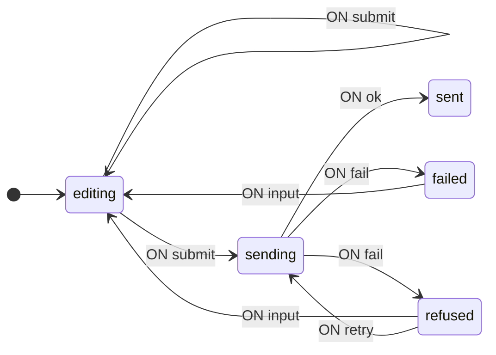
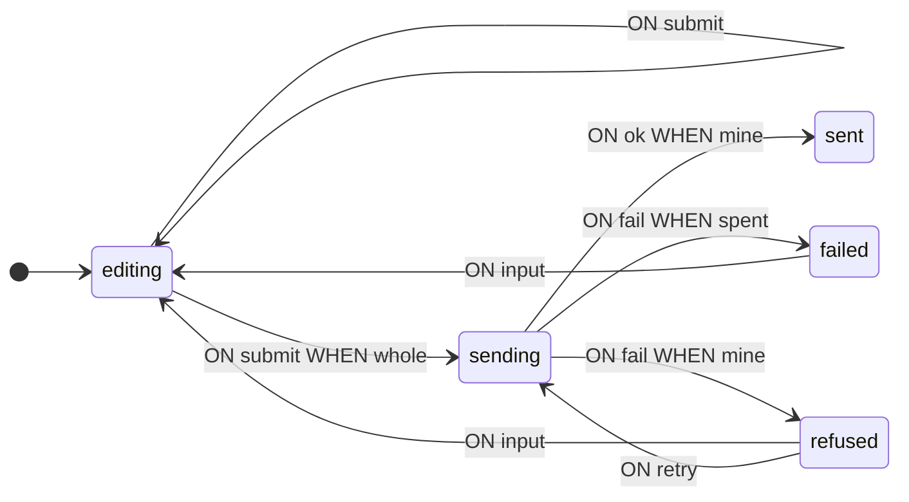
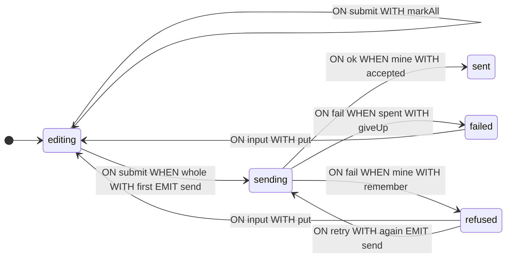

[English](README.md) · **Русский**

# Форма над ненадёжной сетью

Разбор задачи от постановки до готового автомата: форма из трёх полей, сервер с задержкой ответа и двойной доставкой отказов, бюджет из трёх попыток; ответы различаются по номеру попытки. Разделы идут в порядке работы: граф переходов, контекст, условия и операции, обращение со страницы, анализ. Типы вводятся по мере необходимости.

Обозначения и определения — в [руководстве](https://github.com/evgkch/machjs/blob/master/README.ru.md). Ссылки вида «п. 5.2» ведут на пункты этого документа; на руководство ссылаемся по названию раздела — «README, «Схема переходов»».

**Рабочий проект.** Пример открывается как страница — [живая версия](https://evgkch.github.io/machjs/form/). Vite, чистый HTML и TypeScript, без фреймворков; команды выполняются из корня этого репозитория:

```sh
npm install
npm run dev       # http://localhost:5173/form/
npm run build     # tsc --noEmit + сборка в dist/
```

Соответствие файлов разделам документа:

| Файл                               | Разделы                                 |
| ---------------------------------- | --------------------------------------- |
| [`src/types.ts`](src/types.ts)     | 2.1, 3 — состояния, события, контекст   |
| [`src/machine.ts`](src/machine.ts) | 4, 5 — условия, операции, схема         |
| [`src/main.ts`](src/main.ts)       | 6, 9 — подписки, сервер, отрисовка      |

**Содержание**

1. [Постановка](#1-постановка)
2. [Граф переходов](#2-граф-переходов)
3. [Контекст](#3-контекст)
4. [Условия](#4-условия)
5. [Операции](#5-операции)
6. [Обращение из браузера](#6-обращение-из-браузера)
7. [Работа автомата](#7-работа-автомата)
8. [Анализ схемы](#8-анализ-схемы)
9. [Машина на странице](#9-машина-на-странице)

## 1. Постановка

Задача: форма заказа из трёх полей — имя, адрес почты, сумма. Имя непустое, адрес соответствует шаблону почтового адреса, сумма — целое число от 1 до 1000. Кнопка отправляет заказ на сервер; сервер отвечает с задержкой и может отказать. Сеть ненадёжна: каждый отказ доставляется дважды, и копия приходит, когда заказ уже может быть отправлен снова. На отправку отведено три попытки; после третьего отказа попытки прекращаются.

Одно и то же нажатие клавиши означает разное: пока форму правят, оно меняет поле; пока заказ у сервера, поля закрыты; после отказа оно возвращает форму в правку. Ответ сервера тоже означает разное: ответ на текущую попытку — переход, ответ на прошлую отбрасывается. Что именно происходит, зависит от фазы и от номера попытки, а не от содержимого поля.

## 2. Граф переходов

### 2.1 Состояния и события

Таблица 1 — Состояния автомата

| Состояние | Значение                                 |
| --------- | ---------------------------------------- |
| `editing` | Форму правят                             |
| `sending` | Попытка у сервера, ответа нет            |
| `refused` | Сервер отказал; попытки остались         |
| `failed`  | Сервер отказал; бюджет попыток исчерпан  |
| `sent`    | Заказ принят                             |

На входе шесть событий: четыре от пользователя — `input` с именем поля и новым значением, `leave` с именем покинутого поля, `submit` и `retry` без данных — и два от сервера: у `ok` в данных номер попытки и квитанция, у `fail` — номер попытки и причина отказа. На выходе одно событие: `send` с номером попытки и полями заказа. Номер попытки — билет: он записан в `send` и возвращается в ответе.

```ts
import type { IState, IEvent, Merge } from "@evgkch/machjs";

export type Fields = { name: string; email: string; amount: string };
export type Field = keyof Fields;

// Чистые состояния без контекста — контекст появится в разделе 3.
type Phase = IState<"editing" | "sending" | "refused" | "failed" | "sent">;

export type Σ = Merge<
  | IEvent<"input", { field: Field; value: string }>
  | IEvent<"leave", { field: Field }>
  | IEvent<"submit">
  | IEvent<"ok", { attempt: number; receipt: string }>
  | IEvent<"fail", { attempt: number; why: string }>
  | IEvent<"retry">
>;

export type Λ = IEvent<"send", { attempt: number; fields: Fields }>;
```

### 2.2. Первая схема

Исполняемого кода (функций) в ней пока нет — только структура состояний и переходов.

```ts
import type { Schema } from "@evgkch/machjs";

const draft = {
  editing: {
    input: [{ to: "editing" }],
    leave: [{ to: "editing" }],
    submit: [{ to: "sending" }, { to: "editing" }],
  },
  sending: {
    ok: [{ to: "sent" }],
    fail: [{ to: "failed" }, { to: "refused" }],
  },
  refused: { input: [{ to: "editing" }], retry: [{ to: "sending" }] },
  failed: { input: [{ to: "editing" }] },
  sent: {},
} satisfies Schema<Phase, Σ, Λ>;
```

Пары правил соответствуют развилкам задачи. `editing` + `submit`: целая форма уходит на сервер, неполная остаётся в правке. `sending` + `fail`: последний допустимый отказ ведёт в `failed`, промежуточный — в `refused`. Чем правила в каждой паре различаются, пока не записано. В `sending` нет правила `input` — пока заказ у сервера, форма не редактируется; из `sent` переходов нет.

Схема уже пригодна для выполнения: автомат переходит по состояниям, не выполняя вычислений.

```ts
import { StateMachine } from "@evgkch/machjs";

const walk = new StateMachine<Phase, Σ, Λ>(draft, {
  type: "editing",
  context: undefined,
});
walk.dispatch("submit"); // { ok: true }
walk.state.type; // 'sending'
walk.dispatch("fail", { attempt: 1, why: "refused" }); // { ok: true }
walk.state.type; // 'failed'
```

Прогон показывает оба недостатка черновика: `submit` перевёл автомат в `sending` при пустой форме, а первый же отказ перевёл его в `failed`, минуя `refused`, — в обеих парах правила без условий, поэтому всегда срабатывает первое.

### 2.3. Проверка

```ts
import { validate } from "@evgkch/machjs/analysis";
import { formatIssues } from "@evgkch/machjs/formatters";

console.log(formatIssues(validate(draft, "editing")));
```

```
⚠ warning node "sent" has no outgoing transitions
✗ error   cell "submit" at "editing": rule 1 has no guard, so the 1 after it can never fire
✗ error   cell "fail" at "sending": rule 1 has no guard, so the 1 after it can never fire
```

Обе ошибки — то, что показал прогон: в парах `submit` и `fail` нет условий, первое правило срабатывает всегда, второе мертво (README, «Схема переходов» и «Ограничения»). Условия появятся в разделе 4.

Предупреждение о `sent` — намеренное: это конечное состояние, выходов из него не будет и в готовой схеме (п. 8.2).

```ts
import { toMermaid } from "@evgkch/machjs/formatters";

toMermaid(draft, { start: "editing", direction: "LR" });
```



## 3. Контекст

Условия из п. 2.3 должны отличать целую форму от неполной, а ответ на текущую попытку — от чужого. Значит, им нужны поля формы со списком ошибок и номер попытки, которая сейчас у сервера. Состав контекста **разный в разных состояниях**.

Таблица 2 — Что хранит каждое состояние

| Состояние | Содержание                                                      |
| --------- | --------------------------------------------------------------- |
| `editing` | `fields` — поля, `faults` — ошибки, `touched` — отметки касаний |
| `sending` | то же плюс `attempt` — номер попытки, её билет                  |
| `refused` | то же, что в `sending`, плюс `why` — причина отказа             |
| `failed`  | как в `editing`, плюс `why`; счётчика нет — считать нечего      |
| `sent`    | `fields` и `receipt` — квитанция сервера                        |

```ts
/** Одна ошибка одного поля, сформулированная для показа. */
export type Fault = { field: Field; say: string };

/** Какие поля пользователь уже покидал — ошибка показывается только для них. */
export type Touched = Readonly<Record<Field, boolean>>;

/** Форма в работе: поля, текущие ошибки и отметки касаний. */
export type Filling = {
  fields: Fields;
  faults: readonly Fault[];
  touched: Touched;
};

/** Попытка у сервера или после отказа: та же форма и номер попытки — её билет. */
export type InFlight = Filling & { attempt: number };

/** Сервер отказал этой попытке: причина рядом со счётчиком. */
export type Refused = InFlight & { why: string };

/** Бюджет исчерпан: форма и последняя причина; считать больше нечего. */
export type Failed = Filling & { why: string };

export type Q = Merge<
  | IState<"editing", Filling>
  | IState<"sending", InFlight>
  | IState<"refused", Refused>
  | IState<"failed", Failed>
  | IState<"sent", { fields: Fields; receipt: string }>
>;
```

Единый контекст со всеми полями потребовал бы `null` в состояниях, где поле не имеет смысла: `attempt` — только пока идёт отправка, `why` — только после отказа, `receipt` — только после приёма; «отказа не было» отличалось бы от «отказа с пустой причиной» по соглашению. Контекст, привязанный к состоянию, лишние поля исключает: у `editing` их нет, а вход в `refused` без причины не компилируется.

Номер попытки сверяют условия `mine` и `spent` (п. 4.2), и он же записан в `send` (п. 5.2). `failed` номера не хранит: бюджет исчерпан, сверять нечего. У `sent` — только поля и квитанция: список ошибок и отметки касаний относятся к правке, а правка закончена.

Состояние и контекст осмысленны только вместе, поэтому автомат отдаёт их одним значением — `form.state` типа `FsmState`, где `type` сужает `context` (README, «Создание автомата и состояние»).

## 4. Условия

### 4.1. Имена в схеме

Условия записываются в правила по именам функций; реализация приведена в п. 4.2.

> [!NOTE]
> Ниже — набросок без `satisfies`, компилятор его не примет: вход в состояние с контекстом требует функции контекста, поэтому полная схема — в п. 5.3, вместе с операциями. Здесь показано только, где в правилах стоят имена условий; остальные ячейки — как в черновике.

```ts
const guarded = {
  editing: {
    input: [{ to: "editing" }],
    leave: [{ to: "editing" }],
    submit: [{ when: whole, to: "sending" }, { to: "editing" }],
  },
  sending: {
    ok: [{ when: mine, to: "sent" }],
    fail: [
      { when: spent, to: "failed" },
      { when: mine, to: "refused" },
    ],
  },
  // refused, failed, sent — как в п. 2.2
};
```

Ошибок о мёртвых правилах больше нет: в паре `submit` безусловное правило стоит последним, а в паре `fail` условия есть у обоих. Остаётся намеренное предупреждение о `sent`.

```ts
formatIssues(validate(guarded, "editing"));
```

```
⚠ warning node "sent" has no outgoing transitions
```

Имена условий попадают в диаграмму, потому что берутся у самих функций (README, «Подписи и имена»): правила внутри каждой пары теперь различимы.



### 4.2. Реализация

```ts
/** Сколько попыток допускает бюджет до перехода в `failed`. */
export const TRIES = 3;

/** Ошибок нет: единственное условие, под которым срабатывает `submit`. */
export function whole(c: Filling): boolean {
  return c.faults.length === 0;
}

/** Ответ — на попытку, которая сейчас у сервера; любой другой отбрасывается. */
function mine(c: InFlight, p: { attempt: number }): boolean {
  return p.attempt === c.attempt;
}

/** Ответ на текущую попытку, и следующей бюджет не допускает. */
function spent(c: InFlight, p: { attempt: number }): boolean {
  return p.attempt === c.attempt && c.attempt >= TRIES;
}
```

`whole` читает готовый список из контекста и ничего не вычисляет: список поддерживают операции (п. 5). Отдельного вызова валидации при отправке нет — то же поле `faults` читают страница и счётчик панели.

`mine` и `spent` читают оба аргумента — контекст и данные события (README, «Схема переходов»). Порядок в паре `fail` важен: `spent` — частный случай `mine` и стоит первым. Ответ, не прошедший ни одно условие, не подходит ни одному правилу: `dispatch` отвечает `REJECTED`, состояние не меняется. Отказ от перехода — такой же штатный исход, как переход (README, «Формальное определение»); им и отбрасываются дубликаты и опоздавшие ответы.

Условия только читают контекст и данные события, не изменяя их (README, «Ограничения»).

## 5. Операции

### 5.1. Контекст после перехода

Таблица 3 — Функции обновления контекста

| Функция    | Что делает                                              |
| ---------- | ------------------------------------------------------- |
| `put`      | Заменяет поле и перечитывает список ошибок              |
| `mark`     | Отмечает покинутое поле в `touched`                     |
| `markAll`  | Отмечает все поля: `submit` на неполной форме           |
| `first`    | Начинает счёт: та же форма, попытка 1                   |
| `again`    | Та же форма, номер попытки на единицу больше            |
| `remember` | Добавляет к попытке причину отказа                      |
| `giveUp`   | Отбрасывает счётчик; форма и последняя причина остаются |
| `accepted` | Оставляет поля и квитанцию сервера                      |

В листинге ниже приведена также `faultsOf` — чистая функция из полей в список ошибок, её вызывает `put`. Функция `ticketed` контекст не обновляет, а строит данные выходного события, поэтому описана в п. 5.2.

```ts
/** Ошибки полей, перечитываемые при каждом нажатии. */
export function faultsOf(f: Fields): Fault[] {
  return [
    ...(f.name.trim() === ""
      ? [{ field: "name", say: "a name is required" } as const]
      : []),
    ...(/^\S+@\S+\.\S+$/.test(f.email)
      ? []
      : [{ field: "email", say: "not an address" } as const]),
    ...(/^\d+$/.test(f.amount) && +f.amount >= 1 && +f.amount <= 1000
      ? []
      : [{ field: "amount", say: "a number, 1 to 1000" } as const]),
  ];
}

/** Одно нажатие: поле заменено, список ошибок перечитан, отметки сохранены. */
function put(c: Filling, p: { field: Field; value: string }): Filling {
  const fields = { ...c.fields, [p.field]: p.value };
  return { fields, faults: faultsOf(fields), touched: c.touched };
}

/** Пользователь покинул поле: с этого момента его ошибка показывается. */
function mark(c: Filling, p: { field: Field }): Filling {
  return { ...c, touched: { ...c.touched, [p.field]: true } };
}

/** `submit` на неполной форме: показать каждую ошибку. */
function markAll(c: Filling): Filling {
  return { ...c, touched: { name: true, email: true, amount: true } };
}

/** Первая попытка: счёт начинается с 1. */
function first(c: Filling): InFlight {
  return { ...c, attempt: 1 };
}

/** Следующая попытка: та же форма, номер на единицу больше. */
function again(c: Refused): InFlight {
  return {
    fields: c.fields,
    faults: c.faults,
    touched: c.touched,
    attempt: c.attempt + 1,
  };
}

/** Причина отказа, добавленная к попытке. */
function remember(c: InFlight, p: { attempt: number; why: string }): Refused {
  return { ...c, why: p.why };
}

/** Бюджет исчерпан: счётчик отброшен, последняя причина остаётся. */
function giveUp(c: InFlight, p: { attempt: number; why: string }): Failed {
  return { fields: c.fields, faults: c.faults, touched: c.touched, why: p.why };
}

/** Принятый заказ: поля и квитанция сервера; ничего от правки. */
function accepted(
  c: InFlight,
  p: { attempt: number; receipt: string },
): { fields: Fields; receipt: string } {
  return { fields: c.fields, receipt: p.receipt };
}
```

Список ошибок — данные контекста: `put` вызывает `faultsOf` при каждом нажатии и кладёт результат рядом с полями. Ошибка записана с первого нажатия, а показывается только для полей, отмеченных в `touched` (п. 6.3).

Каждая функция возвращает новый объект, а не изменяет переданный (README, «Ограничения»). `again` и `giveUp` собирают объект явно, по полю: разворот `...c` перенёс бы `why` прошлого отказа в новую попытку.

### 5.2. Выходное событие

Событие `send` содержит номер попытки и поля, поэтому его `emit` — пара: имя и функция данных (README, «Схема переходов»).

```ts
/** Данные события `send`: билет и поля. Читает контекст уже после перехода. */
function ticketed(c: InFlight): { attempt: number; fields: Fields } {
  return { attempt: c.attempt, fields: c.fields };
}
```

`ticketed` получает контекст уже после перехода: к этому моменту `first` или `again` записали номер попытки, и в `send` попадает именно он. Одна и та же функция стоит в обоих правилах, ведущих в `sending`.

### 5.3. Схема целиком

```ts
import { StateMachine } from "@evgkch/machjs";

const EMPTY: Fields = { name: "", email: "", amount: "" };
const UNTOUCHED: Touched = { name: false, email: false, amount: false };

export const form = new StateMachine<Q, Σ, Λ>(
  {
    editing: {
      input: [{ to: ["editing", put] }],
      leave: [{ to: ["editing", mark] }],
      submit: [
        { when: whole, to: ["sending", first], emit: ["send", ticketed] },
        { to: ["editing", markAll] },
      ],
    },
    sending: {
      ok: [{ when: mine, to: ["sent", accepted] }],
      // Порядок важен: `spent` — более узкий случай и стоит первым. Ответ,
      // не прошедший ни одно условие, не подходит ни одному правилу — это и есть отбрасывание.
      fail: [
        { when: spent, to: ["failed", giveUp] },
        { when: mine, to: ["refused", remember] },
      ],
    },
    refused: {
      // Правка любого поля возвращает форму в работу; причина отказа остаётся позади.
      input: [{ to: ["editing", put] }],
      retry: [{ to: ["sending", again], emit: ["send", ticketed] }],
    },
    failed: {
      // Правка обнуляет бюджет: следующий submit — снова первая попытка.
      input: [{ to: ["editing", put] }],
    },
    sent: {},
  },
  {
    type: "editing",
    context: { fields: EMPTY, faults: faultsOf(EMPTY), touched: UNTOUCHED },
  },
);
```

Начальный контекст строится тем же `faultsOf`: список ошибок пустой формы записан до первого события. Правило `input` в `refused` и `failed` то же, что в `editing`, — правка любого поля возвращает форму в работу, причину отказа `put` не переносит, а следующий `submit` начинает счёт попыток заново: `first`, попытка 1.

## 6. Обращение из браузера

### 6.1. Разметка и подписки

У каждого поля — подпись, ввод и абзац для ошибки; счётчик, фаза, номер попытки, вердикт сервера и журнал обмена — постоянные элементы панели.

```html
<div class="row">
  <label for="name">Name</label>
  <input id="name" type="text" autocomplete="off" />
  <p class="fault" data-for="name"></p>
</div>
```

Ввод отправляется в автомат без обработки; уход из поля — тоже событие.

```ts
for (const [field, box] of boxes) {
  box.addEventListener("input", () =>
    form.dispatch("input", { field, value: box.value }),
  );
  box.addEventListener("blur", () => form.dispatch("leave", { field }));
}
submit.addEventListener("click", () => form.dispatch("submit"));
retry.addEventListener("click", () => form.dispatch("retry"));
```

Проверок текущего состояния в обработчиках нет. В `sending` правила `input` нет, и `dispatch` отвечает `UNHANDLED`, не изменяя состояния (README, «Выполнение перехода: `dispatch` и `can`»).

### 6.2. Сервер

Сервера в примере нет: на событие `send` подписана сама страница, и ответ отправляет она. Строка журнала обмена — одно сообщение; пометка «taken» или «dropped» у ответа — поле `ok`, которое вернул `dispatch`: `ok: false` означает, что сообщению не подошло ни одно правило.

```ts
/** Строка журнала обмена; пометка ответа — булев результат `dispatch`. */
function line(text: string): void {
  const li = document.createElement("li");
  li.textContent = text;
  wire.append(li);
  wire.scrollTop = wire.scrollHeight;
}

// В `send` — билет попытки; ответ возвращает его.
// `setTimeout` обязателен: вложенный `dispatch` запрещён; задержки заменяют сеть.
form.rx.on("send", ({ attempt, fields }) => {
  line(`▸ send #${attempt}`);
  const deliver = (ms: number, label: string, answer: () => boolean) =>
    setTimeout(() => line(`◂ ${label} — ${answer() ? "taken" : "dropped"}`), ms);
  if (+fields.amount > 900) {
    const why = `amounts over 900 are refused — got ${fields.amount}`;
    // Сеть ненадёжна: каждый отказ доставляется дважды. Копия приходит, когда у
    // автомата может быть уже следующая попытка, — чужой билет не подходит ни одному правилу.
    deliver(700, `fail #${attempt}`, () =>
      form.dispatch("fail", { attempt, why }),
    );
    deliver(2100, `fail #${attempt} (copy)`, () =>
      form.dispatch("fail", { attempt, why }),
    );
  } else {
    deliver(700, `ok #${attempt}`, () =>
      form.dispatch("ok", { attempt, receipt: `ord-${fields.amount}-${attempt}` }),
    );
  }
});
```

Копия отказа приходит через 2,1 секунды, когда после быстрого `retry` у сервера уже следующая попытка. Билет копии не проходит ни `mine`, ни `spent` (п. 4.2), и журнал печатает «dropped». Страница ничего не проверяет: обе пометки записаны по булеву результату `dispatch`.

### 6.3. Отрисовка

Одна функция, выполняемая после каждого перехода, читает автомат и ничего больше:

```ts
import { TRANSITION } from "@evgkch/machjs";

function paint(): void {
  const s = form.state;
  const fields = s.context.fields;
  const wrong = s.type === "sent" ? [] : s.context.faults;
  const said = s.type === "sent" ? null : s.context.touched;
  for (const [field, box] of boxes) {
    if (box.value !== fields[field]) box.value = fields[field];
    // Поле доступно, пока у автомата есть правило для него.
    box.readOnly = !form.can("input", { field, value: box.value });
    // Ошибка записана с первого нажатия; показывается — после ухода из поля.
    const fault = wrong.find((f) => f.field === field);
    const say = fault !== undefined && said !== null && said[field];
    faults.get(field)!.textContent = say ? fault.say : "";
  }
  const spoken = wrong.filter((f) => said !== null && said[f.field]);
  const asked = said === null || Object.values(said).some(Boolean);
  countOut.textContent = !asked
    ? "—"
    : spoken.length === 0
      ? "none"
      : String(spoken.length);

  // Билет, пока есть что показывать: в отправке и после отказа.
  attemptOut.textContent =
    s.type === "sending" || s.type === "refused"
      ? `${s.context.attempt} / ${TRIES}`
      : s.type === "failed"
        ? "spent"
        : "—";

  submit.disabled = !form.can("submit");
  retry.disabled = !form.can("retry");

  verdict.textContent =
    s.type === "refused"
      ? s.context.why
      : s.type === "failed"
        ? `gave up after ${TRIES} attempts — ${s.context.why}`
        : s.type === "sent"
          ? `sent — receipt ${s.context.receipt}`
          : "—";
}

form.rx.on(TRANSITION, paint);
paint();
```

Ни одна ветка не проверяет фазу: поле доступно ровно тогда, когда у автомата есть правило `input`, — та же проверка `can`, что и при `dispatch`. Уберите правило из схемы — поле станет только для чтения.

Кнопка Submit на неполной форме не блокируется: правило для `submit` в `editing` есть в любом случае, `can("submit")` истинно, и нажатие показывает ошибки (переход `editing → editing`, п. 7).

Счётчик считает только показанные ошибки: на нетронутой форме — «—», после ухода из поля — его ошибку, после `submit` на неполной форме — все. Номер попытки: `1 / 3` в отправке и после отказа, «spent» после исчерпания бюджета, иначе «—». Вердикт сервера — один постоянный блок: «—», причина отказа или квитанция; высота страницы при ответе не меняется.

## 7. Работа автомата

В прогоне события отправляются в автомат напрямую, без браузера; разметка и подписки из п. 6 не задействованы. После каждого события показаны результат `dispatch`, состояние и примечание.

```
submit  (форма пуста)      true   editing   все три ошибки показаны
name → anna                true   editing   ошибка имени снята
email → anna@x.dev         true   editing
amount → 950               true   editing   ошибок не осталось
submit                     true   sending   попытка 1, send #1
fail #1                    true   refused   причина в контексте
retry                      true   sending   попытка 2, send #2
fail #1 (копия)            false  sending   чужой билет — отброшено
fail #2                    true   refused
retry                      true   sending   попытка 3, send #3
fail #3                    true   failed    бюджет исчерпан
amount → 300               true   editing   правка после failed
submit                     true   sending   счёт заново: попытка 1, send #1
ok #1                      true   sent      поля и квитанция
```

Первое событие `submit` — переход `editing → editing`: сработало второе правило, `markAll` отметил все поля. Неудачная попытка — такой же переход, как остальные: она записана в прогоне, а на диаграмме у `submit` два ребра.

Строка `fail #1 (копия)` — единственная с `false`: к этому моменту у сервера попытка 2, билет копии не проходит ни `spent`, ни `mine`, перехода нет, и состояние не меняется. `fail #3` проходит `spent`: третий отказ переводит автомат в `failed`. После правки суммы счёт начинается заново, и `ok #1` завершает прогон. Конечное состояние:

```json
{
  "type": "sent",
  "context": {
    "fields": { "name": "anna", "email": "anna@x.dev", "amount": "300" },
    "receipt": "ord-300-1"
  }
}
```

## 8. Анализ схемы

### 8.1. Диаграмма

Та же схема, что в пп. 2.3 и 4.1, но теперь с операциями и выходным событием.

```ts
toMermaid(form.schema, { start: "editing", direction: "LR" });
```



Все операции здесь — именованные функции, поэтому `?` в подписях не встречается: форматтер берёт имя у самой функции (README, «Подписи и имена»).

### 8.2. Проверка

```ts
formatIssues(validate(form.schema, "editing"));
```

```
⚠ warning node "sent" has no outgoing transitions
```

Предупреждение о `sent` остаётся: это конечное состояние, выходов из него нет намеренно.

### 8.3. Схема без кода

```ts
import { toRules } from "@evgkch/machjs/formatters";

toRules(JSON.parse(JSON.stringify(form)));
```

```
FROM editing ON input             TO editing WITH put
FROM editing ON leave             TO editing WITH mark
FROM editing ON submit WHEN whole TO sending WITH first    EMIT send BY ticketed
FROM editing ON submit            TO editing WITH markAll
FROM sending ON ok     WHEN mine  TO sent    WITH accepted
FROM sending ON fail   WHEN spent TO failed  WITH giveUp
FROM sending ON fail   WHEN mine  TO refused WITH remember
FROM refused ON input             TO editing WITH put
FROM refused ON retry             TO sending WITH again    EMIT send BY ticketed
FROM failed  ON input             TO editing WITH put
```

Вывод совпадает строка в строку с `toRules(form.schema)`: кода в JSON нет, но _имя_ каждой функции сохраняется, а в строке правила и печатается только имя. Колонка `WHEN` тоже сохраняется, поэтому при валидации сериализованной схемы каскады `submit` и `fail` по-прежнему не содержат мёртвых правил (README, «Граф и JSON‑представление»).

## 9. Машина на странице

Внизу страницы автомат нарисован виджетами [`@evgkch/machjs-inspector`](https://github.com/evgkch/machjs-inspector): легенда состояний, диаграмма переходов и прогон. Их связывает `<machjs-desk>` — он подключает виджеты к общему субъекту и добавляет каждому переключатель:

```ts
import { MachjsDesk, fromMachine } from "@evgkch/machjs-inspector/ui";

const desk = new MachjsDesk();
desk.wiring = { subject: fromMachine(form) };
el<HTMLElement>("board").append(desk);
for (const widget of document.querySelectorAll<HTMLElement>(
  "machjs-legend, machjs-diagram, machjs-history",
))
  desk.enroll(widget as Parameters<typeof desk.enroll>[0]);
```

Виджеты подписаны на автомат: каждый переход дорисовывается без дополнительного кода на странице. В подписях диаграммы — имена условий, поэтому правила каждой пары различимы: `submit · whole` и `submit`, `fail · spent` и `fail · mine`. Отброшенные ответы в прогон не попадают: виджеты получают только состоявшиеся переходы, отбрасывание видно в журнале обмена (п. 6.2).
