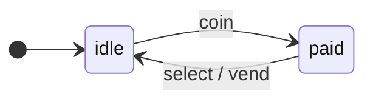

[English](README.md) · **Русский**

<p align="center">
  <a href="https://www.npmjs.com/package/@evgkch/machjs"></a>
  <a href="LICENSE"></a>
  
  
  
</p>

<p align="center">
  <a href="#установка">Установка</a> ·
  <a href="#быстрый-старт">Быстрый старт</a> ·
  <a href="https://evgkch.github.io/machjs/">Примеры</a> ·
  <a href="#формальное-определение-и-термины">Формальное определение</a> ·
  <a href="https://github.com/evgkch/machjs/issues">Issues</a>
</p>

machjs реализует конечный автомат Мили для TypeScript. Вы пишете таблицу правил «состояние → событие → список правил», передаёте её в `new StateMachine` и получаете объект с `dispatch`, `can` и шиной выходных событий. Ту же таблицу читают анализ, форматтеры и инспектор.

Готовые примеры лежат в каталоге [`examples/`](https://github.com/evgkch/machjs/tree/master/examples) этого репозитория и выложены на [evgkch.github.io/machjs](https://evgkch.github.io/machjs/).

---

## Содержание

| Раздел                                                                            | О чём                                                                        |
| --------------------------------------------------------------------------------- | ---------------------------------------------------------------------------- |
| [Установка](#установка)                                                           | Точки входа, требования к сборке                                             |
| [Быстрый старт](#быстрый-старт)                                                   | Язык правил, два примера                                                     |
| [`@evgkch/machjs`](#evgkchmachjs)                                                   | Класс `StateMachine`, носители, схема, шина, сериализация, асинхронность, граф, JSON       |
| [`@evgkch/machjs/analysis`](#evgkchmachjsanalysis)                                  | Достижимость, ошибки, пути                                                   |
| [`@evgkch/machjs/formatters`](#evgkchmachjsformatters)                              | Дерево, правила, Mermaid, DOT                                                |
| [`@evgkch/machjs/debug`](#evgkchmachjsdebug)                                        | Журнал, инварианты, история                                                  |
| [Инспектор](#инспектор)                                                                  | Инструмент разработки: страницы и виджеты                              |
| [Ограничения](#ограничения)                                                       | Чтение схемы, чистота `when`, порядок правил, заморозка контекста, `BUSY` |
| [Сообщения компилятора TypeScript](#сообщения-компилятора-typescript)             | Как читать ошибки типов                                                      |
| [Формальное определение и термины](#формальное-определение-и-термины)             | Математическая модель, обозначения                                           |
| [Визуализация и проверка схемы из файла](#визуализация-и-проверка-схемы-из-файла) | Скрипт `render.ts`, JSON                                                     |

---

## Установка

```sh
npm i @evgkch/machjs
```

Пакет поставляется только в формате ESM и требует `"module": "nodenext"` или совместимого резолвера. Основная точка входа:

```ts
import { StateMachine, TRANSITION } from "@evgkch/machjs";
```

Остальные точки входа подключаются по отдельности, и в сборку попадает только импортированное:

```ts
import { analyze, validate, paths } from "@evgkch/machjs/analysis";
import { toTree, toMermaid } from "@evgkch/machjs/formatters";
import { log, history } from "@evgkch/machjs/debug";
```

---

## Быстрый старт

### Что такое конечный автомат Мили

Конечный автомат описывает систему, которая всегда находится ровно в одном **состоянии** из заранее заданного набора и переключается между ними под действием **входных событий**. При переходе автомат порождает **выходное событие**, если оно записано в правиле.

Автомат рисуется графом: в вершинах стоят состояния, стрелки показывают переходы, подписью стрелки служит пара `входное_событие / выходное_событие`.

**Пример: торговый автомат.** Состояния: `idle` (ожидание) и `paid` (монета получена). Входные события: `coin` (опустить монету) и `select` (выбрать товар). Выходное событие: `vend` (выдача товара).



### Язык правил: FROM, ON, TO, EMIT

Поведение автомата задают **правила**. В правиле четыре слова, и последнее из них необязательно:

```text
FROM <состояние>  ON <событие>  TO <состояние>  [EMIT <событие>]
```

Для нашего примера нужны два правила:

```text
FROM idle  ON coin   TO paid
FROM paid  ON select TO idle  EMIT vend
```

### Первый пример: код

```ts
import { StateMachine } from "@evgkch/machjs";
import type { IState, IEvent, Merge } from "@evgkch/machjs";

type Q = IState<"idle" | "paid">;                  // состояния без контекста
type Σ = Merge<IEvent<"coin"> | IEvent<"select">>; // входные события без данных
type Λ = IEvent<"vend">;                           // выходное событие без данных

const vm = new StateMachine<Q, Σ, Λ>(
  {
    idle: { coin:   [{ to: "paid" }] },
    paid: { select: [{ to: "idle", emit: "vend" }] },
  },
  { type: "idle", context: undefined },
);
```

Отправляем события и подписываемся на выход:

```ts
vm.rx.on("vend", () => console.log("Товар выдан"));

vm.can("select");      // UNHANDLED — правила для этой пары нет
vm.dispatch("select"); // UNHANDLED — в idle событие select не обрабатывается
vm.dispatch("coin");   // OK — переход idle → paid
vm.dispatch("select"); // OK — переход paid → idle + выдача
vm.state.type;         // "idle"
```

### Расширенный автомат: контекст и ещё три слова

Чтобы хранить данные и проверять условия, добавьте к состоянию **контекст**, а к правилу три слова: `WHEN`, `WITH`, `BY`. Полное правило состоит из семи слов, обязательны из них `FROM`, `ON` и `TO`:

```text
FROM <состояние>  ON <событие>  [WHEN <условие>]  TO <состояние>  [WITH <обновление>]  [EMIT <событие>  [BY <данные>]]
```

Порядок выполнения: `WHEN` → `TO` → `WITH` → `EMIT` → `BY`. `BY` работает с уже обновлённым контекстом.

### Второй пример: торговый автомат с разными контекстами состояний

Товар стоит 50 единиц. Автомат принимает монеты разного достоинства и накапливает сумму. Пока сумма меньше цены, автомат остаётся в `idle`, и событие `select` там не обрабатывается; на выходе вместе с товаром идёт сдача.

Контекст у состояний разный:

- в `idle` записаны накопленная сумма и сдача с прошлой покупки;
- в `paid` записана только сумма.

```ts
import { StateMachine } from "@evgkch/machjs";
import type { IState, IEvent, Merge } from "@evgkch/machjs";

type Idle = { paid: number; change: number };
type Paid = { paid: number };

type Q = Merge<IState<"idle", Idle> | IState<"paid", Paid>>;
type Σ = Merge<IEvent<"coin", { value: number }> | IEvent<"select">>;
type Λ = IEvent<"vend", { change: number }>;

const PRICE = 50;

const vm = new StateMachine<Q, Σ, Λ>(
  {
    idle: {
      coin: [
        {
          when: (ctx, { value }) => ctx.paid + value < PRICE,
          to: [
            "idle",
            (ctx, { value }) => ({ paid: ctx.paid + value, change: 0 }),
          ],
        },
        {
          to: ["paid", (ctx, { value }) => ({ paid: ctx.paid + value })],
        },
      ],
    },
    paid: {
      select: [
        {
          to: ["idle", (ctx) => ({ paid: 0, change: ctx.paid - PRICE })],
          emit: ["vend", (ctx: Idle) => ({ change: ctx.change })],
        },
      ],
    },
  },
  { type: "idle", context: { paid: 0, change: 0 } },
);

vm.rx.on("vend", ({ change }) => console.log(`Сдача: ${change}`));
vm.dispatch("coin", { value: 20 }); // idle → idle, paid=20
vm.dispatch("coin", { value: 50 }); // idle → paid, paid=70
vm.dispatch("select");              // снова idle: товар выдан, сдача 20
```

Функция в паре с `to` возвращает контекст того состояния, которое стоит первым в той же паре. Для `idle` это `Idle` со сдачей, для `paid` это `Paid` без неё, и компилятор требует точного совпадения. Сдачу вычисляет `with` и кладёт в новый контекст `idle`, а `by` читает её оттуда: до `by` переход уже выполнен. Параметр `by` аннотирован вручную, потому что пара в `to` не сужает целевое состояние для вывода типов TypeScript.

---

## `@evgkch/machjs`

### Создание автомата и состояние

```ts
new StateMachine<Q, Σ, Λ>(schema, start);
```

| Аргумент | Что в нём                                |
| -------- | ---------------------------------------- |
| `schema` | Схема переходов                          |
| `start`  | Начальное состояние: `{ type, context }` |

Три параметра типа задаются носителями, то есть объектами-отображениями. `Q` и `Σ` обязательны, `Λ` по умолчанию равен `Σ` и указывается, только когда выход отличается от входа.

Текущее состояние читается через геттер `state`:

```ts
vm.state;         // { type: 'idle', context: { paid: 0 } }
vm.state.type;    // 'idle'
vm.state.context; // { paid: 0 }
```

Проверка `type` сужает и контекст:

```ts
if (vm.state.type === "paid") {
  vm.state.context.change; // поле, доступное только в paid
}
```

Метод `restore(state)` устанавливает состояние напрямую, без перехода и без публикации `TRANSITION`:

```ts
vm.restore({ type: "paid", context: { paid: 70, change: 20 } });
```

### Носители и хелперы `IState` / `IEvent`

Каждый носитель отображает тег в то, что этот тег несёт:

| Параметр | Отображение | Множество |
| --- | --- | --- |
| `Q` | состояние → его контекст | `keyof Q` |
| `Σ` | входное событие → его данные | `keyof Σ` |
| `Λ` | выходное событие → его данные | `keyof Λ` |

Носитель можно написать вручную:

```ts
type Q = { empty: void; ready: { rect: Rect }; dragging: { rect: Rect; from: Point } };
```

Хелперы описывают его по одной записи. `Merge` сливает объединение записей в один носитель:

```ts
type Q = Merge<
  | IState<"empty">
  | IState<"ready", { rect: Rect }>
  | IState<"dragging", { rect: Rect; from: Point }>
>;
```

Несколько состояний с одной формой записываются вместе, и тогда `Merge` не нужен:

```ts
type Q = IState<"open" | "closed", { at: number }>;
type Σ = Merge<IEvent<"down" | "move", Point> | IEvent<"up">>;
```

`IEvent` описывает события тем же способом. Второй аргумент по умолчанию равен `void`: такое событие не несёт данных.

### Схема переходов

Схема устроена как двухуровневый объект: `schema[состояние][событие]` даёт список правил. Ячейка читается за O(1).

```ts
{
    idle: {
        coin: [
            { when: short, to: ['idle', collect] },
            { to: ['paid', toPaid] }
        ]
    },
    paid: {
        select: [
            { to: ['idle', toIdle], emit: ['vend', refund] }
        ]
    }
}
```

Порядок правил в списке важен: выполняется первое, чьё `when` вернуло `true`, а правило без `when` подходит всегда. Если не подошло ни одно, перехода нет.

**Поля правила:**

| Поле    | Обязательность | Назначение                                                          |
| ------- | -------------- | ------------------------------------------------------------------- |
| `to`    | обязательно    | Целевое состояние: имя или пара `[имя, функция]`                    |
| `when?` | необязательно  | Условие применимости (чистая функция)                               |
| `emit?` | необязательно  | Выходное событие: имя или пара `[имя, функция]`                     |

В поле `to` пишут имя состояния или пару `[имя, функция]`. Что писать, зависит от контекста целевого состояния:

| Целевое состояние          | Что писать                          |
| -------------------------- | ----------------------------------- |
| Ничего не хранит           | Только имя; пара не скомпилируется  |
| Хранит то же, что источник | Имя или пару                        |
| Хранит другую форму        | Только пару; одного имени не хватит |

Поле `emit` устроено так же: имя для события без данных, пара для события с данными. Правило без выхода не содержит `emit` вовсе.

Дамп сохраняет пару: на месте функции `JSON.stringify` печатает её имя, `["idle", "toIdle"]`.

### Выполнение перехода: `dispatch` и `can`

```ts
dispatch(event, payload?) => Verdict
can(event, payload?)      => Verdict

type Verdict = Result<true, MachineError>;
```

`Result<T, E>` держит одну из двух ветвей: `Result.Ok<T>` с полем `result` или `Result.Err<E>` с полем `error`, и заполнено ровно одно поле из двух. Ветвь сужают `isOk()` и `isError()`, `unwrap()` возвращает значение либо бросает ошибку, `toJSON()` записывает ветвь данными. На ветви `Ok` вердикт несёт `true`: других данных ни `can`, ни `dispatch` не возвращают.

Все вердикты берутся из пяти готовых констант, по одному экземпляру на каждую, поэтому вызов не создаёт объектов. Ветвь читают через `isOk`, а саму константу сравнивают по идентичности.

| Константа | `error` | Значение |
| --------- | ------- | -------- |
| `OK` | — | переход выполнен; `can` даёт этот вердикт, когда переход выполнился бы |
| `UNHANDLED` | `UnhandledError` | в текущем состоянии нет ячейки для события |
| `REJECTED` | `RejectedError` | ячейка есть, все `when` отклонили событие с этими данными |
| `TERMINAL` | `TerminalError` | состояние терминальное: исходящих переходов нет вообще |
| `BUSY` | `BusyError` | вложенный вызов: внешний `dispatch` ещё выполняется |

`dispatch` выполняет семь шагов по порядку:

1. Находит ячейку `schema[состояние][событие]`. Если у состояния нет ни одной ячейки, вердикт `TERMINAL`; если нет ячейки для этого события, `UNHANDLED`.
2. Перебирает правила ячейки и проверяет `when`, берёт первое подходящее. Если не подошло ни одно, вердикт `REJECTED`.
3. Вычисляет новый контекст функцией из пары с `to`, если функция там есть.
4. Формирует выходное событие, если в правиле есть `emit`; данные для события даёт функция из пары.
5. Атомарно фиксирует новое состояние.
6. Публикует выходное событие в `rx`, затем `TRANSITION`.
7. Возвращает `OK`.

Ошибка не зависит от вызова и данных не несёт: событие и текущее состояние есть у вызывающего кода и без вердикта.

`can` выполняет только шаги 1–2, без побочных эффектов.

```ts
button.disabled = !vm.can("select").isOk();

const r = vm.dispatch("select");
if (r.isError()) say(r.error);
```

> [!WARNING]
> Пока функции `when` чисты, `can` и `dispatch` возвращают один и тот же вердикт.

### Шина `rx` и `TRANSITION`

Выходные события публикуются в `rx`, приёмнике канала [`@evgkch/chanjs`](https://github.com/evgkch/chanjs).

```ts
const off = vm.rx.on("vend", ({ change }) => console.log(change));
off(); // отписка
```

После каждого состоявшегося перехода по ключу `TRANSITION` публикуется объект `Transition`:

```ts
import { TRANSITION } from "@evgkch/machjs";
vm.rx.on(TRANSITION, (t) => console.log(t));
```

`t` содержит поля `input`, `source`, `target`, `output?` и `at`. В `at` записан `Date.now()`, снятый в момент перехода.

### Атомарность и вложенные вызовы

Состояние фиксируется до отправки событий, поэтому обработчики выполняются уже при новом состоянии. Исключение в `when`, `with` или `by` оставляет автомат без изменений.

Вложенный `dispatch` того же экземпляра не выполняется: он возвращает `BUSY`, а внешний переход завершается штатно. Вложенным считается вызов из подписки и вызов из `when`, `with` или `by` текущего перехода. Чтобы отправить следующее событие в ответ на переход, вызовите `dispatch` через `queueMicrotask` внутри подписки `rx.on` или `rx.once`.

### Сериализация

`JSON.stringify(machine)` пишет граф, то есть схему, где каждая операция сведена к имени. Позиция машины лежит отдельно, в `machine.state`: пара `{ type, context }` попадает в JSON, если сериализуется сам контекст. Контексту с несериализуемым содержимым задайте свой `toJSON`. Обратно состояние ставит конструктор:

```ts
const saved = JSON.stringify(vm.state);
// …в другом процессе, с той же схемой:
const vm2 = new StateMachine<Q, Σ, Λ>(schema, JSON.parse(saved));
```

Прогон сериализуется теми же значениями: в `history` (`@evgkch/machjs/debug`) записаны такие же пары `{ type, context }`.

### Асинхронность

`when`, `with` и `by` синхронны. Асинхронная работа выполняется вне автомата, а её результат приходит в автомат обычным событием. Отсюда два способа:

**Результат вычисляется до отправки:**

```ts
button.addEventListener("click", async () => {
  vm.dispatch("sign", { who, sig: await sign(who, text) });
});
```

**Ожидание оформляется состоянием.** Запрос уходит выходным событием, ответ приходит входным, а между ними автомат находится в состоянии ожидания:

```text
FROM draft    ON submit  TO checking EMIT gate
FROM checking ON checked TO review
```

```ts
vm.rx.on("gate", async ({ text }) => {
  // После `await` выполнение продолжается вне текущего перехода: это не вложенный dispatch.
  vm.dispatch("checked", await check(text));
});
```

### Чтение схемы без автомата

`edges`, `nodes` и `graph` читают схему без автомата:

```ts
import { edges, nodes, graph } from "@evgkch/machjs";

const allEdges = edges(schema);   // Edge[] — по одному ребру на правило
const allNodes = nodes(schema);   // string[] — все состояния
const graphObj = graph(schema);   // Graph<...> — то же, что toJSON
```

`nodes` возвращает объединение ключей схемы и всех целевых состояний правил. Поэтому в список попадает и состояние без ячеек (`ghost: {}`), у которого нет ни одного ребра, и состояние, встречающееся только как цель.

Там же экспортируется `nameOf(operation, slot)`. Её вызывают `toJSON` и форматтеры, поэтому имена операций во всех представлениях схемы совпадают. В собственном рендерере вызывайте эту функцию, а не восстанавливайте имя самостоятельно.

### Граф и JSON‑представление

`toJSON()` возвращает граф: схему без тел функций, но с их именами. Каждая функция заменяется строкой (или `"?"` для анонимной) на том месте, где стояла: внутри пары в `to` или `emit`, под ключом `when` у условия.

```json
{
  "idle": {
    "coin": [
      { "when": "short", "to": ["idle", "collect"] },
      { "to": ["paid", "toPaid"] }
    ]
  },
  "paid": {
    "select": [{ "to": ["idle", "toIdle"], "emit": ["vend", "refund"] }]
  }
}
```

У JSON та же форма, что и у схемы в коде. Эта форма однозначна и для `emit`: пара `["vend", "refund"]` читается как одно событие с функцией данных, а не как список из двух событий.

Такую схему можно не только нарисовать и проверить, но и передать в конструктор. Имя на месте функции читается как её нейтральное значение: условие истинно, функция контекста тождественна, а выходное событие уходит без данных.

### Сигнатуры

```ts
class StateMachine<Q extends Carrier, Σ extends Carrier, Λ extends Carrier = Σ> {
    constructor(schema: Schema<Q, Σ, Λ>, start: FsmState<Q>);
    readonly schema: Schema<Q, Σ, Λ>;
    get state(): FsmState<Q>;
    get rx(): Rx<...>;
    // одна сигнатура: имя события, или имя и его данные
    can(...args: Args<Σ>): Verdict;
    dispatch(...args: Args<Σ>): Verdict;
    restore(state: FsmState<Q>): void;
    toJSON(): Graph<Q, Σ, Λ>;
}

type IState<Q extends PropertyKey, D = void> = { [q in Q]: D };
type IEvent<T extends PropertyKey, D = void> = { [t in T]: D };
type Merge<U> = { ... };

function edges<T>(schema: T): Edge<Nodes<T>>[];
function nodes<T>(schema: T): Nodes<T>[];
function graph<T, Σ extends Carrier = Carrier, Λ extends Carrier = Carrier>(
    schema: T,
): Graph<IState<Nodes<T>, unknown>, Σ, Λ>;
function nameOf(operation: Function | string | undefined, slot: string): string | undefined;
// две половины пары `to` или `emit`
function nameIn(slot: Slot | undefined): PropertyKey | undefined;
function opIn(slot: Slot | undefined): Op | undefined;

// общая форма любого автомата, для кода, который работает с автоматами вообще
type AnyMachine = {
    readonly state: { readonly type: PropertyKey };
    readonly rx: { on(msg: typeof TRANSITION, hear: (t: AnyTransition) => void): Off };
    can(type: PropertyKey, payload?: unknown): Verdict;
    dispatch(type: PropertyKey, payload?: unknown): Verdict;
    toJSON(): unknown;
};

// core/result: значение одной из двух ветвей, Ok либо Err, никогда обе
type Result<T, E extends Error = Error> = Result.Ok<T, E> | Result.Err<T, E>;
namespace Result {
    class Ok<T, E extends Error = Error> {
        readonly result: T;
        readonly error: undefined;
    }
    class Err<T, E extends Error = Error> {
        readonly result: undefined;
        readonly error: E;
    }
    const ok: <T, E extends Error = Error>(result: T) => Result.Ok<T, E>;
    const error: <E extends Error, T = never>(error: E) => Result.Err<T, E>;
}
// на обеих ветвях
isOk(): this is Result.Ok<T, E>;
isError(): this is Result.Err<T, E>;
unwrap(): T;                        // значение либо брошенная ошибка
toJSON(): { result: T } | { error: { name: string; message: string } };

// вердикт dispatch и can: пять констант, по одному экземпляру
type Verdict = Result<true, MachineError>;
type MachineError = UnhandledError | RejectedError | TerminalError | BusyError;
const OK: Result.Ok<true, MachineError>;
const UNHANDLED: Result.Err<true, MachineError>; // error: UnhandledError
const REJECTED: Result.Err<true, MachineError>;  // error: RejectedError
const TERMINAL: Result.Err<true, MachineError>;  // error: TerminalError
const BUSY: Result.Err<true, MachineError>;      // error: BusyError

// файл core/errors: четыре ошибки-вердикта; ядро их не бросает
class UnhandledError extends Error {}
class RejectedError extends Error {}
class TerminalError extends Error {}
class BusyError extends Error {}
const TRANSITION: unique symbol;
```

`Args<Σ>` в сигнатурах выше остаётся внутренним типом и наружу не экспортируется.

Экспортируемые типы: `Carrier`, `IState`, `IEvent`, `Merge`, `FsmState`, `FsmEvent`, `When`, `With`, `By`, `Rule`, `Schema`, `Graph`, `Edge`, `Nodes`, `Transition`, `AnyTransition`, `AnyMachine`, `Off`, `Verdict`.

---

## `@evgkch/machjs/analysis`

Статическая проверка схемы: автомат не запускается, условия не вызываются. Анализ читает структуру графа, то есть поля `to`, `emit` и наличие `when`, но не значение, которое вернуло бы условие. Поэтому схема с кодом и та же схема, восстановленная из JSON, дают одинаковый результат.

```ts
function analyze<T, Q extends PropertyKey = PropertyKey>(schema: T, start?: Q): Analysis<Q>;
function validate<T, Q extends PropertyKey = PropertyKey>(schema: T, start?: Q): Issue<Q>[];
function paths<T, Q extends PropertyKey = PropertyKey>(schema: T, from: Q): Path<Q>[];
```

### `analyze`

`analyze` возвращает четыре списка состояний:

| Поле          | Что в нём                                  |
| ------------- | ------------------------------------------ |
| `nodes`       | все состояния схемы                        |
| `reachable`   | достижимые из `start`                      |
| `unreachable` | есть в схеме, но недостижимы из `start`    |
| `terminal`    | без исходящих переходов                    |

> [!WARNING]
> Без `start` достижимость не считается вовсе: `reachable` и `unreachable` возвращаются пустыми, а `validate(schema)` без второго аргумента не даёт ни одной находки `unreachable`.

### `validate`

`validate` возвращает те же факты и добавляет две проверки на уровне ячейки:

| `kind`           | Уровень   | Когда                                                   |
| ---------------- | --------- | ------------------------------------------------------- |
| `unreachable`    | `error`   | состояние недостижимо из `start`                        |
| `dead-rule`      | `error`   | правило стоит после безусловного и не сработает никогда |
| `terminal`       | `warning` | из состояния нет выхода                                 |
| `duplicate-edge` | `warning` | два правила ячейки во время работы неразличимы          |

Каждый элемент `Issue` содержит `severity`, `kind`, `node` и готовое сообщение `message`; у находок уровня ячейки заполнено также поле `event`. Для вывода отчёта служит `formatIssues` из `formatters`.

```ts
console.log(formatIssues(validate(vm.schema, "idle")));
```

Одной проверке `duplicate-edge` нужен исходный код: правила сравниваются по тождеству функции-условия, а имя из дампа тождества не даёт, потому что два разных анонимных условия печатаются одинаково, как `?`. На схеме из JSON эта проверка не срабатывает, остальные три работают в полном объёме.

Правило без `when` нарушением не считается.

### `paths`

`paths` перечисляет все простые пути из заданного состояния.

| Поле    | Что в нём                                    |
| ------- | -------------------------------------------- |
| `nodes` | Последовательность состояний пути            |
| `legs`  | Пройденные рёбра                             |
| `kind`  | Чем путь закончился: `terminal` или `cycle`  |

Путь получает `kind: 'terminal'`, если закончился в состоянии без исходящих переходов, и `kind: 'cycle'`, если вернулся в уже пройденное состояние. При `cycle` последний элемент `nodes` повторяет один из предыдущих.

> [!WARNING]
> На плотных графах число путей растёт экспоненциально.

Экспортируемые типы: `Analysis`, `Issue`, `Path`.

---

## `@evgkch/machjs/formatters`

Вывод схемы в текст. Модуль только печатает схему и ничего о графе не вычисляет: обход, достижимость и перечисление путей относятся к `analysis`.

Префикс в имени указывает на тип аргумента: `to*` принимает схему, `format*` принимает значение, построенное другим модулем.

```ts
type Formatter<T, Opts = never> = (value: T, options?: Opts) => string;

const toMermaid: Formatter<unknown, RenderOptions<PropertyKey>>;
const toDot: Formatter<unknown, RenderOptions<PropertyKey>>;
const toTree: Formatter<unknown, TextOptions<PropertyKey>>;
const toRules: Formatter<unknown>;
const formatIssues: Formatter<Issue<PropertyKey>[], FormatOptions>;
const edgeLabel: (edge: Edge) => string;
```

### Форматы вывода

| Функция        | Что печатает                                                              |
| -------------- | ------------------------------------------------------------------------- |
| `toMermaid`    | Mermaid `stateDiagram-v2`; вставляется прямо в Markdown                   |
| `toDot`        | Graphviz DOT                                                              |
| `toTree`       | Дерево с отступами для терминала: строка на состояние, под ней исходящие рёбра |
| `toRules`      | Построчный список правил, все семь слов: `FROM ON WHEN TO WITH EMIT BY`   |
| `formatIssues` | Отчёт `validate`, по строке на находку (`✗ error` / `⚠ warning`)          |

### Опции

Форматтер принимает схему, а не автомат, поэтому текущее состояние передаётся ему в опциях.

`RenderOptions` (`toMermaid`, `toDot`):

| Поле        | Что делает                                              |
| ----------- | ------------------------------------------------------- |
| `current`   | подсветить это состояние как текущее                    |
| `start`     | нарисовать метку начального состояния                   |
| `direction` | `'TB'` (по умолчанию) или `'LR'`                        |
| `label`     | своя подпись ребра вместо `edgeLabel`                   |

`TextOptions` (`toTree`) принимает те же `current` и `label` и добавляет два своих поля; `start` и `direction` здесь не нужны.

| Поле    | Что делает                                                   |
| ------- | ------------------------------------------------------------ |
| `color` | выделить текущее состояние инверсией (ANSI), по умолчанию нет |
| `at`    | напечатать срез одного состояния, а не всю схему             |

У `FormatOptions` (`formatIssues`) есть одно поле `color`.

Маркеры дерева: `●` отмечает состояние, переданное в `current`, `∎` отмечает тупик.

```ts
toMermaid(vm.schema, { start: "idle", direction: "LR", current: vm.state.type });
toTree(vm.schema, { at: "paid" });
```

### Подписи и имена

`edgeLabel` строит подпись ребра в том порядке, в каком выполняется правило: `ON coin WHEN short WITH collect EMIT vend`. Те же ключевые слова используют `toRules` и журнал переходов из `debug`.

В подписи ребра нет слова `BY`. Полный набор из семи слов печатает `toRules`.

Имена операций берутся у самих функций; у анонимных вместо имени печатается `?`. Схема, восстановленная из JSON, даёт тот же вывод, что и схема с кодом: результаты `toRules(vm.schema)` и `toRules(vm.toJSON())` совпадают.

Ширина колонок вычисляется по всей схеме сразу, поэтому строки выровнены между собой. Колонку, которую не заполняет ни одно правило, `toRules` из вывода убирает; в строках, где такая колонка пуста, остаются пробелы.

---

## `@evgkch/machjs/debug`

Наблюдение за работающим автоматом. `log`, `invariant` и `history` подписываются на `TRANSITION`, поэтому получают только состоявшиеся переходы; `rules` ни на что не подписывается и форматирует переданный ей переход. `dispatch`, вернувший вердикт на ветви `Err`, и `restore` событий не публикуют и в наблюдение не попадают.

```ts
function log(fsm, sink?: (t: Transition) => void): Off;
function rules(sink?: (line: string, t: Transition) => void): (t: Transition) => void;
function invariant(fsm, check: (context, t: Transition) => boolean, onViolation?): Off;
function history(fsm, opts?: { maxSize?: number }): History;
```

### `log`

`log` подписывается на переходы и возвращает функцию отписки. В `sink` передаётся объект `Transition` целиком.

```ts
const off = log(vm, (t) => {
  if (t.output) send(t.output);
});
```

Так в одном обработчике разбирают все выходные события, не перечисляя их типы: `rx.on` требует указать один конкретный тип, а через `TRANSITION` приходят все.

### `rules`

Сама `rules` ничего не печатает: она заворачивает функцию, принимающую строку, в `sink` для `log`, а без аргумента отдаёт строку в `console.log`. Строка составлена на том же языке, что и вывод `toRules`, но из семи слов заполняются четыре. Переход содержит `FROM`, `ON`, `TO` и `EMIT`; имена операций сработавшего правила в нём не сохраняются.

```ts
log(vm); // sink по умолчанию — rules(), печать в консоль
log(vm, rules((line) => file.write(line + "\n")));
```

> [!NOTE]
> Не следует путать `rules` из `debug` и `toRules` из `formatters`. Первая форматирует по одному состоявшемуся переходу, вторая печатает схему целиком; язык у них общий.

### `invariant`

`invariant` проверяет свойство контекста после каждого состоявшегося перехода. Если `check` вернул `false`, а `onViolation` не задан, выбрасывается исключение. Заданный `onViolation` вызывается вместо этого и получает переход и ту же строку, которая попала бы в текст исключения.

```ts
invariant(vm, (ctx) => ctx.paid >= 0);
```

### `history`

`history` записывает состояние автомата после каждого перехода.

| Член                 | Что это                                                     |
| -------------------- | ------------------------------------------------------------ |
| `states`, `index`    | записанные состояния и текущая позиция в них                |
| `canUndo`, `canRedo` | доступны ли шаг назад и шаг вперёд                          |
| `undo`, `redo`       | шаг назад и вперёд; возвращают `false`, если шаг невозможен |
| `jump(i)`            | ставит автомат в запись с номером `i`                       |
| `rx`                 | публикует `moved` с новым индексом после `undo`, `redo` и `jump`  |
| `stop()`             | прекращает запись и отписывается от переходов               |

`undo`, `redo` и `jump` двигают автомат через `fsm.restore`: переходы не переигрываются и `Transition` не публикуется, поэтому собственные шаги история не записывает. Очередной `dispatch` после отмены отбрасывает всё, что было записано впереди.

Параметр `maxSize` (не меньше 1) ограничивает размер буфера. При переполнении удаляется самая старая запись, и отмена доступна не дальше чем на `maxSize` переходов назад.

Экспортируемый тип: `History`.

---

## Инспектор

Пакет [`@evgkch/machjs-inspector`](https://github.com/evgkch/machjs/tree/master/packages/inspector) даёт инструмент разработки для машин этой библиотеки: текст правил, фигуру переходов, классическую диаграмму и прогон, связанные общей подсветкой. Инспектор читает дамп схемы ([открыть инспектор](https://evgkch.github.io/machjs/inspector/)) или подключается к работающей машине одной строкой:

```ts
import { inspect } from "@evgkch/machjs-inspector";

const cart = inspect(new StateMachine(schema, start), { name: "cart" });
```

[`toRules(vm.schema)`](#evgkchmachjsformatters) возвращает текст для вставки в редактор инспектора: язык у них один, и вывод в консоль достаточно скопировать.

Виджеты инспектора подключаются и по отдельности, не поднимая целый инспектор: в примерах этого репозитория машины нарисованы отдельными виджетами ([открыть примеры](https://evgkch.github.io/machjs/)).

---

## Ограничения

- Схема читается один раз, в конструкторе. Машина не читает позднейшие изменения объекта схемы; чтобы изменить поведение, постройте новую машину.
- **`when` должны быть чистыми.** Иначе `can` и `dispatch` на одном и том же событии возвращают разные вердикты.
- **Безусловное правило, если оно есть, должно стоять последним.** Правила после него недостижимы; в выводе `validate` это ошибка `dead-rule`.
- **Функция контекста должна возвращать новый объект.** После перехода контекст замораживается, и попытка изменить его на месте приводит к ошибке. Заморозка включена, когда `process` недоступен или `NODE_ENV !== 'production'`; кроме того, она поверхностная и на вложенные объекты не распространяется.
- **`restore` не выполняет перехода.** Он не публикует событий, не замораживает контекст и не проверяет контекст на соответствие состоянию.
- **Вложенный `dispatch` того же экземпляра возвращает `BUSY` и ничего не делает.** Используйте `queueMicrotask` внутри подписки.

---

## Сообщения компилятора TypeScript

| Сообщение                                 | Причина                                 |
| ----------------------------------------- | --------------------------------------- |
| `Type '"x"' is not assignable to type 'readonly ["x", ...]'`            | Имя там, где нужна пара: контекст целевого состояния или данные события не построены. |
| `Type 'readonly ["x", ...]' is not assignable to type '"x"'`          | Пара там, где нужно имя: цель ничего не несёт, или событие без данных.               |
| `Type '"vending"' is not assignable ...`  | Недопустимое целевое состояние.         |
| `... 'insert' does not exist in type ...` | Событие отсутствует во входном алфавите. |
| `Expected 2 arguments, but got 1`         | Событие несёт данные, а их не передали. |

---

## Формальное определение и термины

### Базовый автомат Мили

Кортеж $(Q, \Sigma, \Lambda, \delta, \omega, q_0)$ задаёт состояния $Q$, вход $\Sigma$, выход $\Lambda$, частичную функцию переходов $\delta$, частичную функцию выхода $\omega$ и начальное состояние $q_0$.

> [!NOTE]
> В библиотеке $Q$, $\Sigma$ и $\Lambda$ заданы носителями, а не множествами: носитель отображает тег в то, что этот тег несёт. Сами множества выражаются через `keyof`: $\mathrm{keyof}\,Q$ даёт типы состояний, $\mathrm{keyof}\,\Sigma$ даёт входной алфавит. Событие записывается как `{ type, payload }`, состояние как `{ type, context }`.

### Зависимый контекст

Контекст принадлежит состоянию, а не автомату: $Q[q]$ обозначает то, что несёт состояние $q$, и у разных $q$ оно разное. Поэтому состояние берётся целиком, вместе со своим контекстом, типом `FsmState<Q>`. Привычный случай «один контекст на все состояния» получается, когда $Q[q]$ от $q$ не зависит.

### Отображение шага

$$\mathrm{step}: \mathrm{FsmState}\langle Q \rangle \times \mathrm{Msg}(\Sigma) \rightharpoonup \mathrm{FsmState}\langle Q \rangle \times \mathrm{Msg}(\Lambda)$$

Шаг принимает и возвращает состояние целиком, потому что по одному имени контекст не восстановить. Частичность существенна: отказ (`UNHANDLED`, `REJECTED`, `TERMINAL` или `BUSY`) такой же законный исход, как переход.

### Обозначения

| Символ                            | Значение                                          |
| --------------------------------- | ------------------------------------------------- |
| $Q$                               | Носитель состояний: тип состояния → его контекст  |
| $\mathrm{keyof}\,Q$               | Множество типов состояний                         |
| $q$                               | Один тип состояния                                |
| $Q[q]$                            | Контекст состояния $q$                            |
| $\mathrm{FsmState}\langle Q\rangle$ | Состояние целиком: `{ type, context }`            |
| $\mathrm{Msg}(\Sigma)$            | Событие целиком: `{ type, payload }`, тип `FsmEvent<Σ>` |
| $\Sigma$, $\Lambda$               | Носители входа и выхода                           |
| $\sigma$, $\lambda$               | Тип входного и выходного события                  |
| $\delta$                          | Переходы (`to`: имя и функция контекста)                          |
| $\omega$                          | Выход (`emit`: имя и функция данных)                             |
| $q_0$                             | Начальное состояние                               |

---

## Визуализация и проверка схемы из файла

Скрипт `packages/core/scripts/render.ts` (не входит в пакет; запускается из каталога `packages/core`):

```sh
node scripts/render.ts machine.json tree           # дерево
node scripts/render.ts machine.json rules          # правила
node scripts/render.ts machine.json mermaid        # Mermaid
node scripts/render.ts machine.json dot            # DOT
node scripts/render.ts machine.json report idle    # отчёт
```

На вход скрипт принимает результат `JSON.stringify(machine)`: метки и имена операций без исходного кода. Пакет импортируется по имени (`@evgkch/machjs/formatters`), поэтому в свежем клоне нужен собранный `dist`: сначала выполните `npm run build`. Без режима и с неизвестным режимом печатается дерево.

---

<p align="center">
  <a href="https://evgkch.github.io/machjs/">Примеры</a> ·
  <a href="https://github.com/evgkch/chanjs">chanjs</a> ·
  <a href="LICENSE">MIT</a>
</p>
