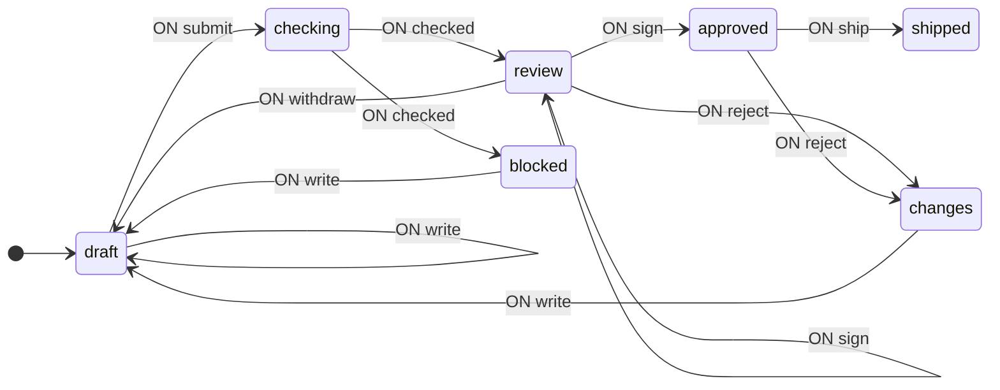
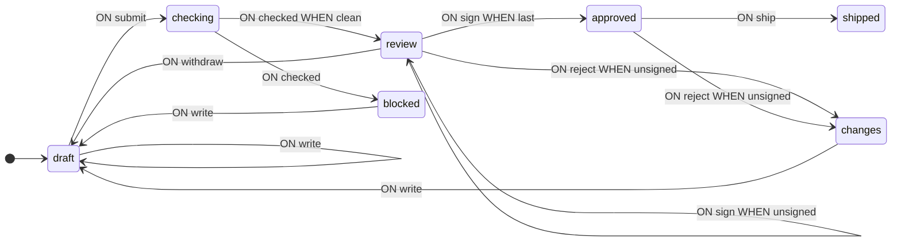
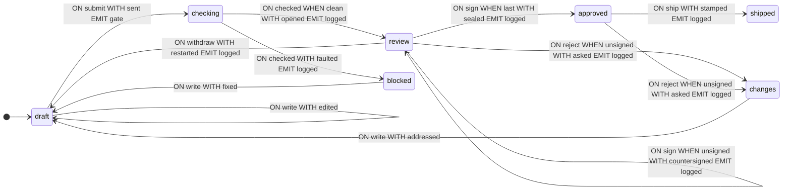

**English** · [Русский](README.ru.md)

# Schema Review

A complete walkthrough from problem statement to a working state machine: a change moving through review — an automated gate, then two sign-offs, then it ships. The document under review is itself a state-machine schema: the gate is the library's own `validate` and `analyze`, and the machine that runs the review is drawn on the page by the widgets of [`@evgkch/machjs-inspector`](https://github.com/evgkch/machjs-inspector). The sections follow the order of work — first the transition graph, then context, guards and operations, then the gate, the page and the analysis. In the code, type definitions are usually placed before the schema, but here they are introduced as needed.

Notation and definitions are given in the [guide](https://github.com/evgkch/machjs/blob/master/README.md). References of the form “section 4.2” point to sections of this document; the guide is referenced by section title — “README, “Transition schema””.

**Working project.** The example runs as a page — [live demo](https://evgkch.github.io/machjs/review/). Vite, plain HTML and TypeScript, no frameworks; the commands are run from the root of this repository:

```sh
npm install
npm run dev       # http://localhost:5173/review/
npm run build     # tsc --noEmit + build to dist/
```

Correspondence between files and sections of the document:

| File                               | Sections                                           |
| ---------------------------------- | -------------------------------------------------- |
| [`src/types.ts`](src/types.ts)     | 2.1, 3 — states, events, context                   |
| [`src/machine.ts`](src/machine.ts) | 4, 5 — guards, operations, schema                  |
| [`src/gate.ts`](src/gate.ts)       | 6 — reading the document, the automated check      |
| [`src/main.ts`](src/main.ts)       | 7 — the page, the buttons, the drawing, the wait   |
| [`index.html`](index.html)         | 7.1 — the markup: the sign buttons, the reason box |
| [`src/style.css`](src/style.css)   | presentation; no behaviour rules live in it        |

**Contents**

1. [Problem statement](#1-problem-statement)
2. [Transition graph](#2-transition-graph)
3. [Context](#3-context)
4. [Guards](#4-guards)
5. [Operations](#5-operations)
6. [The gate](#6-the-gate)
7. [Interaction from the browser](#7-interaction-from-the-browser)
8. [Machine run](#8-machine-run)
9. [Schema analysis](#9-schema-analysis)
10. [The machine on the page](#10-the-machine-on-the-page)

## 1. Problem statement

The task: a change goes through review. A machine checks it first, then two of a board of three reviewers sign off on it, then it ships. The signature is electronic: ECDSA over the document text. The submission under review is a state-machine schema: the library checks documents written in its own language — and draws them too.

Workflows like this are usually written as one record and a status string: a `submission` object with every field the whole pipeline could ever have, and a `status` that says which of them are meant to be present. That shape permits the same bug over and over: a document that is `shipped` and still has an open fault list, or `blocked` with a signature on it — the record contains every field, and the status string does not constrain them.

The fix is to make the phase a state and give each state exactly the fields that phase has. The compiler then refuses what the workflow used to permit by accident: a field in a phase that does not own it simply does not type.

## 2. Transition graph

### 2.1 States and events

Table 1 — Machine states

| State      | Meaning                                      |
| ---------- | -------------------------------------------- |
| `draft`    | Being written; can be edited and submitted   |
| `checking` | Sent to the gate, waiting on it              |
| `blocked`  | The gate refused it; being fixed             |
| `review`   | The gate passed; collecting sign-offs        |
| `changes`  | A reviewer asked for changes; being answered |
| `approved` | The quorum is reached; ready to ship         |
| `shipped`  | Out. Nothing can happen to it                |

There are seven input events: `write` with the new text, `submit`, `checked` with the gate's answer, `sign` with the signer's name and the signature itself, `reject` with the reviewer's name and the reason, `ship`, and `withdraw`. There are two output events: `gate` with the text to check, and `logged` with one line for the activity feed.

```ts
import type { IState, IEvent, Merge } from "@evgkch/machjs";

// Pure states without context.
type Q = IState<
  | "draft"
  | "checking"
  | "blocked"
  | "review"
  | "changes"
  | "approved"
  | "shipped"
>;

type Σ = Merge<
  | IEvent<"write", string>
  | IEvent<"submit">
  | IEvent<"checked", readonly Fault[]>
  | IEvent<"sign", { who: string; sig: string }>
  | IEvent<"reject", { who: string; why: string }>
  | IEvent<"ship">
  | IEvent<"withdraw">
>;

type Λ = Merge<
  IEvent<"gate", { text: string }> | IEvent<"logged", { line: string }>
>;
```

The types `Ticket`, `Fault` and `Sign` will be introduced in section 3, when the context appears.

### 2.2. First schema

There is no executable code (functions) in it yet — only the structure of states and transitions.

```ts
import type { Schema } from "@evgkch/machjs";

const draft = {
  draft: {
    write: [{ to: "draft" }],
    submit: [{ to: "checking" }],
  },
  checking: {
    checked: [{ to: "review" }, { to: "blocked" }],
  },
  blocked: {
    write: [{ to: "draft" }],
  },
  review: {
    sign: [{ to: "approved" }, { to: "review" }],
    reject: [{ to: "changes" }],
    withdraw: [{ to: "draft" }],
  },
  changes: {
    write: [{ to: "draft" }],
  },
  approved: {
    ship: [{ to: "shipped" }],
    reject: [{ to: "changes" }],
  },
  shipped: {},
} satisfies Schema<Q, Σ, Λ>;
```

Two rules in the pair `checking` + `checked` correspond to the gate's two answers — pass into `review` or refuse into `blocked` — and two rules in the pair `review` + `sign` to a signature's two fates: it completes the quorum, or it does not yet. What exactly distinguishes them is not yet written. `shipped` is the end: it has no rules.

The schema is already executable: the machine transitions between states without performing any calculations.

```ts
import { StateMachine } from "@evgkch/machjs";

const walk = new StateMachine<Q, Σ, Λ>(draft, {
  type: "draft",
  context: undefined,
});
walk.dispatch("submit"); // true
walk.state.type; // 'checking'
```

### 2.3. Validation

```ts
import { validate } from "@evgkch/machjs/analysis";
import { formatIssues } from "@evgkch/machjs/formatters";

console.log(formatIssues(validate(draft, "draft")));
```

```
⚠ warning node "shipped" has no outgoing transitions
✗ error   cell "checked" at "checking": rule 1 has no guard, so the 1 after it can never fire
✗ error   cell "sign" at "review": rule 1 has no guard, so the 1 after it can never fire
```

The two errors point to the same problem: there are multiple rules in a cell but no guards, so the first always fires (README, “Transition schema” and “Limitations”). The warning about `shipped` is not a repair to make — it is how the library marks a final state (README, “validate”).

```ts
import { toMermaid } from "@evgkch/machjs/formatters";

toMermaid(draft, { start: "draft", direction: "LR" });
```



The `review --> review` arrow is the rule for a signature that does not complete the quorum: the document stays in review.

## 3. Context

The guards from section 2.3 must tell whether the gate found anything that blocks, and whether this signature completes the quorum. To do that they need the gate's list of faults and the signatures already given — so context.

```ts
/** What is under review: somebody's schema, as they typed it. */
type Doc = { readonly name: string; readonly text: string };

/** One thing wrong with a submission. */
type Fault = {
  readonly rank: "blocker" | "caution";
  readonly where: string;
  readonly what: string;
};

/**
 * A sign-off: who, when, and the signature itself — ECDSA P-256 over the document text, hex.
 *
 * The text cannot change while signatures are collected (no `write` rule in `review`), so every
 * signature is over the same text. Any edit produces a new text, which is why every path out of
 * `review` drops the signatures: they are computed over the old one.
 */
type Sign = {
  readonly who: string;
  readonly at: number;
  readonly sig: string;
};

/** Something that was raised and has been answered. */
type Closed = {
  readonly round: number;
  readonly by: string;
  readonly what: string;
};

/** The submission itself — the part that survives every phase. */
type Ticket = {
  readonly doc: Doc;
  readonly round: number;
  readonly closed: readonly Closed[];
};
```

A submission is not one object with fields added along the way. It is a different object in every phase, and the phase decides which: a fault list exists only in `blocked`, a signature list from `review` on, a timestamp only in `shipped`. The context composition is **different in different states**.

Table 2 — What each state holds

| State               | Content                                             |
| ------------------- | --------------------------------------------------- |
| `draft`, `checking` | the ticket — `doc`, `round`, `closed`               |
| `blocked`           | the ticket plus `faults` — the gate's findings      |
| `review`            | the ticket plus `notes` (the cautions) and `signs`  |
| `changes`           | the ticket plus `asked` (the request) and `by`      |
| `approved`          | the ticket plus `signs`                             |
| `shipped`           | the ticket plus `signs` and `at`                    |

```ts
export type Q = Merge<
  | IState<"draft", Ticket>
  | IState<"checking", Ticket>
  | IState<"blocked", Ticket & { faults: readonly Fault[] }>
  | IState<
      "review",
      Ticket & { notes: readonly Fault[]; signs: readonly Sign[] }
    >
  | IState<"changes", Ticket & { asked: string; by: string }>
  | IState<"approved", Ticket & { signs: readonly Sign[] }>
  | IState<"shipped", Ticket & { signs: readonly Sign[]; at: number }>
>;
```

The persistent part is `Ticket`: the document, the round number, the closed items. The remaining fields are declared in the context of a specific phase and do not exist outside it.

A single record with all fields at once would look shorter, but it would need a placeholder for every phase without the field — an empty fault list, a list of no signatures, a zero timestamp. That is exactly how a `shipped` document ends up with an open fault list. The state-bound context rules the placeholder out: `draft` has no `faults` field.

An item that was answered is _closed_, not deleted: `closed` records the round, the author and the text, and the record stays for the life of the ticket. If a revision did not fix the problem, the next gate run enters the same item again, beside the old record.

A state and its context only make sense together, so the machine returns them as a single value — `flow.state` of type `FsmState` — where `type` narrows the `context` (README, “Creating a machine and the state”).

## 4. Guards

### 4.1. Names in the schema

Guards are written in the rules by function names; their implementations are given in section 4.2.

> [!NOTE]
> Below is a sketch, not a schema that the compiler would accept, and there is no `satisfies` intentionally. Context is tied to the state (section 3): guards read it, and a transition into a state with context requires a context function. The full schema is given in section 5.3, together with the operations; here we only show where the guard names stand in the rules.

```ts
const guarded = {
  draft: {
    write: [{ to: "draft" }],
    submit: [{ to: "checking" }],
  },
  checking: {
    checked: [{ to: "review", when: clean }, { to: "blocked" }],
  },
  blocked: {
    write: [{ to: "draft" }],
  },
  review: {
    sign: [
      { to: "approved", when: last },
      { to: "review", when: unsigned },
    ],
    reject: [{ to: "changes", when: unsigned }],
    withdraw: [{ to: "draft" }],
  },
  changes: {
    write: [{ to: "draft" }],
  },
  approved: {
    ship: [{ to: "shipped" }],
    reject: [{ to: "changes", when: unsigned }],
  },
  shipped: {},
};
```

The two dead-rule errors are gone. The cells are guarded differently, and this is deliberate. `checking` + `checked` ends in an unguarded rule: the gate's answer has an outcome either way. `review` + `sign` has no unguarded rule: a repeat signature satisfies neither guard, and `dispatch` returns `false`. `reject` is guarded too: a request for changes from a reviewer whose signature stands would contradict it. Refusing a transition is as ordinary an outcome as taking one (README, “validate”). Validation leaves one finding.

```ts
formatIssues(validate(guarded, "draft"));
```

```
⚠ warning node "shipped" has no outgoing transitions
```

Guard names appear in the diagram because they are taken from the functions themselves (README, “Labels and names”):



### 4.2. Implementation

```ts
const QUORUM = 2;

/** Did the gate find anything that blocks. Cautions do not — they go to the reviewers. */
function clean(_c: Ticket, faults: readonly Fault[]): boolean {
  return !faults.some((f) => f.rank === "blocker");
}

/** Is this the signature that completes the quorum. */
function last(c: { signs: readonly Sign[] }, p: { who: string }): boolean {
  return !given(c.signs, p.who) && c.signs.length + 1 >= QUORUM;
}

/** No standing signature from this person. On `sign` it admits a first signature; on `reject`
    a request for changes: one made over a standing signature would contradict it. */
function unsigned(c: { signs: readonly Sign[] }, p: { who: string }): boolean {
  return !given(c.signs, p.who);
}

const given = (signs: readonly Sign[], who: string) =>
  signs.some((s) => s.who === who);
```

`clean` reads the gate's answer: it returns `false` on a blocker, `true` on cautions alone. `last` is the quorum test: a signature that is not a repeat and brings the count to `QUORUM`. `unsigned` stands in two cells: on `sign` it admits a reviewer's first signature (the quorum case is handled by the first rule — guards are checked in order), on `reject` — a request for changes from a reviewer without a standing signature. A repeat signature satisfies no guard of its cell: `dispatch` returns `false`, `can("sign", …)` too, and the page disables the signer's button (section 7.3). The board is one larger than the quorum, so in `approved` `reject` is still available to at least one reviewer. Guards only read the context and event payload, never mutating them (README, “Limitations”).

## 5. Operations

### 5.1. Context after transition

Table 3 — Context update functions

| Function        | What it does                                                         |
| --------------- | -------------------------------------------------------------------- |
| `edited`        | Replaces the document's text                                         |
| `sent`          | Increments `round` by one                                            |
| `fixed`         | Replaces the text and records the gate's blockers in `closed`        |
| `addressed`     | Replaces the text and records the reviewer's request in `closed`     |
| `faulted`       | Carries the gate's faults into `blocked`                             |
| `opened`        | Into `review`: keeps the cautions as `notes`, no signs yet           |
| `countersigned` | Adds a signature short of the quorum; the review context is kept     |
| `sealed`        | Adds the last signature; enters `approved` without `notes`           |
| `asked`         | Writes the request and its author into the `changes` context         |
| `restarted`     | The author withdraws: returns a `Ticket` without the `review` fields |
| `stamped`       | Stamps the time it shipped                                           |

The listing below also contains `text` and the `line` helpers. They do not update the context but build output events, and so are covered in section 5.2.

```ts
function edited(c: Ticket, text: string): Ticket {
  return { ...c, doc: { ...c.doc, text } };
}

/** Off to the gate, and this is the round it will answer about. */
function sent(c: Ticket): Ticket {
  return { ...c, round: c.round + 1 };
}

/** The author pulling it back out of review: nothing was raised, so nothing to close. */
function restarted(c: Ticket): Ticket {
  return { doc: c.doc, round: c.round, closed: c.closed };
}

/** Answering what the gate refused on: every blocker is closed as the revision goes in. */
function fixed(c: Ticket & { faults: readonly Fault[] }, text: string): Ticket {
  const settled: Closed[] = c.faults
    .filter((f) => f.rank === "blocker")
    .map((f) => ({
      round: c.round,
      by: "gate",
      what: `${f.where} — ${f.what}`,
    }));
  return {
    doc: { ...c.doc, text },
    round: c.round,
    closed: [...c.closed, ...settled],
  };
}

/** The same act one phase over: the reviewer's request is answered, and stays on the ticket. */
function addressed(
  c: Ticket & { asked: string; by: string },
  text: string,
): Ticket {
  return {
    doc: { ...c.doc, text },
    round: c.round,
    closed: [...c.closed, { round: c.round, by: c.by, what: c.asked }],
  };
}

function faulted(
  c: Ticket,
  faults: readonly Fault[],
): Ticket & { faults: readonly Fault[] } {
  return { ...c, faults };
}

/** Into review carrying what the gate let through: the cautions, for a human to weigh. */
function opened(
  c: Ticket,
  faults: readonly Fault[],
): Ticket & { notes: readonly Fault[]; signs: readonly Sign[] } {
  return {
    ...c,
    notes: faults.filter((f) => f.rank === "caution"),
    signs: [],
  };
}

/** A signature short of the quorum: the review context is kept, the list grows by one. */
function countersigned(
  c: Ticket & { notes: readonly Fault[]; signs: readonly Sign[] },
  p: { who: string; sig: string },
): Ticket & { notes: readonly Fault[]; signs: readonly Sign[] } {
  return {
    ...c,
    signs: [...c.signs, { who: p.who, at: Date.now(), sig: p.sig }],
  };
}

/**
 * The signature that completes the quorum — and the exit from review.
 *
 * Rebuilt, not spread, for the reason `restarted` gives: `notes` belongs to the `review` context
 * and is not part of the `approved` one; a spread would carry it along anyway.
 */
function sealed(
  c: Ticket & { notes: readonly Fault[]; signs: readonly Sign[] },
  p: { who: string; sig: string },
): Ticket & { signs: readonly Sign[] } {
  return {
    doc: c.doc,
    round: c.round,
    closed: c.closed,
    signs: [...c.signs, { who: p.who, at: Date.now(), sig: p.sig }],
  };
}

/**
 * The request for changes and its author — the `changes` context.
 *
 * Also rebuilt: both source contexts include signatures, and the `changes` context does not.
 * The signatures are bound to the text under review anyway — see `Sign`.
 */
function asked(
  c: Ticket,
  p: { who: string; why: string },
): Ticket & { asked: string; by: string } {
  return {
    doc: c.doc,
    round: c.round,
    closed: c.closed,
    asked: p.why,
    by: p.who,
  };
}

function stamped(c: Ticket & { signs: readonly Sign[] }) {
  return { ...c, at: Date.now() };
}
```

Every one of these returns the context of the phase being entered. `...c` carries the `Ticket` fields unchanged; written beside it is what the new phase adds.

`restarted`, `sealed` and `asked` return only the listed fields. Returning `c` whole would typecheck — the `review` context is compatible with `Ticket` — and would carry the signatures into `draft` and `notes` into `approved`, although the types of those contexts have no such fields.

`fixed` and `addressed` record the item in `closed` rather than delete it. Whether the revision fixed the problem, the next gate run shows: anything still wrong lands in the new fault list, beside the old record in `closed`.

Each function returns a new object, never mutating the passed one (README, “Limitations”).

### 5.2. Output events

Both output events carry data, so both `emit`s are pairs — the name and a packer (README, “Transition schema”). The machine does not run the gate and does not update the page: it emits `gate` and `logged`, and the app handles them (section 7.2).

```ts
function text(c: Ticket) {
  return { text: c.doc.text };
}

const line = (s: string) => ({ line: s });

/* Each line names its round, because the feed is the one place the rounds are told apart. */

function passed(c: Ticket & { notes: readonly Fault[] }) {
  return line(
    c.notes.length
      ? `round ${c.round}: gate passed with ${c.notes.length} caution(s) — ${QUORUM} sign-offs needed`
      : `round ${c.round}: gate passed clean — ${QUORUM} sign-offs needed`,
  );
}

function refused(c: Ticket & { faults: readonly Fault[] }) {
  const blockers = c.faults.filter((f) => f.rank === "blocker").length;
  return line(`round ${c.round}: gate refused it — ${blockers} blocker(s)`);
}

function oneMore(c: { signs: readonly Sign[] }) {
  return line(`signed off — ${QUORUM - c.signs.length} to go`);
}

function quorum(c: { signs: readonly Sign[] }) {
  return line(`approved by ${c.signs.map((s) => s.who).join(" and ")}`);
}

function sentBack(c: Ticket & { asked: string; by: string }) {
  return line(`round ${c.round}: ${c.by} asked for changes — ${c.asked}`);
}

function pulled() {
  return line("withdrawn by the author");
}

function shipped(c: Ticket) {
  return line(
    `${c.doc.name} shipped after ${c.round} round(s), ${c.closed.length} item(s) settled`,
  );
}
```

The packers are the `by` half: they read the context _after_ the transition and turn it into the event's payload. `text` reads the current document; `passed` and `refused` — the result of the gate's answer; `quorum` — the signatures that completed the quorum. The page builds the feed from these lines and keeps no log of its own.

### 5.3. Full schema

```ts
import { StateMachine } from "@evgkch/machjs";

const START: Doc = {
  name: "turnstile.json",
  text: `{
  "locked": {
    "coin": [{ "to": ["open", "reset"], "emit": "opened" }],
    "push": [{ "to": "locked", "emit": "denied" }]
  },
  "open": {
    "push": [{ "to": "locked" }]
  }
}`,
};

export const flow = new StateMachine<Q, Σ, Λ>(
  {
    draft: {
      write: [{ to: ["draft", edited] }],
      submit: [{ to: ["checking", sent], emit: ["gate", text] }],
    },
    checking: {
      checked: [
        { when: clean, to: ["review", opened], emit: ["logged", passed] },
        { to: ["blocked", faulted], emit: ["logged", refused] },
      ],
    },
    blocked: {
      write: [{ to: ["draft", fixed] }],
    },
    review: {
      sign: [
        { when: last, to: ["approved", sealed], emit: ["logged", quorum] },
        {
          when: unsigned,
          to: ["review", countersigned],
          emit: ["logged", oneMore],
        },
      ],
      reject: [
        { when: unsigned, to: ["changes", asked], emit: ["logged", sentBack] },
      ],
      withdraw: [{ to: ["draft", restarted], emit: ["logged", pulled] }],
    },
    changes: {
      write: [{ to: ["draft", addressed] }],
    },
    approved: {
      ship: [{ to: ["shipped", stamped], emit: ["logged", shipped] }],
      reject: [
        { when: unsigned, to: ["changes", asked], emit: ["logged", sentBack] },
      ],
    },
    shipped: {},
  },
  { type: "draft", context: { doc: START, round: 0, closed: [] } },
);
```

The `sign` cell has no unguarded rule: a repeat signature satisfies neither guard, `dispatch` returns `false`, and the state does not move. `can("sign", …)` for a signer returns `false` as well, and the page disables that button (section 7.3). The same guard stands on `reject` in both phases: only a reviewer without a standing signature may request changes.

The initial state is `draft` with a `Ticket` context; its `doc` is itself a schema — `START`, a turnstile written in the library's own language.

## 6. The gate

The gate is what CI would run before a human is asked to look. Because the thing being reviewed is a schema, the checks are the library's own — `validate` for the findings and `analyze` for the shape.

```ts
import { analyze, validate } from "@evgkch/machjs/analysis";
import { edges, nodes } from "@evgkch/machjs";
import type { Fault } from "./types.js";

/** A schema as a text box can hand one over: keyed by state, holding anything. */
export type Graph = Record<string, unknown>;
```

`Graph` is deliberately loose: the functions below accept a graph that may be nonsense, and return a value rather than throw. `object` would lose the state names: `keyof object` is `never`, and `nodes` would return an empty list.

### 6.1. Reading the document

```ts
export function readGraph(text: string): Graph | string {
  let read: unknown;
  try {
    read = JSON.parse(text);
  } catch (e) {
    return (e as Error).message;
  }
  if (read === null || typeof read !== "object" || Array.isArray(read))
    return "a schema is an object keyed by state";
  if (Object.keys(read).length === 0) return "the schema names no states";
  return read as Graph;
}

export const startOf = (graph: Graph): string => Object.keys(graph)[0] ?? "";
```

The gate takes text, not a schema: what an author submits is a document, and “it is not valid JSON” is one of the gate's answers. `readGraph` is exported: the page parses the same document for the drawing (section 7.3) with the same code. The start state is the first one named in the schema, as in the inspector's widgets.

### 6.2. What the library says

```ts
const found = (graph: Graph, start: string): Fault[] =>
  validate(graph, start)
    // A dead end is no finding: the library marks it as a warning, but a state with no way
    // out is usually the intended final one. The case where nothing at all can run is
    // policy's own blocker below.
    .filter((issue) => issue.kind !== "terminal")
    .map((issue) => ({
      rank: issue.severity === "error" ? "blocker" : "caution",
      where: issue.event ? `${issue.node} · ${String(issue.event)}` : issue.node,
      what: issue.message,
    }));
```

`validate`'s two severities are kept almost as they are: an error blocks, a warning is shown to the reviewers. The one exception: the dead-end warning is not filed at all — a state with no way out is usually the schema's intended final state (README, `validate`), and the nothing-can-run case is a policy blocker of its own (section 6.3). The mapping to `Fault` is done here, so the guard in the machine checks one thing: is there a blocker.

### 6.3. House rules

```ts
const policy = (graph: Graph, start: string): Fault[] => {
  const out: Fault[] = [];
  const facts = analyze(graph, start);

  if (facts.terminal.length === facts.nodes.length)
    out.push({
      rank: "blocker",
      where: "schema",
      what: "every state is a dead end — nothing here can run",
    });

  for (const q of nodes(graph))
    if (q !== q.toLowerCase())
      out.push({
        rank: "caution",
        where: q,
        what: "state names are lower case in this codebase",
      });

  for (const row of edges(graph))
    if (row.when === "?")
      out.push({
        rank: "caution",
        where: `${String(row.from)} · ${String(row.on)}`,
        what: "the guard has no name, so no diagram can say what it decides",
      });

  return out;
};
```

The house rules are this organisation's, not the library's. There are three: a schema with no way out of any state, a state name not in lower case, a guard without a name. The third applies to the serialized form: a dump writes the operation's name in place of the function, and `?` in place of a nameless guard — the rule checks `when === "?"`.

The two lists are separated: `found` is facts about the schema, `policy` is policy.

### 6.4. Running the gate

```ts
/** A document that will not read is one fault — there is nothing to analyse. */
const unreadable = (what: string): Fault[] => [
  { rank: "blocker", where: "document", what },
];

export function gate(text: string): readonly Fault[] {
  const graph = readGraph(text);
  if (typeof graph === "string") return unreadable(graph);
  const start = startOf(graph);
  return [...found(graph, start), ...policy(graph, start)];
}
```

The gate's answer is only the fault list: the library's findings, then the policy's. The schema's size — states, rules, reachability — the page computes itself when drawing (section 7.3).

## 7. Interaction from the browser

### 7.1. Markup and dispatch

The page is a queue of one submission: a textarea for the document, the drawing under it, a row of phase chips, the open findings, the settled items, the signatures, and the buttons.

```ts
const el = <T extends HTMLElement>(id: string) =>
  document.getElementById(id) as T;

const doc = el<HTMLTextAreaElement>("doc");
const rev = el<HTMLSelectElement>("rev");
const revOptions = [...rev.querySelectorAll("option")];
const why = el<HTMLInputElement>("why");
// … the rest of the element refs …

/** Who may sign: one button per board member, the name in `data-sign`. */
const signs = [
  ...document.querySelectorAll<HTMLButtonElement>("[data-sign]"),
].map((button) => [button.dataset["sign"]!, button] as const);
```

The signature is real: ECDSA P-256 via WebCrypto over the document text. Keys are generated on load; WebCrypto is asynchronous and `dispatch` is not, so the signature is computed in the handler, before the event is dispatched.

```ts
/** One P-256 keypair per board member. A real pipeline would look them up. */
const keys = new Map<string, CryptoKeyPair>();
for (const [who] of signs)
  keys.set(
    who,
    await crypto.subtle.generateKey(
      { name: "ECDSA", namedCurve: "P-256" },
      false,
      ["sign", "verify"],
    ),
  );

/** The signature: ECDSA over the document text, hex-encoded. */
async function autograph(who: string, text: string): Promise<string> {
  const bytes = await crypto.subtle.sign(
    { name: "ECDSA", hash: "SHA-256" },
    keys.get(who)!.privateKey,
    new TextEncoder().encode(text),
  );
  return [...new Uint8Array(bytes)]
    .map((b) => b.toString(16).padStart(2, "0"))
    .join("");
}

doc.addEventListener("input", () => flow.dispatch("write", doc.value));
submit.addEventListener("click", () => flow.dispatch("submit"));
ship.addEventListener("click", () => flow.dispatch("ship"));
withdraw.addEventListener("click", () => flow.dispatch("withdraw"));
for (const [who, button] of signs)
  button.addEventListener("click", async () =>
    flow.dispatch("sign", {
      who,
      sig: await autograph(who, flow.state.context.doc.text),
    }),
  );

reject.addEventListener("click", () => {
  const sent = flow.dispatch("reject", {
    who: rev.value,
    why: why.value.trim() || "no reason given",
  });
  if (sent) why.value = "";
});
```

No handler tests the phase. Every input is passed straight to `dispatch`; whether it is accepted, the schema's rules decide. A keystroke while the gate has the document is refused by the schema: there is no `write` rule in `checking`, `dispatch` returns `false`, the state does not change (README, “Executing a transition: `dispatch` and `can`”). The reason box is cleared only on an accepted request — visible in `dispatch`'s return value. The board is written once, in the markup: the `data-sign` buttons and the select beside the reason box.

### 7.2. The wait: gate as a listener

```ts
flow.rx.on("gate", ({ text }) => {
  setTimeout(() => flow.dispatch("checked", gate(text)), 700);
});

flow.rx.on("logged", ({ line }) => {
  const row = document.createElement("li");
  row.textContent = line;
  feed.prepend(row);
});
```

`checked` is dispatched through `setTimeout`: the library forbids a nested `dispatch` (README, “Atomicity and nested calls”).

The waiting is a state of the machine. `submit` emits `gate`, this code runs the checks and dispatches `checked` back, and in between the machine is in `checking` — a state with no `write` rule, so the document cannot be edited meanwhile. The listener holds no promise, flag, or `busy` boolean.

### 7.3. Drawing

```ts
/** One row of two lines: what it is about, and what it says. */
const item = (cls: string, where: string, what: string) => {
  const row = document.createElement("li");
  row.className = cls;
  const a = document.createElement("span");
  a.className = "where";
  a.textContent = where;
  const b = document.createElement("span");
  b.className = "what";
  b.textContent = what;
  row.append(a, b);
  return row;
};

const fault = (f: Fault) => item(f.rank, f.where, f.what);

/** An item that was raised and answered — kept, and marked as the round it belonged to. */
const closed = (c: Closed) =>
  item("done", `round ${c.round} · ${c.by}`, c.what);

function paint(): void {
  const s = flow.state;
  document.body.dataset["phase"] = s.type;
  phaseOut.textContent = s.type;

  // The text comes from the machine, and the box is read-only whenever `write` cannot fire —
  // the same `can` the buttons use.
  if (doc.value !== s.context.doc.text) doc.value = s.context.doc.text;
  doc.readOnly = !flow.can("write", doc.value);

  faultsOut.replaceChildren(
    ...(s.type === "blocked"
      ? s.context.faults.map(fault)
      : s.type === "review"
        ? s.context.notes.map(fault)
        : s.type === "changes"
          ? [item("caution", s.context.by, s.context.asked)]
          : []),
  );

  closedOut.replaceChildren(...s.context.closed.map(closed));
  settledBox.hidden = s.context.closed.length === 0;

  // … the sign-off readout and the round readout …

  submit.disabled = !flow.can("submit");
  ship.disabled = !flow.can("ship");
  withdraw.disabled = !flow.can("withdraw");
  for (const [who, button] of signs)
    button.disabled = !flow.can("sign", { who, sig: "" });
  for (const option of revOptions)
    option.disabled = !flow.can("reject", { who: option.value, why: "" });
  const open = revOptions.find((o) => !o.disabled);
  if (rev.selectedOptions[0]?.disabled && open) rev.value = open.value;
  reject.disabled = !flow.can("reject", { who: rev.value, why: "" });
}

flow.rx.on(TRANSITION, paint);
paint();
```

`paint` runs after every transition and reads the machine and nothing else. The state is a discriminated union, so `s.type` narrows `s.context`: inside the `review` branch the signatures are in scope and the fault list is not, because a document in review has no fault list. The compiler checks the same thing the schema does.

A button is enabled when `can(event)` — the same question the next `dispatch` will check — returns `true`; the set of available actions is written in the schema, not on this page. Delete a rule from the table and the button is disabled; add one and it is enabled. The question narrows by payload too: once anna has signed, `can("sign", { who: "anna", … })` returns `false` while the same question about boris returns `true`. The select's options are disabled by the same question; if the selected one is disabled, the page moves the selection to an available one.

## 8. Machine run

The run is performed by sending events directly, without using the page; the markup and subscriptions from section 7 are not involved. After each event, the phase, the round, and the salient context are shown.

```
write (broken JSON)         draft     round 0
submit                      checking  round 1
checked · 1 blocker         blocked   round 1   faults: 1
write (fixed)               draft     round 1   closed: 1
submit                      checking  round 2
checked · clean             review    round 2   signs: —
sign anna                   review    round 2   signs: anna f2a1e345…
sign anna — repeat          review    round 2   dispatch → false
sign boris                  approved  round 2   signs: anna, boris
ship                        shipped   round 2   at: set
```

`submit` is the only event that increments the round; the gate's answer comes back as `checked`, with a whole state in between. The first round was refused: the document was broken JSON, the gate returned one blocker, and the machine went to `blocked` with that blocker in the context. An edit returned the document to `draft`; `fixed` recorded the blocker in `closed` — one record there now. The second round passed clean; `sign` from anna added the first signature — ECDSA over the document text, its hex stored in the context. A repeat `sign` from anna satisfied no guard of the cell: `dispatch` returned `false`, the state did not change; anna's button on the page is disabled at this point. `sign` from boris fired the `last` guard and moved the machine to `approved` — without `notes`: `sealed` does not carry them. `ship` stamped the time and moved the machine to `shipped`, which has no rules.

The path not shown: `reject` is guarded by `unsigned` — in `review` only a reviewer without a standing signature can send it, and in `approved`, with two signatures out of a board of three, only the third reviewer, vera. An edit answers the request through `addressed` — the same way `fixed` closed the blocker. `withdraw` in `review` goes back to `draft` through `restarted`, which does not carry the signatures — a field a draft does not have.

## 9. Schema analysis

### 9.1. Diagram

The same schema as in sections 2.3 and 4.1, but now with operations and output events.

```ts
toMermaid(flow.schema, { start: "draft", direction: "LR" });
```



All operations here are named functions, so `?` does not appear in the labels — and every rule has a `WITH`: every transition has a context function. The `EMIT` labels name the event and never the packer: `by` is the one word absent from the diagram (README, “Labels and names”).

### 9.2. Validation

```ts
formatIssues(validate(flow.schema, "draft"));
```

```
⚠ warning node "shipped" has no outgoing transitions
```

There are no unreachable states, no dead rules, and every state but one has an outgoing path. The exception is `shipped`, and it is intentional: with this warning the library marks a final state (README, “validate”).

## 10. The machine on the page

At the bottom of the page the automaton is drawn by the widgets of [`@evgkch/machjs-inspector`](https://github.com/evgkch/machjs-inspector): the legend of states, the transition diagram and the run. `<machjs-desk>` binds them — it wires the widgets to one subject and gives each a switch:

```ts
import { MachjsDesk, fromMachine } from "@evgkch/machjs-inspector/ui";

const desk = new MachjsDesk();
desk.wiring = { subject: fromMachine(flow) };
board.append(desk);
desk.enroll(diagram); // wiring, drawing and a switch
```

The widgets are subscribed to the machine: every transition is drawn with no code on the page.
