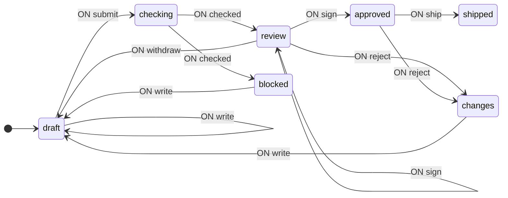
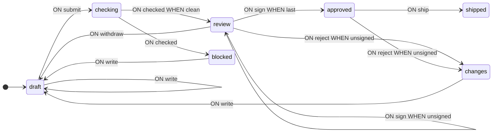
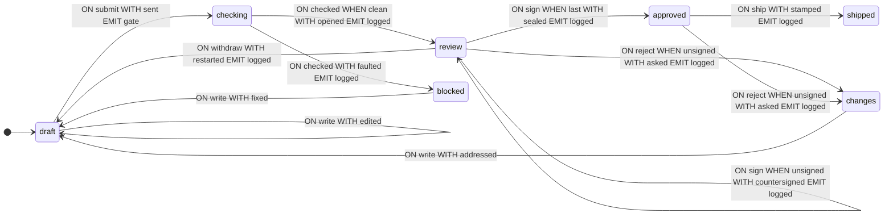

[English](README.md) · **Русский**

# Рецензирование схемы

Разбор задачи от постановки до готового автомата: изменение проходит ревью — автоматический гейт, затем две подписи, затем выпуск. Документ под ревью — схема конечного автомата: гейт — библиотечные `validate` и `analyze`, а машину, ведущую ревью, рисуют на странице виджеты [`@evgkch/machjs-inspector`](https://github.com/evgkch/machjs-inspector). Разделы идут в порядке работы: граф переходов, контекст, условия и операции, гейт, страница, анализ. Типы вводятся по мере необходимости.

Обозначения и определения — в [руководстве](https://github.com/evgkch/machjs/blob/master/README.ru.md). Ссылки вида «п. 4.2» ведут на пункты этого документа; на руководство ссылаемся по названию раздела — «README, «Схема переходов»».

**Рабочий проект.** Пример открывается как страница — [живая версия](https://evgkch.github.io/machjs/review/). Vite, чистый HTML и TypeScript, без фреймворков; команды выполняются из корня этого репозитория:

```sh
npm install
npm run dev       # http://localhost:5173/review/
npm run build     # tsc --noEmit + сборка в dist/
```

Соответствие файлов разделам документа:

| Файл                               | Разделы                                          |
| ---------------------------------- | ------------------------------------------------ |
| [`src/types.ts`](src/types.ts)     | 2.1, 3 — состояния, события, контекст            |
| [`src/machine.ts`](src/machine.ts) | 4, 5 — условия, операции, схема                  |
| [`src/gate.ts`](src/gate.ts)       | 6 — чтение документа, автоматическая проверка    |
| [`src/main.ts`](src/main.ts)       | 7 — страница, кнопки, рисунок, ожидание          |
| [`index.html`](index.html)         | 7.1 — разметка: кнопки подписантов, поле причины |
| [`src/style.css`](src/style.css)   | оформление; правил поведения в нём нет           |

**Содержание**

1. [Постановка](#1-постановка)
2. [Граф переходов](#2-граф-переходов)
3. [Контекст](#3-контекст)
4. [Условия](#4-условия)
5. [Операции](#5-операции)
6. [Гейт](#6-гейт)
7. [Обращение из браузера](#7-обращение-из-браузера)
8. [Работа автомата](#8-работа-автомата)
9. [Анализ схемы](#9-анализ-схемы)
10. [Машина на странице](#10-машина-на-странице)

## 1. Постановка

Задача: изменение проходит ревью. Сначала его проверяет машина, затем двое из совета трёх рецензентов подписывают, затем — выпуск. Подпись — электронная: ECDSA над текстом документа. На проверку подаётся схема конечного автомата: библиотека проверяет документы, написанные на её собственном языке, — и она же их рисует.

Такой процесс обычно пишут как одну запись и строку статуса: объект `submission` со всеми полями и поле `status`, указывающее, какие из них сейчас имеют смысл. Эта форма допускает баг: документ со статусом `shipped`, но с открытым списком замечаний, или `blocked` с уже стоящей подписью — запись содержит все поля, а строка статуса их не ограничивает.

Здесь фаза сделана состоянием, и у каждого состояния ровно те поля, которые есть у фазы: поле в чужом состоянии не проходит типизацию.

## 2. Граф переходов

### 2.1 Состояния и события

Таблица 1 — Состояния автомата

| Состояние  | Значение                                    |
| ---------- | ------------------------------------------- |
| `draft`    | Черновик: можно править и отправлять        |
| `checking` | Отправлено на проверку, идёт ожидание       |
| `blocked`  | Гейт отклонил; идёт исправление             |
| `review`   | Гейт пропустил; идёт сбор подписей          |
| `changes`  | Рецензент запросил правки; идёт ответ       |
| `approved` | Кворум набран; готово к выпуску             |
| `shipped`  | Выпущено. С ним больше ничего не происходит |

На входе семь событий: `write` с новым текстом, `submit`, `checked` с ответом гейта, `sign` с именем подписавшего и самой подписью, `reject` с именем рецензента и причиной, `ship` и `withdraw`. На выходе два: `gate` с текстом для проверки и `logged` с одной строкой для ленты.

```ts
import type { IState, IEvent, Merge } from "@evgkch/machjs";

// Чистые состояния без контекста.
type Q = IState<
  | "draft"
  | "checking"
  | "blocked"
  | "review"
  | "changes"
  | "approved"
  | "shipped"
>;

type Σ = Merge<
  | IEvent<"write", string>
  | IEvent<"submit">
  | IEvent<"checked", readonly Fault[]>
  | IEvent<"sign", { who: string; sig: string }>
  | IEvent<"reject", { who: string; why: string }>
  | IEvent<"ship">
  | IEvent<"withdraw">
>;

type Λ = Merge<
  IEvent<"gate", { text: string }> | IEvent<"logged", { line: string }>
>;
```

Типы `Ticket`, `Fault` и `Sign` вводятся в разделе 3.

### 2.2. Первая схема

Исполняемого кода (функций) в ней пока нет — только структура состояний и переходов.

```ts
import type { Schema } from "@evgkch/machjs";

const draft = {
  draft: {
    write: [{ to: "draft" }],
    submit: [{ to: "checking" }],
  },
  checking: {
    checked: [{ to: "review" }, { to: "blocked" }],
  },
  blocked: {
    write: [{ to: "draft" }],
  },
  review: {
    sign: [{ to: "approved" }, { to: "review" }],
    reject: [{ to: "changes" }],
    withdraw: [{ to: "draft" }],
  },
  changes: {
    write: [{ to: "draft" }],
  },
  approved: {
    ship: [{ to: "shipped" }],
    reject: [{ to: "changes" }],
  },
  shipped: {},
} satisfies Schema<Q, Σ, Λ>;
```

Два правила в паре `checking` + `checked` соответствуют двум ответам гейта — пропустить в `review` или отклонить в `blocked`, — а два правила в паре `review` + `sign` — двум случаям подписи: она завершает кворум или ещё нет. Чем именно они различаются, пока не записано. `shipped` — конец: правил у него нет.

Схема уже пригодна для выполнения: автомат переходит по состояниям, не выполняя вычислений.

```ts
import { StateMachine } from "@evgkch/machjs";

const walk = new StateMachine<Q, Σ, Λ>(draft, {
  type: "draft",
  context: undefined,
});
walk.dispatch("submit"); // true
walk.state.type; // 'checking'
```

### 2.3. Проверка

```ts
import { validate } from "@evgkch/machjs/analysis";
import { formatIssues } from "@evgkch/machjs/formatters";

console.log(formatIssues(validate(draft, "draft")));
```

```
⚠ warning node "shipped" has no outgoing transitions
✗ error   cell "checked" at "checking": rule 1 has no guard, so the 1 after it can never fire
✗ error   cell "sign" at "review": rule 1 has no guard, so the 1 after it can never fire
```

Обе ошибки указывают на одно: в ячейке несколько правил, но нет условий, поэтому всегда срабатывает первое (README, «Схема переходов» и «Ограничения»). Предупреждение о `shipped` чинить не нужно — так библиотека отмечает конечное состояние (README, «validate»).

```ts
import { toMermaid } from "@evgkch/machjs/formatters";

toMermaid(draft, { start: "draft", direction: "LR" });
```



Стрелка `review --> review` — правило для подписи, не завершившей кворум: документ остаётся в ревью.

## 3. Контекст

Условия из п. 2.3 должны различать, вернул ли гейт блокирующее замечание и завершает ли подпись кворум. Для этого им нужны список замечаний гейта и уже поставленные подписи — то есть контекст.

```ts
/** Документ под проверкой: имя и текст схемы. */
type Doc = { readonly name: string; readonly text: string };

/** Одно замечание к подаче. */
type Fault = {
  readonly rank: "blocker" | "caution";
  readonly where: string;
  readonly what: string;
};

/**
 * Подпись: кто, когда и сама подпись — ECDSA P-256 над текстом документа, в hex.
 *
 * Пока подписи собираются, текст не меняется (в `review` нет правила `write`), поэтому все
 * подписи — над одним текстом. Любая правка даёт новый текст, и каждый выход из `review`
 * сбрасывает подписи: они вычислены над старым.
 */
type Sign = {
  readonly who: string;
  readonly at: number;
  readonly sig: string;
};

/** Закрытый пункт: раунд, автор, текст. */
type Closed = {
  readonly round: number;
  readonly by: string;
  readonly what: string;
};

/** Постоянная часть контекста: документ, раунд, закрытые пункты. */
type Ticket = {
  readonly doc: Doc;
  readonly round: number;
  readonly closed: readonly Closed[];
};
```

Подача — не один объект, к которому по ходу добавляются поля: состав контекста **разный в разных состояниях**. Список замечаний есть только в `blocked`, список подписей — начиная с `review`, метка времени — только в `shipped`.

Таблица 2 — Что хранит каждое состояние

| Состояние           | Содержание                                      |
| ------------------- | ----------------------------------------------- |
| `draft`, `checking` | заявка — `doc`, `round`, `closed`               |
| `blocked`           | заявка плюс `faults` — замечания гейта          |
| `review`            | заявка плюс `notes` (предупреждения) и `signs`  |
| `changes`           | заявка плюс `asked` (запрос) и `by`             |
| `approved`          | заявка плюс `signs`                             |
| `shipped`           | заявка плюс `signs` и `at`                      |

```ts
export type Q = Merge<
  | IState<"draft", Ticket>
  | IState<"checking", Ticket>
  | IState<"blocked", Ticket & { faults: readonly Fault[] }>
  | IState<
      "review",
      Ticket & { notes: readonly Fault[]; signs: readonly Sign[] }
    >
  | IState<"changes", Ticket & { asked: string; by: string }>
  | IState<"approved", Ticket & { signs: readonly Sign[] }>
  | IState<"shipped", Ticket & { signs: readonly Sign[]; at: number }>
>;
```

Постоянная часть — `Ticket`: документ, номер раунда, закрытые пункты. Остальные поля объявлены в контексте конкретной фазы и вне её не существуют.

Единая запись со всеми полями потребовала бы заглушки для каждой фазы без поля — пустой список замечаний, список без подписей, нулевую метку времени. Именно так документ со статусом `shipped` и оказывается с открытым списком замечаний. Контекст, привязанный к состоянию, заглушку исключает: у `draft` поля `faults` нет.

Пункт, на который ответили, _закрывается_, а не удаляется: в `closed` записаны раунд, автор и текст, и запись сохраняется до конца работы над заявкой.

Состояние и контекст осмысленны только вместе, поэтому автомат возвращает их одним значением — `flow.state` типа `FsmState`, где `type` сужает `context` (README, «Создание автомата и состояние»).

## 4. Условия

### 4.1. Имена в схеме

Условия записываются в правила по именам функций; их реализации приведены в п. 4.2.

> [!NOTE]
> Ниже — набросок без `satisfies`, компилятор его не примет: вход в состояние с контекстом требует функции контекста, поэтому полная схема — в п. 5.3, вместе с операциями. Здесь показано только, где в правиле стоят имена условий.

```ts
const guarded = {
  draft: {
    write: [{ to: "draft" }],
    submit: [{ to: "checking" }],
  },
  checking: {
    checked: [{ to: "review", when: clean }, { to: "blocked" }],
  },
  blocked: {
    write: [{ to: "draft" }],
  },
  review: {
    sign: [
      { to: "approved", when: last },
      { to: "review", when: unsigned },
    ],
    reject: [{ to: "changes", when: unsigned }],
    withdraw: [{ to: "draft" }],
  },
  changes: {
    write: [{ to: "draft" }],
  },
  approved: {
    ship: [{ to: "shipped" }],
    reject: [{ to: "changes", when: unsigned }],
  },
  shipped: {},
};
```

Ошибки о мёртвых правилах исчезли, а ячейки устроены по-разному. `checking` + `checked` кончается безусловным правилом: у ответа гейта есть исход в любом случае. В `review` + `sign` безусловного правила нет: повторная подпись не подходит ни одному условию, и `dispatch` возвращает `false` — отказ от перехода такой же штатный исход, как переход (README, «validate»). `reject` тоже под условием: запрос правок при действующей подписи противоречил бы ей. Проверка оставляет одно замечание.

```ts
formatIssues(validate(guarded, "draft"));
```

```
⚠ warning node "shipped" has no outgoing transitions
```

Имена условий попадают в диаграмму, потому что берутся у самих функций (README, «Подписи и имена»):



### 4.2. Реализация

```ts
const QUORUM = 2;

/** Нашёл ли гейт что-то блокирующее. Предупреждения — нет: они идут рецензентам. */
function clean(_c: Ticket, faults: readonly Fault[]): boolean {
  return !faults.some((f) => f.rank === "blocker");
}

/** Та ли это подпись, что добирает кворум. */
function last(c: { signs: readonly Sign[] }, p: { who: string }): boolean {
  return !given(c.signs, p.who) && c.signs.length + 1 >= QUORUM;
}

/** У этого человека нет действующей подписи. На `sign` пропускает первую подпись,
    на `reject` — запрос правок: запрос при действующей подписи противоречил бы ей. */
function unsigned(c: { signs: readonly Sign[] }, p: { who: string }): boolean {
  return !given(c.signs, p.who);
}

const given = (signs: readonly Sign[], who: string) =>
  signs.some((s) => s.who === who);
```

`clean` читает ответ гейта: при блокере возвращает `false`, при одних предупреждениях — `true`. `last` — проверка кворума: подпись не повторная и доводит счёт до `QUORUM`. `unsigned` стоит в двух ячейках: на `sign` пропускает первую подпись рецензента (кворумный случай разобран первым правилом — условия проверяются по порядку), на `reject` — запрос правок от рецензента без действующей подписи. Для подписавшего `can("sign", …)` возвращает `false`, и страница отключает его кнопку (п. 7.3). Совет на одного больше кворума, поэтому и в `approved` `reject` доступен хотя бы одному рецензенту. Условия только читают контекст и данные события, не изменяя их (README, «Ограничения»).

## 5. Операции

### 5.1. Контекст после перехода

Таблица 3 — Функции обновления контекста

| Функция         | Что делает                                                        |
| --------------- | ----------------------------------------------------------------- |
| `edited`        | Заменяет текст документа                                          |
| `sent`          | Увеличивает `round` на единицу                                    |
| `fixed`         | Заменяет текст и записывает блокеры гейта в `closed`              |
| `addressed`     | Заменяет текст и записывает запрос рецензента в `closed`          |
| `faulted`       | Переносит замечания гейта в `blocked`                             |
| `opened`        | Вход в `review`: предупреждения — в `notes`, подписей пока нет    |
| `countersigned` | Добавляет подпись, не завершающую кворум; контекст ревью сохранён |
| `sealed`        | Добавляет последнюю подпись; `notes` в контекст `approved` не переносит |
| `asked`         | Записывает запрос и его автора в контекст `changes`; без подписей |
| `restarted`     | Автор отзывает: возвращает `Ticket` без полей `review`            |
| `stamped`       | Ставит метку времени выпуска                                      |

В листинге ниже приведены также `text` и хелпер `line`. Контекст они не обновляют, а строят выходные события, поэтому описаны в п. 5.2.

```ts
function edited(c: Ticket, text: string): Ticket {
  return { ...c, doc: { ...c.doc, text } };
}

/** Отправка гейту: номер раунда увеличивается. */
function sent(c: Ticket): Ticket {
  return { ...c, round: c.round + 1 };
}

/** Автор отзывает из ревью: остаётся `Ticket` без полей `review`. */
function restarted(c: Ticket): Ticket {
  return { doc: c.doc, round: c.round, closed: c.closed };
}

/** Ответ на то, что отклонил гейт: каждый блокер закрывается вместе с правкой. */
function fixed(c: Ticket & { faults: readonly Fault[] }, text: string): Ticket {
  const settled: Closed[] = c.faults
    .filter((f) => f.rank === "blocker")
    .map((f) => ({
      round: c.round,
      by: "gate",
      what: `${f.where} — ${f.what}`,
    }));
  return {
    doc: { ...c.doc, text },
    round: c.round,
    closed: [...c.closed, ...settled],
  };
}

/** Правка после запроса рецензента: запрос записывается в `closed`. */
function addressed(
  c: Ticket & { asked: string; by: string },
  text: string,
): Ticket {
  return {
    doc: { ...c.doc, text },
    round: c.round,
    closed: [...c.closed, { round: c.round, by: c.by, what: c.asked }],
  };
}

function faulted(
  c: Ticket,
  faults: readonly Fault[],
): Ticket & { faults: readonly Fault[] } {
  return { ...c, faults };
}

/** Вход в `review`: предупреждения гейта — в `notes`, подписей пока нет. */
function opened(
  c: Ticket,
  faults: readonly Fault[],
): Ticket & { notes: readonly Fault[]; signs: readonly Sign[] } {
  return {
    ...c,
    notes: faults.filter((f) => f.rank === "caution"),
    signs: [],
  };
}

/** Подпись, не завершившая кворум: контекст ревью сохраняется, список растёт на одну. */
function countersigned(
  c: Ticket & { notes: readonly Fault[]; signs: readonly Sign[] },
  p: { who: string; sig: string },
): Ticket & { notes: readonly Fault[]; signs: readonly Sign[] } {
  return {
    ...c,
    signs: [...c.signs, { who: p.who, at: Date.now(), sig: p.sig }],
  };
}

/**
 * Подпись, добравшая кворум, — и выход из ревью.
 *
 * Собрано заново, а не спредом, по той же причине, что `restarted`: `notes` принадлежит
 * контексту `review`, в контекст `approved` не входит, а спред перенёс бы его дальше.
 */
function sealed(
  c: Ticket & { notes: readonly Fault[]; signs: readonly Sign[] },
  p: { who: string; sig: string },
): Ticket & { signs: readonly Sign[] } {
  return {
    doc: c.doc,
    round: c.round,
    closed: c.closed,
    signs: [...c.signs, { who: p.who, at: Date.now(), sig: p.sig }],
  };
}

/**
 * Запрос правок и его автор — контекст `changes`.
 *
 * Тоже собран заново: оба исходных контекста содержат подписи, а контекст `changes` — нет.
 * Подписи и так привязаны к тексту под ревью — см. `Sign`.
 */
function asked(
  c: Ticket,
  p: { who: string; why: string },
): Ticket & { asked: string; by: string } {
  return {
    doc: c.doc,
    round: c.round,
    closed: c.closed,
    asked: p.why,
    by: p.who,
  };
}

function stamped(c: Ticket & { signs: readonly Sign[] }) {
  return { ...c, at: Date.now() };
}
```

Каждая из этих функций возвращает контекст фазы, в которую выполняется переход. `...c` переносит поля `Ticket` без изменений; рядом записано то, что добавляется в новой фазе.

`restarted`, `sealed` и `asked` возвращают только перечисленные поля. Вернуть `c` целиком прошло бы типизацию — контекст `review` совместим с `Ticket` — и перенесло бы подписи в `draft`, а `notes` в `approved`, хотя в типах этих контекстов таких полей нет.

`fixed` и `addressed` записывают пункт в `closed`, а не удаляют. Исправила ли правка проблему, покажет следующий прогон гейта: неисправленное попадёт в новый список замечаний, рядом со старой записью в `closed`.

Каждая функция возвращает новый объект, а не изменяет переданный (README, «Ограничения»).

### 5.2. Выходные события

Оба выходных события содержат данные, поэтому оба `emit` — пары: имя и функция данных (README, «Схема переходов»). Автомат не запускает гейт и не обновляет страницу: он испускает `gate` и `logged`, а обрабатывает их приложение (п. 7.2).

```ts
function text(c: Ticket) {
  return { text: c.doc.text };
}

const line = (s: string) => ({ line: s });

/* В каждой строке — номер раунда: больше он нигде не показывается. */

function passed(c: Ticket & { notes: readonly Fault[] }) {
  return line(
    c.notes.length
      ? `round ${c.round}: gate passed with ${c.notes.length} caution(s) — ${QUORUM} sign-offs needed`
      : `round ${c.round}: gate passed clean — ${QUORUM} sign-offs needed`,
  );
}

function refused(c: Ticket & { faults: readonly Fault[] }) {
  const blockers = c.faults.filter((f) => f.rank === "blocker").length;
  return line(`round ${c.round}: gate refused it — ${blockers} blocker(s)`);
}

function oneMore(c: { signs: readonly Sign[] }) {
  return line(`signed off — ${QUORUM - c.signs.length} to go`);
}

function quorum(c: { signs: readonly Sign[] }) {
  return line(`approved by ${c.signs.map((s) => s.who).join(" and ")}`);
}

function sentBack(c: Ticket & { asked: string; by: string }) {
  return line(`round ${c.round}: ${c.by} asked for changes — ${c.asked}`);
}

function pulled() {
  return line("withdrawn by the author");
}

function shipped(c: Ticket) {
  return line(
    `${c.doc.name} shipped after ${c.round} round(s), ${c.closed.length} item(s) settled`,
  );
}
```

Функции данных — это `by`, вторая половина пары `emit`: они читают контекст уже _после_ перехода и превращают его в данные события. `text` читает текущий документ; `passed` и `refused` — результат ответа гейта; `quorum` — подписи, завершившие кворум. Страница строит ленту из этих строк и собственного журнала не ведёт.

### 5.3. Схема целиком

```ts
import { StateMachine } from "@evgkch/machjs";

const START: Doc = {
  name: "turnstile.json",
  text: `{
  "locked": {
    "coin": [{ "to": ["open", "reset"], "emit": "opened" }],
    "push": [{ "to": "locked", "emit": "denied" }]
  },
  "open": {
    "push": [{ "to": "locked" }]
  }
}`,
};

export const flow = new StateMachine<Q, Σ, Λ>(
  {
    draft: {
      write: [{ to: ["draft", edited] }],
      submit: [{ to: ["checking", sent], emit: ["gate", text] }],
    },
    checking: {
      checked: [
        { when: clean, to: ["review", opened], emit: ["logged", passed] },
        { to: ["blocked", faulted], emit: ["logged", refused] },
      ],
    },
    blocked: {
      write: [{ to: ["draft", fixed] }],
    },
    review: {
      sign: [
        { when: last, to: ["approved", sealed], emit: ["logged", quorum] },
        {
          when: unsigned,
          to: ["review", countersigned],
          emit: ["logged", oneMore],
        },
      ],
      reject: [
        { when: unsigned, to: ["changes", asked], emit: ["logged", sentBack] },
      ],
      withdraw: [{ to: ["draft", restarted], emit: ["logged", pulled] }],
    },
    changes: {
      write: [{ to: ["draft", addressed] }],
    },
    approved: {
      ship: [{ to: ["shipped", stamped], emit: ["logged", shipped] }],
      reject: [
        { when: unsigned, to: ["changes", asked], emit: ["logged", sentBack] },
      ],
    },
    shipped: {},
  },
  { type: "draft", context: { doc: START, round: 0, closed: [] } },
);
```

Начальное состояние — `draft` с контекстом `Ticket`; `doc` в нём — сама схема: `START`, турникет, записанный на языке библиотеки.

## 6. Гейт

Гейт — автоматическая проверка перед ревью. Проверяется схема, поэтому проверки — из самой библиотеки: `validate` ищет замечания, `analyze` возвращает факты о графе.

```ts
import { analyze, validate } from "@evgkch/machjs/analysis";
import { edges, nodes } from "@evgkch/machjs";
import type { Fault } from "./types.js";

/** Схема в том виде, в каком её отдаёт текстовое поле: ключи — состояния, значения — что угодно. */
export type Graph = Record<string, unknown>;
```

`Graph` намеренно широкий: функции ниже принимают граф, который может быть бессмыслицей, и возвращают значение, а не бросают исключение. `object` потерял бы имена состояний: `keyof object` — это `never`, и `nodes` вернул бы пустой список.

### 6.1. Чтение документа

```ts
export function readGraph(text: string): Graph | string {
  let read: unknown;
  try {
    read = JSON.parse(text);
  } catch (e) {
    return (e as Error).message;
  }
  if (read === null || typeof read !== "object" || Array.isArray(read))
    return "a schema is an object keyed by state";
  if (Object.keys(read).length === 0) return "the schema names no states";
  return read as Graph;
}

export const startOf = (graph: Graph): string => Object.keys(graph)[0] ?? "";
```

Гейт принимает текст, а не схему: автор отправляет документ, и «это не валидный JSON» — один из ответов гейта. `readGraph` экспортируется: страница разбирает тот же документ для рисунка (п. 7.3) тем же кодом. Стартовое состояние — первое названное в схеме, как в виджетах инспектора.

### 6.2. Что возвращает библиотека

```ts
const found = (graph: Graph, start: string): Fault[] =>
  validate(graph, start)
    // Тупик — не находка: библиотека помечает его предупреждением, но состояние без
    // выходов — обычно задуманный финал. Случай «не работает ничего» — блокер
    // внутренних правил ниже.
    .filter((issue) => issue.kind !== "terminal")
    .map((issue) => ({
      rank: issue.severity === "error" ? "blocker" : "caution",
      where: issue.event ? `${issue.node} · ${String(issue.event)}` : issue.node,
      what: issue.message,
    }));
```

Две степени строгости `validate` сохраняются: ошибка — блокер, предупреждение показывается рецензентам. Исключение — предупреждение о тупиковом состоянии: состояние без выходов обычно и есть задуманный финал схемы (README, «validate»), а случай «не работает ничего» закрыт блокером внутренних правил (п. 6.3). Перевод в `Fault` выполняется здесь, поэтому условие в автомате проверяет одно: есть ли блокер.

### 6.3. Внутренние правила

```ts
const policy = (graph: Graph, start: string): Fault[] => {
  const out: Fault[] = [];
  const facts = analyze(graph, start);

  if (facts.terminal.length === facts.nodes.length)
    out.push({
      rank: "blocker",
      where: "schema",
      what: "every state is a dead end — nothing here can run",
    });

  for (const q of nodes(graph))
    if (q !== q.toLowerCase())
      out.push({
        rank: "caution",
        where: q,
        what: "state names are lower case in this codebase",
      });

  for (const row of edges(graph))
    if (row.when === "?")
      out.push({
        rank: "caution",
        where: `${String(row.from)} · ${String(row.on)}`,
        what: "the guard has no name, so no diagram can say what it decides",
      });

  return out;
};
```

Внутренние правила — этой организации, а не библиотеки. Их три: схема без выхода из всех состояний; имя состояния не в нижнем регистре; условие без имени. Третье относится к сериализованной форме: дамп записывает вместо функции её имя, а вместо безымянного условия — `?`, и правило проверяет `when === "?"`.

Два списка разделены: `found` — факты о схеме, `policy` — политика.

### 6.4. Прогон гейта

```ts
/** Документ, который не читается, — это одно замечание: анализировать нечего. */
const unreadable = (what: string): Fault[] => [
  { rank: "blocker", where: "document", what },
];

export function gate(text: string): readonly Fault[] {
  const graph = readGraph(text);
  if (typeof graph === "string") return unreadable(graph);
  const start = startOf(graph);
  return [...found(graph, start), ...policy(graph, start)];
}
```

Ответ гейта — только список замечаний: находки библиотеки, затем находки политики. Размер схемы — состояния, правила, достижимость — страница вычисляет сама при отрисовке (п. 7.3).

## 7. Обращение из браузера

### 7.1. Разметка и отправка

Страница показывает одну подачу: текстовое поле для документа, рисунок документа под ним, строка меток фаз, открытые замечания, закрытые пункты, подписи и кнопки.

```ts
const el = <T extends HTMLElement>(id: string) =>
  document.getElementById(id) as T;

const doc = el<HTMLTextAreaElement>("doc");
const rev = el<HTMLSelectElement>("rev");
const revOptions = [...rev.querySelectorAll("option")];
const why = el<HTMLInputElement>("why");
// … остальные ссылки на элементы …

/** Кто может подписывать: по кнопке на участника, имя — в атрибуте `data-sign`. */
const signs = [
  ...document.querySelectorAll<HTMLButtonElement>("[data-sign]"),
].map((button) => [button.dataset["sign"]!, button] as const);
```

Подпись — настоящая: ECDSA P-256 через WebCrypto над текстом документа. Ключи создаются при загрузке; WebCrypto асинхронен, а `dispatch` — нет, поэтому подпись вычисляется в обработчике, до отправки события.

```ts
/** По паре ключей P-256 на участника. Настоящий пайплайн взял бы их из хранилища. */
const keys = new Map<string, CryptoKeyPair>();
for (const [who] of signs)
  keys.set(
    who,
    await crypto.subtle.generateKey(
      { name: "ECDSA", namedCurve: "P-256" },
      false,
      ["sign", "verify"],
    ),
  );

/** Подпись: ECDSA над текстом документа, в hex. */
async function autograph(who: string, text: string): Promise<string> {
  const bytes = await crypto.subtle.sign(
    { name: "ECDSA", hash: "SHA-256" },
    keys.get(who)!.privateKey,
    new TextEncoder().encode(text),
  );
  return [...new Uint8Array(bytes)]
    .map((b) => b.toString(16).padStart(2, "0"))
    .join("");
}

doc.addEventListener("input", () => flow.dispatch("write", doc.value));
submit.addEventListener("click", () => flow.dispatch("submit"));
ship.addEventListener("click", () => flow.dispatch("ship"));
withdraw.addEventListener("click", () => flow.dispatch("withdraw"));
for (const [who, button] of signs)
  button.addEventListener("click", async () =>
    flow.dispatch("sign", {
      who,
      sig: await autograph(who, flow.state.context.doc.text),
    }),
  );

reject.addEventListener("click", () => {
  const sent = flow.dispatch("reject", {
    who: rev.value,
    why: why.value.trim() || "no reason given",
  });
  if (sent) why.value = "";
});
```

Обработчики не проверяют состояние: каждый ввод передаётся в `dispatch`, и схема принимает или отклоняет его по своим правилам. Пока документ у гейта, нажатия отклоняются: правила `write` в `checking` нет, `dispatch` возвращает `false`, состояние не меняется (README, «Выполнение перехода: `dispatch` и `can`»). Поле причины очищается только при принятом запросе — по возвращаемому значению `dispatch`. Список подписантов записан один раз, в разметке: кнопки с `data-sign` и селектор возле поля причины.

### 7.2. Ожидание: гейт как слушатель

```ts
flow.rx.on("gate", ({ text }) => {
  setTimeout(() => flow.dispatch("checked", gate(text)), 700);
});

flow.rx.on("logged", ({ line }) => {
  const row = document.createElement("li");
  row.textContent = line;
  feed.prepend(row);
});
```

`checked` отправляется через `setTimeout`: вложенный `dispatch` библиотека запрещает (README, «Атомарность и вложенные вызовы»).

Ожидание — состояние автомата. `submit` испускает `gate`, этот код выполняет проверки и отправляет `checked` обратно, а между ними автомат находится в `checking` — состоянии без правила `write`, поэтому документ в это время недоступен для правки. Слушатель не хранит ни промиса, ни флага, ни `busy`.

### 7.3. Отрисовка

```ts
/** Строка из двух линий: о чём речь и что сказано. */
const item = (cls: string, where: string, what: string) => {
  const row = document.createElement("li");
  row.className = cls;
  const a = document.createElement("span");
  a.className = "where";
  a.textContent = where;
  const b = document.createElement("span");
  b.className = "what";
  b.textContent = what;
  row.append(a, b);
  return row;
};

const fault = (f: Fault) => item(f.rank, f.where, f.what);

/** Пункт, который поднимали и на который ответили, — сохранён и помечен раундом. */
const closed = (c: Closed) =>
  item("done", `round ${c.round} · ${c.by}`, c.what);

function paint(): void {
  const s = flow.state;
  document.body.dataset["phase"] = s.type;
  phaseOut.textContent = s.type;

  // Текст берётся из машины, а поле закрыто на чтение всякий раз, когда `write` не может
  // сработать, — тот же `can`, что и у кнопок.
  if (doc.value !== s.context.doc.text) doc.value = s.context.doc.text;
  doc.readOnly = !flow.can("write", doc.value);

  faultsOut.replaceChildren(
    ...(s.type === "blocked"
      ? s.context.faults.map(fault)
      : s.type === "review"
        ? s.context.notes.map(fault)
        : s.type === "changes"
          ? [item("caution", s.context.by, s.context.asked)]
          : []),
  );

  closedOut.replaceChildren(...s.context.closed.map(closed));
  settledBox.hidden = s.context.closed.length === 0;

  // … счётчик подписей и счётчик раунда …

  submit.disabled = !flow.can("submit");
  ship.disabled = !flow.can("ship");
  withdraw.disabled = !flow.can("withdraw");
  for (const [who, button] of signs)
    button.disabled = !flow.can("sign", { who, sig: "" });
  for (const option of revOptions)
    option.disabled = !flow.can("reject", { who: option.value, why: "" });
  const open = revOptions.find((o) => !o.disabled);
  if (rev.selectedOptions[0]?.disabled && open) rev.value = open.value;
  reject.disabled = !flow.can("reject", { who: rev.value, why: "" });
}

flow.rx.on(TRANSITION, paint);
paint();
```

`paint` срабатывает после каждого перехода и читает автомат — и ничего больше. Состояние — размеченное объединение, поэтому `s.type` сужает `s.context`: внутри ветки `review` подписи в области видимости, а список замечаний — нет, потому что у документа в ревью нет списка замечаний. Компилятор проверяет то же, что и схема.

Кнопка включена, когда `can(event)` — та же проверка, которую выполнит следующий `dispatch`, — возвращает `true`; множество доступных действий записано в схеме, а не на странице. Удалите правило — кнопка отключится; добавьте — включится. Проверка сужается и по данным события: после подписи anna `can("sign", { who: "anna", … })` возвращает `false`, тот же вызов для boris — `true`. Опции селектора отключаются той же проверкой; если отключена выбранная, выбор переставляется на доступную.

## 8. Работа автомата

В прогоне события отправляются напрямую, без страницы; разметка и подписки из п. 7 не задействованы. После каждого события показаны состояние, раунд и значимые поля контекста.

```
write "…" (сломанный JSON)   draft     раунд 0
submit                       checking  раунд 1
checked · 1 блокер           blocked   раунд 1   замечаний: 1
write "…" (исправлено)       draft     раунд 1   закрыто: 1
submit                       checking  раунд 2
checked · чисто              review    раунд 2   подписей: —
sign anna                    review    раунд 2   подписи: anna f2a1e345…
sign anna — повторно         review    раунд 2   dispatch → false
sign boris                   approved  раунд 2   подписи: anna, boris
ship                         shipped   раунд 2   at: установлено
```

`submit` — единственное событие, которое увеличивает раунд; ответ гейта возвращается событием `checked`, и между ними — отдельное состояние `checking`. Первый раунд отклонён: документ был сломанным JSON, гейт вернул один блокер, и автомат перешёл в `blocked` с этим блокером в контексте. Правка вернула документ в `draft`; `fixed` записал блокер в `closed`, теперь там одна запись. Второй раунд прошёл чисто; `sign` от anna добавил первую подпись — ECDSA над текстом документа, в контексте хранится её hex. Повторный `sign` от anna не подошёл ни одному условию ячейки: `dispatch` вернул `false`, состояние не изменилось; кнопка anna на странице в этот момент отключена. `sign` от boris сработал по условию `last` и перевёл автомат в `approved` — без `notes`: `sealed` их не переносит. `ship` поставил метку времени и перевёл автомат в `shipped`, где правил нет.

Непоказанный путь: `reject` под условием `unsigned` — в `review` его может отправить только рецензент без действующей подписи, а в `approved`, где подписей две при совете из трёх, — только третий, vera. Правка закрывает запрос через `addressed` — так же, как `fixed` закрыл блокер. `withdraw` в `review` возвращает в `draft` через `restarted`, который не переносит подписи: поля `signs` у черновика нет.

## 9. Анализ схемы

### 9.1. Диаграмма

Та же схема, что и в пп. 2.3 и 4.1, но теперь с операциями и выходными событиями.

```ts
toMermaid(flow.schema, { start: "draft", direction: "LR" });
```



Все операции здесь — именованные функции, поэтому `?` в подписях не встречается, — и `WITH` стоит у каждого правила: у каждого перехода есть функция контекста. В подписях `EMIT` — имя события, а не функции данных: `by` — единственное слово, которого в диаграмме нет (README, «Подписи и имена»).

### 9.2. Проверка

```ts
formatIssues(validate(flow.schema, "draft"));
```

```
⚠ warning node "shipped" has no outgoing transitions
```

Недостижимых состояний нет, мёртвых правил нет, и у каждого состояния, кроме одного, есть выход. Исключение — `shipped`, намеренное: этим предупреждением библиотека отмечает конечное состояние (README, «validate»).

## 10. Машина на странице

Внизу страницы автомат нарисован виджетами [`@evgkch/machjs-inspector`](https://github.com/evgkch/machjs-inspector): легенда состояний, диаграмма переходов и прогон. Их связывает `<machjs-desk>` — он подключает виджеты к общему субъекту и добавляет каждому переключатель:

```ts
import { MachjsDesk, fromMachine } from "@evgkch/machjs-inspector/ui";

const desk = new MachjsDesk();
desk.wiring = { subject: fromMachine(flow) };
board.append(desk);
desk.enroll(diagram); // проводка, отрисовка и переключатель
```

Виджеты подписаны на машину: каждый переход дорисовывается без дополнительного кода на странице.
